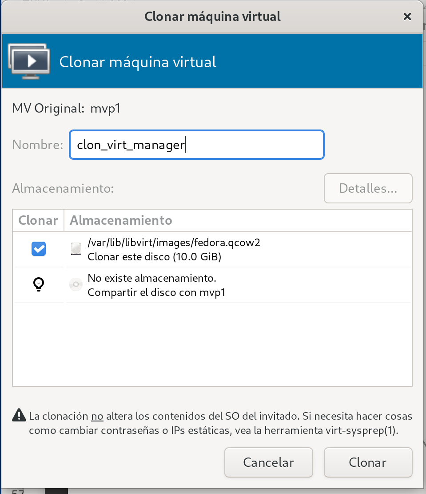
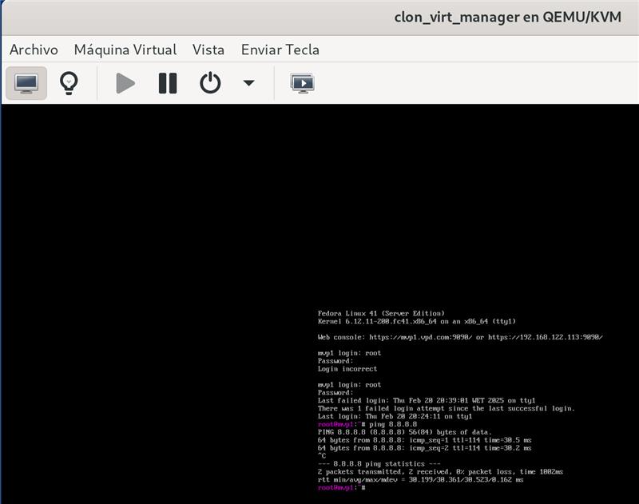
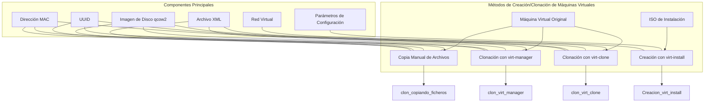
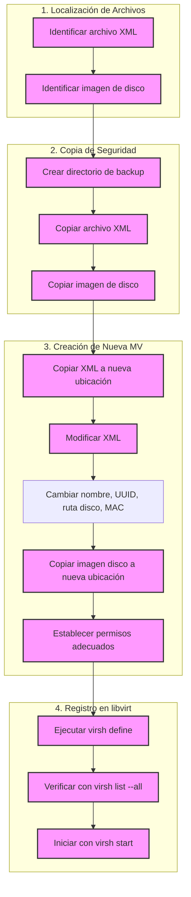
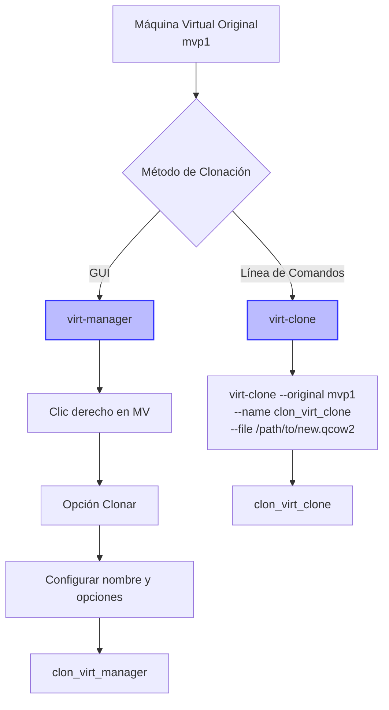
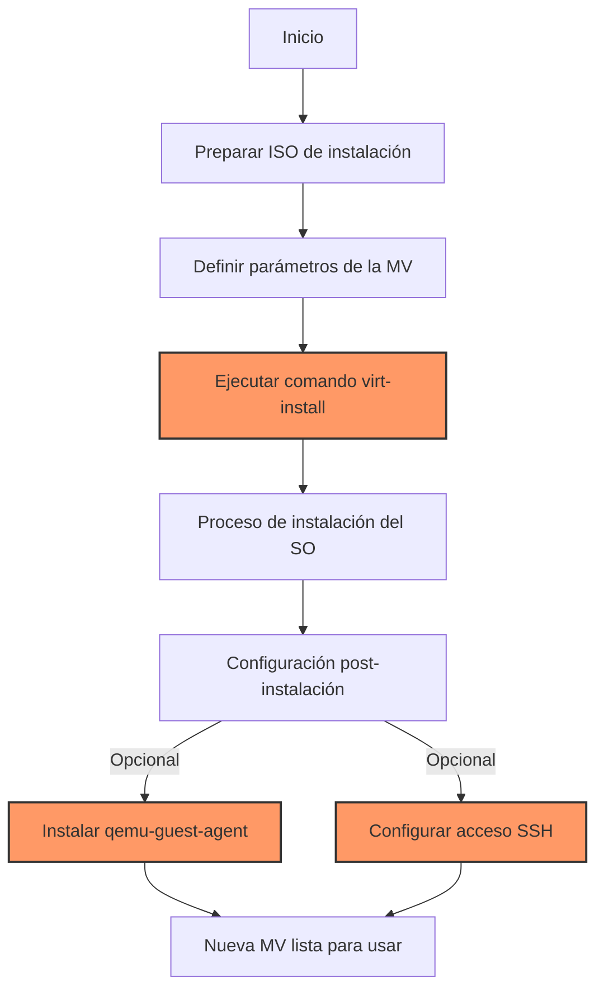
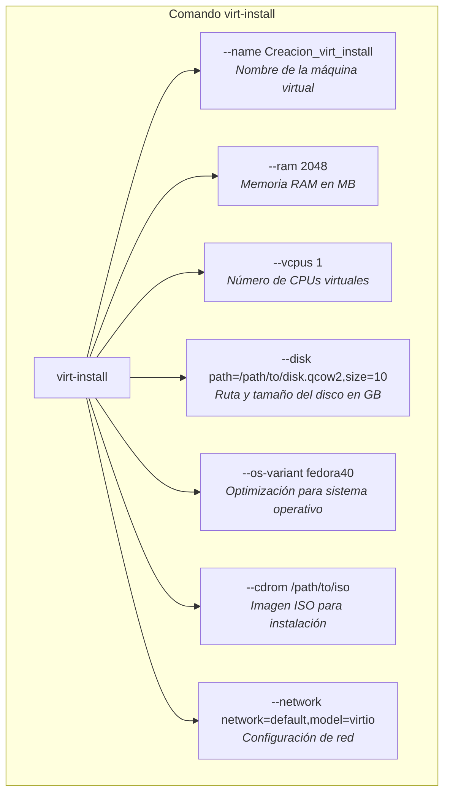
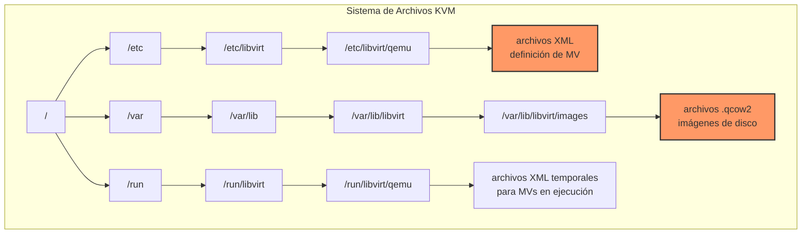
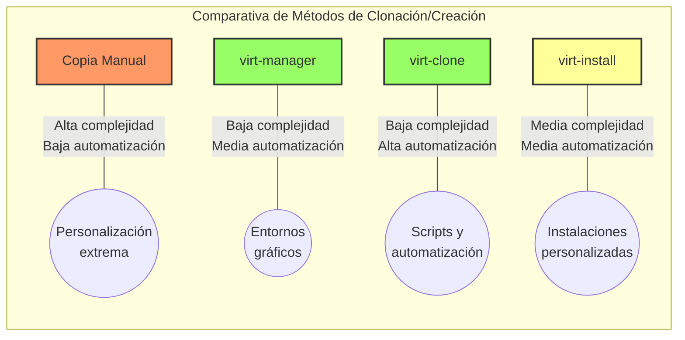
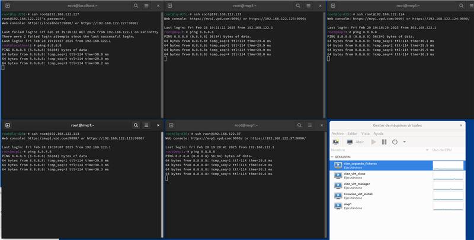

# Operaciones con Máquinas Virtuales KVM

## Tabla de contenido

- [Operaciones con Máquinas Virtuales KVM](#operaciones-con-máquinas-virtuales-kvm)
  - [Tabla de contenido](#tabla-de-contenido)
  - [Introducción](#introducción)
  - [Desarrollo](#desarrollo)
    - [Fase 1. Copia de seguridad y restauración manual](#fase-1-copia-de-seguridad-y-restauración-manual)
      - [Tarea 1. Creación de copia de seguridad de la máquina virtual](#tarea-1-creación-de-copia-de-seguridad-de-la-máquina-virtual)
      - [Tarea 2. Creación de máquina virtual a partir de copia de seguridad](#tarea-2-creación-de-máquina-virtual-a-partir-de-copia-de-seguridad)
    - [Fase 2. Clonación de máquinas virtuales](#fase-2-clonación-de-máquinas-virtuales)
      - [Tarea 3. Clonación mediante virt-manager](#tarea-3-clonación-mediante-virt-manager)
      - [Tarea 4. Clonación mediante virt-clone](#tarea-4-clonación-mediante-virt-clone)
    - [Fase 3. Creación de máquinas virtuales con virt-install](#fase-3-creación-de-máquinas-virtuales-con-virt-install)
      - [Tarea 5. Creación e instalación de máquina virtual con virt-install](#tarea-5-creación-e-instalación-de-máquina-virtual-con-virt-install)
  - [Resumen Visual de Operaciones](#resumen-visual-de-operaciones)
    - [Diagrama de Métodos de Clonación y Creación](#diagrama-de-métodos-de-clonación-y-creación)
    - [Flujo de trabajo: Copia de seguridad y restauración manual](#flujo-de-trabajo-copia-de-seguridad-y-restauración-manual)
    - [Flujo de trabajo: Clonación mediante herramientas](#flujo-de-trabajo-clonación-mediante-herramientas)
    - [Flujo de trabajo: Creación con virt-install](#flujo-de-trabajo-creación-con-virt-install)
    - [Estructura de archivos de KVM](#estructura-de-archivos-de-kvm)
    - [Comparativa de Métodos](#comparativa-de-métodos)
  - [Pruebas y Validación](#pruebas-y-validación)
    - [Verificación de conectividad](#verificación-de-conectividad)
    - [Verificación de acceso SSH](#verificación-de-acceso-ssh)
      - [Acceso a mvp1 (máquina virtual original)](#acceso-a-mvp1-máquina-virtual-original)
      - [Acceso a Creacion_virt_install (máquina virtual creada con virt-install)](#acceso-a-creacion_virt_install-máquina-virtual-creada-con-virt-install)
      - [Acceso a clon_virt_manager (máquina virtual clonada con virt-manager)](#acceso-a-clon_virt_manager-máquina-virtual-clonada-con-virt-manager)
      - [Acceso a clon_virt_clone (máquina virtual clonada con virt-clone)](#acceso-a-clon_virt_clone-máquina-virtual-clonada-con-virt-clone)
      - [Acceso a clon_copiando_ficheros (máquina virtual creada manualmente)](#acceso-a-clon_copiando_ficheros-máquina-virtual-creada-manualmente)
    - [Conclusión de las pruebas](#conclusión-de-las-pruebas)
  - [Conclusiones](#conclusiones)
  - [Bibliografía](#bibliografía)

## Introducción

El objetivo de esta práctica es realizar operaciones con máquinas virtuales utilizando diferentes herramientas disponibles en la plataforma de virtualización KVM. Se utilizarán tanto el entorno gráfico (`virt-manager`) como las utilidades de línea de comandos (`virsh`, `virt-clone`, `virt-install`) para gestionar dominios virtuales.

KVM (Kernel-based Virtual Machine) es una tecnología de virtualización nativa integrada en el kernel de Linux que permite implementar virtualización completa con asistencia por hardware. Como se estudió en los temas teóricos, KVM se compone de tres elementos fundamentales:

1. **Módulos del kernel**: Los módulos `kvm.ko` y `kvm-intel.ko` o `kvm-amd.ko` que se integran en el núcleo Linux y hacen más eficiente la virtualización.
2. **QEMU (Quick Emulator)**: Encargado de emular los dispositivos de hardware para los sistemas invitados. Cada sistema invitado en ejecución se manifiesta como un proceso `qemu-system-x86_64` en el sistema anfitrión.
3. **Libvirt**: Biblioteca que proporciona una API estable para la administración de máquinas virtuales, independientemente del hypervisor subyacente.

Esta práctica permite familiarizarse con diferentes métodos para copiar, clonar y crear máquinas virtuales, así como verificar su correcto funcionamiento y conectividad.

## Desarrollo

### Fase 1. Copia de seguridad y restauración manual

#### Tarea 1. Creación de copia de seguridad de la máquina virtual

En esta tarea se realizará una copia de seguridad manual de la máquina virtual mvp1 creada en la práctica anterior. Para ello, se identificarán y copiarán los archivos necesarios sin utilizar herramientas específicas de clonación.

Como paso previo, se localizan los archivos de configuración de la máquina virtual. Primero se busca el archivo de definición XML con la máquina virtual apagada:

```bash
root@lq-d25:~# find / -name 'mvp1.xml'
/etc/libvirt/qemu/mvp1.xml
```

**Explicación del comando**:

- `find`: Herramienta para buscar archivos en el sistema de archivos
- `/`: Comenzar la búsqueda desde la raíz del sistema de archivos
- `-name 'mvp1.xml'`: Buscar archivos con el nombre exacto 'mvp1.xml'

Ahora, se vuelve a ejecutar el mismo comando con la máquina virtual ejecutándose:

```bash
root@lq-d25:~# find / -name 'mvp1.xml'
/etc/libvirt/qemu/mvp1.xml
/run/libvirt/qemu/mvp1.xml
```

**Explicación de la salida**:

- Cuando la máquina virtual no está en ejecución, el archivo de definición XML solo se encuentra en `/etc/libvirt/qemu/`
- Cuando la máquina virtual está en ejecución, aparece una copia adicional en `/run/libvirt/qemu/`
- El archivo en `/etc/libvirt/qemu/` es la definición persistente de la máquina virtual
- El archivo en `/run/libvirt/qemu/` es una copia temporal utilizada durante la ejecución de la VM que puede contener información de estado adicional

> **Nota técnica**: Como se explica en el tema 1.2, los archivos de configuración XML son fundamentales en el ecosistema KVM/libvirt, ya que especifican todos los aspectos de la máquina virtual, desde dispositivos virtuales hasta conexiones de red. Libvirt recomienda no editar estos archivos directamente sino a través de herramientas como `virsh edit`, aunque en situaciones como la clonación manual puede ser necesario modificarlos.

A continuación, se necesita identificar dónde se encuentra la imagen del disco de la máquina virtual:

```bash
root@lq-d25:~# find / -name '*.qcow2'
/var/lib/libvirt/images/fedora.qcow2
/usr/share/edk2/ovmf/OVMF_VARS_4M.secboot.qcow2
/usr/share/edk2/ovmf/OVMF_CODE_4M.secboot.qcow2
/usr/share/edk2/ovmf/OVMF_VARS_4M.qcow2
/usr/share/edk2/ovmf/OVMF_CODE_4M.qcow2
```

La salida muestra que la máquina virtual mvp1 utiliza un archivo de imagen de disco ubicado en `/var/lib/libvirt/images/fedora.qcow2`.

> **Nota sobre formato qcow2**: Como se estudió en el tema 1.2, qcow2 (QEMU Copy-On-Write v2) es el formato nativo de QEMU que ofrece ventajas como expansión dinámica, instantáneas y cifrado. Esto significa que el archivo solo ocupa el espacio realmente utilizado, no el tamaño total reservado para el disco virtual, lo que optimiza el uso del almacenamiento.

Para una copia de seguridad completa, se necesita copiar tanto el archivo de definición XML como la imagen del disco.

Primero, se crea un directorio para almacenar la copia de seguridad:

```bash
root@lq-d25:~# mkdir -p /backup/mvp1/
```

Ahora, se copian los archivos necesarios:

```bash
root@lq-d25:~# cp /etc/libvirt/qemu/mvp1.xml /backup/mvp1/
root@lq-d25:~# cp /var/lib/libvirt/images/fedora.qcow2 /backup/mvp1/fedora.qcow2
```

Se verifica que los archivos se hayan copiado correctamente:

```bash
root@lq-d25:~# ls -lh /backup/mvp1/
total 2.1G
-rw-r--r-- 1 root root 2.1G Feb 20 14:30 fedora.qcow2
-rw-r--r-- 1 root root 3.2K Feb 20 14:30 mvp1.xml
```

Con estos archivos respaldados, tenemos todo lo necesario para recrear la máquina virtual en el siguiente paso.

#### Tarea 2. Creación de máquina virtual a partir de copia de seguridad

En esta tarea se creará una nueva máquina virtual llamada "clon_copiando_ficheros" utilizando los archivos de copia de seguridad generados en la tarea anterior. Para ello, se emplearán las herramientas nativas de libvirt y se verificará su correcto funcionamiento.

El primer paso consiste en copiar el archivo de definición XML de la máquina virtual original, adaptándolo para la nueva máquina virtual:

```bash
root@lq-d25:~# cp /etc/libvirt/qemu/mvp1.xml /etc/libvirt/qemu/clon_copiando_ficheros.xml
```

**Explicación del comando**:

- `cp`: Herramienta estándar de Linux para copiar archivos
- `/etc/libvirt/qemu/mvp1.xml`: Archivo XML de definición de la máquina virtual original
- `/etc/libvirt/qemu/clon_copiando_ficheros.xml`: Ruta donde se creará el nuevo archivo de definición

A continuación, es necesario modificar el archivo XML copiado para adaptarlo a la nueva máquina virtual. Los cambios necesarios incluyen:

1. Cambiar el nombre de la máquina virtual
2. Generar un nuevo UUID para evitar conflictos
3. Actualizar la ruta del archivo de imagen de disco
4. Cambiar la dirección MAC de la interfaz de red

> **Elementos clave del archivo XML**: Como se detalla en el tema 1.2, el archivo XML de definición de una máquina virtual contiene secciones que describen todos los componentes virtualizados, incluyendo CPU, memoria, dispositivos de almacenamiento y dispositivos de red. Cada uno de estos componentes tiene propiedades específicas que determinan cómo se comporta la máquina virtual y cómo interactúa con el sistema anfitrión.

El archivo XML debe modificarse de la siguiente manera:

```xml
<!--
WARNING: THIS IS AN AUTO-GENERATED FILE. CHANGES TO IT ARE LIKELY TO BE
OVERWRITTEN AND LOST. Changes to this xml configuration should be made using:
  virsh edit mvp1
or other application using the libvirt API.
-->

<domain type='kvm'>
  <name>clon_copiando_ficheros</name>
  <uuid>1f4f17c1-3037-40d4-8866-c1aa8fb37292</uuid>
  <metadata>
    <!-- ... contenido omitido ... -->
  </metadata>
  <devices>
    <emulator>/usr/bin/qemu-system-x86_64</emulator>
    <disk type='file' device='disk'>
      <driver name='qemu' type='qcow2' discard='unmap'/>
      <source file='/var/lib/libvirt/images/clon_copiando_ficheros.qcow2'/>
      <target dev='vda' bus='virtio'/>
      <address type='pci' domain='0x0000' bus='0x04' slot='0x00' function='0x0'/>
    </disk>
    <!-- ... contenido omitido ... -->
    <interface type='network'>
      <mac address='00:16:3e:50:87:50'/>
      <source network='default'/>
      <model type='virtio'/>
      <address type='pci' domain='0x0000' bus='0x01' slot='0x00' function='0x0'/>
    </interface>
    <!-- ... contenido omitido ... -->
  </devices>
</domain>
```

**Elementos modificados en el XML**:

- `<name>`: Cambiado de "mvp1" a "clon_copiando_ficheros"
- `<uuid>`: Generado un nuevo UUID para evitar conflictos con la máquina virtual original
- `<source file>`: Actualizada la ruta del disco para apuntar al nuevo archivo de imagen
- `<mac address>`: Cambiada la dirección MAC para evitar conflictos de red

Para la generación de la nueva dirección MAC, se utiliza un script auxiliar:

```bash
root@lq-d25:~# python ./macgen.py
00:16:3e:3d:24:39
```

**Explicación del comando**:

- `python ./macgen.py`: Script que genera una dirección MAC válida
- La salida proporciona una dirección MAC única que puede utilizarse para la nueva máquina virtual

> **Nota**: Es fundamental asignar una dirección MAC única a cada máquina virtual para evitar conflictos en la red que causarían problemas de conectividad.

Una vez modificado el archivo XML, se procede a copiar el archivo de imagen de disco de la máquina virtual original:

```bash
root@lq-d25:~# cp /backup/mvp1/fedora.qcow2 /var/lib/libvirt/images/clon_copiando_ficheros.qcow2
```

**Explicación del comando**:

- `cp`: Herramienta para copiar archivos
- `/backup/mvp1/fedora.qcow2`: Archivo de imagen de disco respaldado en la tarea anterior
- `/var/lib/libvirt/images/clon_copiando_ficheros.qcow2`: Ubicación estándar donde libvirt almacena las imágenes de disco

A continuación, se establecen los permisos adecuados para el archivo de imagen de disco:

```bash
root@lq-d25:~# chown qemu:qemu /var/lib/libvirt/images/clon_copiando_ficheros.qcow2
root@lq-d25:~# chmod 600 /var/lib/libvirt/images/clon_copiando_ficheros.qcow2
```

**Explicación de los comandos**:

- `chown qemu:qemu`: Asigna el propietario y grupo "qemu" al archivo, permitiendo que el servicio QEMU/KVM acceda a él
- `chmod 600`: Establece permisos restrictivos (lectura y escritura solo para el propietario) para garantizar la seguridad

Finalmente, se define la nueva máquina virtual en libvirt utilizando el archivo XML modificado:

```bash
root@lq-d25:~# virsh define /etc/libvirt/qemu/clon_copiando_ficheros.xml
Domain 'clon_copiando_ficheros' defined from /etc/libvirt/qemu/clon_copiando_ficheros.xml
```

**Explicación del comando**:

- `virsh define`: Comando de libvirt para definir una nueva máquina virtual desde un archivo XML
- `/etc/libvirt/qemu/clon_copiando_ficheros.xml`: Ruta al archivo XML modificado
- La salida confirma que la definición se ha completado correctamente

Para verificar que la máquina virtual se ha definido correctamente, se ejecuta:

```bash
root@lq-d25:~# virsh list --all
Id   Nombre                   Estado
----------------------------------------
-    clon_copiando_ficheros   apagado
-    mvp1                     apagado
```

**Explicación del comando**:

- `virsh list --all`: Muestra todas las máquinas virtuales definidas, tanto en ejecución como apagadas
- La salida muestra que la nueva máquina virtual "clon_copiando_ficheros" está definida correctamente en estado apagado

Para iniciar la máquina virtual clonada y verificar su funcionalidad:

```bash
root@lq-d25:~# virsh start clon_copiando_ficheros
Domain 'clon_copiando_ficheros' started
```

**Explicación del comando**:

- `virsh start`: Comando para iniciar una máquina virtual definida
- `clon_copiando_ficheros`: Nombre de la máquina virtual a iniciar
- La salida confirma que la máquina virtual se ha iniciado correctamente

Una vez iniciada, se puede verificar su estado:

```bash
root@lq-d25:~# virsh list
 Id   Nombre                   Estado
------------------------------------------
 3    clon_copiando_ficheros   ejecutando
```

La máquina virtual clonada está ahora en ejecución y lista para ser utilizada, completando así el proceso de creación de una máquina virtual a partir de una copia de seguridad manual.

### Fase 2. Clonación de máquinas virtuales

#### Tarea 3. Clonación mediante virt-manager

En esta tarea se realizará la clonación de la máquina virtual mvp1 utilizando la interfaz gráfica `virt-manager`. Este procedimiento permite crear una copia completa de una máquina virtual existente a través de una interfaz gráfica, lo que resulta adecuado para administradores que prefieren interactuar con herramientas visuales en vez de la línea de comandos.

> **Herramientas de gestión de KVM**: Como se explicó en el tema 1.2, `virt-manager` es una aplicación de interfaz gráfica que forma parte del ecosistema libvirt y proporciona una manera intuitiva de gestionar máquinas virtuales. Aunque realiza las mismas operaciones que los comandos de línea, abstrae la complejidad detrás de una interfaz visual.

Para realizar la clonación a través de `virt-manager`, se deben seguir estos pasos:

1. Iniciar la aplicación `virt-manager` con permisos de administrador:

```bash
root@lq-d25:~# virt-manager
```

2. Verificar que la máquina virtual de origen (mvp1) esté apagada. Para clonar una máquina virtual, es recomendable que esté detenida para evitar inconsistencias en el estado de los archivos.

3. En la ventana principal de `virt-manager`, se debe seleccionar la máquina virtual mvp1, hacer clic derecho sobre ella y seleccionar la opción "Clonar":


_Figura 1: Interfaz de virt-manager mostrando el menú contextual con la opción de Clonar seleccionada_

En el asistente de clonación, se configuran los siguientes parámetros:

- **Nombre**: Se debe especificar "clon_virt_manager"
- **Método de clonación**: Se mantiene la opción por defecto "Clonar almacenamiento completo"
- **Ubicación de almacenamiento**: Se mantiene la ubicación predeterminada

Una vez finalizada la clonación, la nueva máquina virtual "clon_virt_manager" aparecerá en la lista de máquinas virtuales disponibles en estado "apagado".

Para verificar la correcta clonación y funcionamiento, se inicia la máquina virtual clonada haciendo clic en el botón "Iniciar la máquina virtual" en la barra de herramientas superior.

Una vez iniciada, se puede verificar la conectividad de red desde dentro de la máquina virtual clonada:


_Figura 2: Consola de la máquina virtual mostrando comandos de verificación de conectividad de red_

Este método de clonación a través de la interfaz gráfica `virt-manager` ofrece una alternativa simple y eficaz para duplicar máquinas virtuales, especialmente útil en entornos donde se prefiere el uso de herramientas gráficas sobre la línea de comandos.

#### Tarea 4. Clonación mediante virt-clone

En esta tarea se realizará la clonación de la máquina virtual mvp1 utilizando la herramienta de línea de comandos `virt-clone`. Esta utilidad forma parte del conjunto de herramientas de administración de libvirt y permite crear copias exactas de máquinas virtuales existentes directamente desde la terminal, sin necesidad de utilizar interfaces gráficas.

A diferencia del método manual visto en la Tarea 2, esta herramienta automatiza todo el proceso de clonación, incluyendo la copia del disco, la generación de un nuevo UUID y la asignación de una dirección MAC única.

Para clonar la máquina virtual utilizando `virt-clone`, se ejecuta el siguiente comando:

```bash
root@lq-d25:~# virt-clone --original mvp1 --name clon_virt_clone --file /var/lib/libvirt/images/clon_virt_clone.qcow2
Allocating 'clon_virt_clone.qcow2'                                            | 1.7 GB  00:00:00 ...

El clon 'clon_virt_clone' ha sido creado exitosamente.
```

**Explicación del comando**:

- `virt-clone`: Herramienta para clonar máquinas virtuales de libvirt
- `--original mvp1`: Especifica el nombre de la máquina virtual a clonar
- `--name clon_virt_clone`: Define el nombre de la nueva máquina virtual
- `--file /var/lib/libvirt/images/clon_virt_clone.qcow2`: Establece la ruta y el nombre para el nuevo archivo de imagen de disco.

> **Nota**: Es importante que la máquina virtual original esté apagada durante el proceso de clonación para evitar posibles inconsistencias en el estado del disco clonado.

Para verificar que la máquina virtual se ha clonado correctamente, se utiliza el comando `virsh list`:

```bash
root@lq-d25:~# virsh list --all
Id   Nombre                   Estado
----------------------------------------
-    clon_copiando_ficheros   apagado
-    clon_virt_clone          apagado
-    clon_virt_manager        apagado
-    mvp1                     apagado
```

**Explicación del comando**:

- `virsh list --all`: Muestra todas las máquinas virtuales definidas en el sistema, incluyendo las que están apagadas
- La salida confirma que la nueva máquina virtual "clon_virt_clone" ha sido creada y está en estado apagado

Para iniciar la máquina virtual clonada:

```bash
root@lq-d25:~# virsh start clon_virt_clone
Domain 'clon_virt_clone' started
```

**Explicación del comando**:

- `virsh start`: Comando para iniciar una máquina virtual
- `clon_virt_clone`: Nombre de la máquina virtual a iniciar
- La salida confirma que la máquina virtual se ha iniciado correctamente

Para verificar que la máquina virtual está en ejecución:

```bash
root@lq-d25:~# virsh list
 Id   Nombre                  Estado
------------------------------------------
 4    clon_virt_clone         ejecutando
```

**Ventajas del método `virt-clone` frente a otros métodos de clonación**:

1. **Automatización completa**: Realiza todos los pasos necesarios para la clonación en una sola operación
2. **Eficiencia**: Minimiza el riesgo de errores al automatizar los cambios necesarios en la configuración
3. **Facilidad de uso**: Requiere un único comando con pocos parámetros
4. **Reproducibilidad**: Facilita la creación de scripts para clonar múltiples máquinas virtuales

La herramienta `virt-clone` resulta particularmente útil en entornos donde se requiere la creación rápida de múltiples máquinas virtuales idénticas, como en escenarios de pruebas, desarrollo o capacitación.

### Fase 3. Creación de máquinas virtuales con virt-install

#### Tarea 5. Creación e instalación de máquina virtual con virt-install

En esta tarea se creará una nueva máquina virtual llamada "Creacion_virt_install" utilizando la herramienta de línea de comandos `virt-install`. A diferencia de los métodos de clonación vistos anteriormente, esta herramienta permite crear máquinas virtuales completamente nuevas con configuraciones personalizadas y realizar la instalación del sistema operativo en un solo paso.

Para esta máquina virtual, se establecerán las siguientes especificaciones:

- **Nombre**: Creacion_virt_install
- **Memoria RAM**: 2 GB (2048 MB)
- **Procesadores virtuales**: 1 vCPU
- **Disco**: 10 GB
- **Sistema Operativo**: Fedora Server 41 (instalación mínima)
- **Red**: Configuración NAT a través de la red virtual "default"

> **Virtualización de recursos**: Como se explica en el tema 1.1, la virtualización permite asignar recursos físicos (CPU, memoria, almacenamiento) a múltiples máquinas virtuales. KVM soporta tanto asignación estática como dinámica de estos recursos, además de características avanzadas como sobrecarga (overcommitting) que permite asignar más recursos virtuales que los físicamente disponibles, aprovechando que no todas las máquinas virtuales utilizan sus recursos al máximo simultáneamente.

> **Red NAT en KVM**: Como se detalla en el tema 1.2, la red NAT (Network Address Translation) es uno de los modos de red más comunes en KVM, donde se crea una red privada para las máquinas virtuales y se utiliza la dirección IP del anfitrión para la comunicación externa. Esto permite que las máquinas virtuales tengan acceso a Internet sin necesidad de asignarles direcciones IP públicas o enrutables.

El comando para crear la nueva máquina virtual es el siguiente:

```bash
root@lq-d25:~# virt-install \
  --name Creacion_virt_install \
  --ram 2048 \
  --vcpus 1 \
  --disk path=/var/lib/libvirt/images/Creacion_virt_install.qcow2,size=10 \
  --os-variant fedora40 \
  --cdrom /ISO/Fedora-Server-netinst-x86_64-41-1.4.iso \
  --network network=default,model=virtio
```

**Explicación detallada del comando**:

- `virt-install`: Herramienta para crear nuevas máquinas virtuales e iniciar su instalación
- `--name Creacion_virt_install`: Especifica el nombre de la nueva máquina virtual
- `--ram 2048`: Asigna 2048 MB (2 GB) de memoria RAM a la máquina virtual
- `--vcpus 1`: Configura la máquina virtual con 1 CPU virtual
- `--disk path=/var/lib/libvirt/images/Creacion_virt_install.qcow2,size=10`: Crea un nuevo disco virtual de 10 GB en el formato qcow2
- `--os-variant fedora40`: Optimiza la configuración para Fedora (versión 40, la más cercana disponible a Fedora 41)
- `--cdrom /ISO/Fedora-Server-netinst-x86_64-41-1.4.iso`: Conecta la imagen ISO de instalación de Fedora Server 41
- `--network network=default,model=virtio`: Configura la interfaz de red para usar la red virtual "default" con el modelo de dispositivo "virtio"

Al ejecutar este comando, se observa la siguiente salida:

```bash
root@lq-d25:~# virt-install --name Creacion_virt_install --ram 2048 --vcpus 1 --disk path=/var/lib/libvirt/images/Creacion_virt_install.qcow2,size=10 --os-variant fedora40 --cdrom /ISO/Fedora-Server-netinst-x86_64-41-1.4.iso --network network=default,model=virtio

Empezando la instalación...
Allocating 'Creacion_virt_install.qcow2'                    |    0 B  00:00 ...
Creando dominio...                                          |    0 B  00:00
Running graphical console command: virt-viewer --connect qemu:///system --wait Creacion_virt_install
```

Una vez completada la instalación del sistema operativo, es recomendable instalar el agente de invitado QEMU para mejorar la integración entre el sistema anfitrión y la máquina virtual:

```bash
root@localhost:~# sudo dnf install -y qemu-guest-agent
Actualizando y cargando repositorios:
Fedora 41 - x86_64 - Updates           100% |   3.5 MiB/s |  10.7 MiB |  00m03s
Fedora 41 openh264 (From Cisco) - x86_ 100% |   5.1 KiB/s |   4.8 KiB |  00m01s
Fedora 41 - x86_64                     100% |   7.5 MiB/s |  35.4 MiB |  00m05s
Repositorios cargados.
Package                  Arch    Version                  Repository        Size
Installing:
qemu-guest-agent        x86_64  2:9.1.2-3.fc41           updates      962.9 KiB

Transaction Summary:
Installing:         1 package

El tamaño total de paquetes entrantes es 313 KiB. Se necesita descargar 313 KiB.
Después de esta operación, 963 KiB extra serán utilizados (instalar 963 KiB, eliminar 0 B).
[1/1] qemu-guest-agent-2:9.1.2-3.fc41.x 100% |   1.0 MiB/s | 313.2 KiB |  00m00s
--------------------------------------------------------------------------------
[1/1] Total                             100% | 495.5 KiB/s | 313.2 KiB |  00m01s
Ejecutando transacción
[1/3] Verificar archivos de paquete     100% | 333.0   B/s |   1.0   B |  00m00s
[2/3] Preparar transacción             100% |  18.0   B/s |   1.0   B |  00m00s
[3/3] Instalando qemu-guest-agent-2:9.1 100% | 976.3 KiB/s | 965.6 KiB |  00m01s
>>> Ejecutando post-install scriptlet: qemu-guest-agent-2:9.1.2-3.fc41.x86_64
>>> Finalizado post-install scriptlet: qemu-guest-agent-2:9.1.2-3.fc41.x86_64
>>> Salida del scriptlet:
>>> Created symlink '/etc/systemd/system/dev-virtio\x2dports-org.qemu.guest_agen
>>> Unit /usr/lib/systemd/system/qemu-guest-agent.service is added as a dependen
>>>
¡Completado!
```

**Explicación del comando**:

- `sudo dnf install -y qemu-guest-agent`: Instala el paquete qemu-guest-agent utilizando el gestor de paquetes dnf
- `-y`: Responde automáticamente "sí" a las confirmaciones durante la instalación

Adicionalmente, se activa el servicio del agente QEMU para que se inicie automáticamente:

```bash
root@localhost:~# sudo systemctl enable --now qemu-guest-agent
Unit /usr/lib/systemd/system/qemu-guest-agent.service is added as a dependency to a non-existent unit dev-virtio\x2dports-org.qemu.guest_agent.0.device.
```

**Explicación del comando**:

- `systemctl enable --now`: Habilita el servicio para que se inicie en el arranque del sistema y lo inicia inmediatamente
- `qemu-guest-agent`: Nombre del servicio a habilitar

Por último, para facilitar la administración remota de la máquina virtual, se configura el servicio SSH para permitir el acceso directo como usuario root:

```bash
root@localhost:~# echo "PermitRootLogin yes" | sudo tee -a /etc/ssh/sshd_config
PermitRootLogin yes
```

A continuación, se reinicia el servicio SSH para aplicar los cambios de configuración:

```bash
root@localhost:~# systemctl restart sshd
```

La creación de máquinas virtuales mediante `virt-install` resulta especialmente útil cuando se necesitan configuraciones específicas que no están presentes en las máquinas virtuales existentes o cuando se requiere una instalación limpia del sistema operativo con parámetros personalizados.

## Resumen Visual de Operaciones

Esta sección proporciona representaciones gráficas para ayudar a comprender los diferentes métodos de gestión de máquinas virtuales en KVM abordados en esta práctica.

### Diagrama de Métodos de Clonación y Creación

El siguiente diagrama muestra una visión general de los cuatro métodos utilizados para crear/clonar máquinas virtuales en esta práctica, así como los principales componentes involucrados.



### Flujo de trabajo: Copia de seguridad y restauración manual

Este diagrama muestra el proceso paso a paso para realizar una copia de seguridad manual y restaurarla como una nueva máquina virtual.



A continuación, se presenta un resumen de los comandos esenciales utilizados en este proceso:

| Paso                | Comando                                                                             | Descripción                                        |
| ------------------- | ----------------------------------------------------------------------------------- | -------------------------------------------------- |
| Localizar XML       | `find / -name 'mvp1.xml'`                                                           | Encuentra el archivo XML de definición             |
| Localizar disco     | `find / -name '*.qcow2'`                                                            | Encuentra las imágenes de disco en formato qcow2   |
| Crear backup        | `mkdir -p /backup/mvp1/`                                                            | Crea directorio para almacenar copias de seguridad |
| Copiar archivos     | `cp /etc/libvirt/qemu/mvp1.xml /backup/mvp1/`                                       | Copia el archivo XML original                      |
|                     | `cp /var/lib/libvirt/images/fedora.qcow2 /backup/mvp1/`                             | Copia la imagen de disco original                  |
| Crear nueva MV      | `cp /etc/libvirt/qemu/mvp1.xml /etc/libvirt/qemu/clon_copiando_ficheros.xml`        | Crea base para la definición de la nueva MV        |
| Generar MAC         | `python ./macgen.py`                                                                | Genera una dirección MAC aleatoria                 |
| Copiar imagen       | `cp /backup/mvp1/fedora.qcow2 /var/lib/libvirt/images/clon_copiando_ficheros.qcow2` | Crea copia de la imagen de disco                   |
| Establecer permisos | `chown qemu:qemu /var/lib/libvirt/images/clon_copiando_ficheros.qcow2`              | Asigna propietario correcto                        |
|                     | `chmod 600 /var/lib/libvirt/images/clon_copiando_ficheros.qcow2`                    | Establece permisos adecuados                       |
| Definir MV          | `virsh define /etc/libvirt/qemu/clon_copiando_ficheros.xml`                         | Registra la MV en libvirt                          |
| Verificar           | `virsh list --all`                                                                  | Verifica que la nueva MV aparece en la lista       |
| Iniciar             | `virsh start clon_copiando_ficheros`                                                | Inicia la MV clonada                               |

### Flujo de trabajo: Clonación mediante herramientas

Este diagrama muestra los dos métodos de clonación automatizada utilizados en la práctica.



Comparación de los comandos para ambos métodos:

| Método       | Entorno  | Comando                                                                                                  | Ventajas                                                  |
| ------------ | -------- | -------------------------------------------------------------------------------------------------------- | --------------------------------------------------------- |
| virt-manager | Gráfico  | Interfaz gráfica (No requiere comandos)                                                                  | Intuitivo, visual, menor curva de aprendizaje             |
| virt-clone   | Terminal | `virt-clone --original mvp1 --name clon_virt_clone --file /var/lib/libvirt/images/clon_virt_clone.qcow2` | Automatizable, scriptable, rápido para usuarios avanzados |

### Flujo de trabajo: Creación con virt-install

Este diagrama ilustra el proceso de creación de una nueva máquina virtual usando virt-install.



Desglose del comando `virt-install`:



### Estructura de archivos de KVM

Este diagrama muestra la estructura de archivos y directorios relevantes para la gestión de máquinas virtuales en KVM.



### Comparativa de Métodos

Esta comparación visual muestra los diferentes métodos utilizados en la práctica según su complejidad y nivel de automatización:



| Método       | Complejidad | Automatización | Flexibilidad | Casos de uso ideales                                                    |
| ------------ | ----------- | -------------- | ------------ | ----------------------------------------------------------------------- |
| Copia Manual | Alta        | Baja           | Alta         | Personalización extrema, comprensión profunda del sistema               |
| virt-manager | Baja        | Media          | Media        | Administradores novatos, operaciones simples, entorno de escritorio     |
| virt-clone   | Baja        | Alta           | Media        | Clonación rápida, scripts, entornos sin GUI                             |
| virt-install | Media       | Media          | Alta         | Creación personalizada, automatización de despliegues, entornos sin GUI |

## Pruebas y Validación

En esta sección se presentan las pruebas realizadas para verificar el correcto funcionamiento de las máquinas virtuales creadas y clonadas durante esta práctica. Las pruebas se centran en dos aspectos fundamentales: la conectividad de red y el acceso SSH.

### Verificación de conectividad

Para validar que todas las máquinas virtuales funcionan correctamente y tienen acceso a la red, se verifica que todas pueden ejecutarse simultáneamente y acceder a Internet. La Figura 3 muestra el estado de las máquinas virtuales en ejecución.


_Figura 3: Panel de virt-manager mostrando todas las máquinas virtuales creadas ejecutándose simultáneamente_

Esta imagen permite verificar que:

- Todas las máquinas virtuales (mvp1, clon_copiando_ficheros, clon_virt_manager, clon_virt_clone y Creacion_virt_install) se encuentran en ejecución
- El administrador de máquinas virtuales las reconoce correctamente

Para una verificación más exhaustiva, se debe acceder a cada máquina virtual y comprobar su conectividad interna, como se detalla en la siguiente sección.

### Verificación de acceso SSH

El acceso SSH es crucial para la administración remota de las máquinas virtuales. A continuación, se presentan las pruebas de acceso SSH desde el host anfitrión a cada una de las máquinas virtuales creadas, verificando así su correcta configuración de red y servicios.

#### Acceso a mvp1 (máquina virtual original)

```bash
root@lq-d25:~# ssh root@192.168.122.124
The authenticity of host '192.168.122.124 (192.168.122.124)' can't be established.
ED25519 key fingerprint is SHA256:gRFGvZlUIel5P1EJEdiEEgvXQ48k7iMy9Oz5SDPY2h4.
This host key is known by the following other names/addresses:
    ~/.ssh/known_hosts:1: 192.168.122.123
    ~/.ssh/known_hosts:4: mvp1.vpd.com
Are you sure you want to continue connecting (yes/no/[fingerprint])? yes
Warning: Permanently added '192.168.122.124' (ED25519) to the list of known hosts.
Web console: https://mvp1.vpd.com:9090/ or https://192.168.122.124:9090/

Last login: Fri Feb 28 19:17:39 2025
root@mvp1:~# exit
cerrar sesión
Connection to 192.168.122.124 closed.
```

**Explicación de la prueba**:

- `ssh root@192.168.122.124`: Comando para establecer una conexión SSH como usuario root a la dirección IP 192.168.122.124 (mvp1)

#### Acceso a Creacion_virt_install (máquina virtual creada con virt-install)

```bash
root@lq-d25:~# ssh root@192.168.122.227
root@192.168.122.227's password:
Web console: https://localhost:9090/ or https://192.168.122.227:9090/

Last login: Fri Feb 28 19:18:58 2025
root@localhost:~# exit
cerrar sesión
Connection to 192.168.122.227 closed.
```

**Explicación de la prueba**:

- `ssh root@192.168.122.227`: Comando para establecer una conexión SSH a la máquina virtual Creacion_virt_install

#### Acceso a clon_virt_manager (máquina virtual clonada con virt-manager)

```bash
root@lq-d25:~# ssh root@192.168.122.113
The authenticity of host '192.168.122.113 (192.168.122.113)' can't be established.
ED25519 key fingerprint is SHA256:gRFGvZlUIel5P1EJEdiEEgvXQ48k7iMy9Oz5SDPY2h4.
This host key is known by the following other names/addresses:
    ~/.ssh/known_hosts:1: 192.168.122.123
    ~/.ssh/known_hosts:4: mvp1.vpd.com
    ~/.ssh/known_hosts:8: 192.168.122.124
Are you sure you want to continue connecting (yes/no/[fingerprint])? yes
Warning: Permanently added '192.168.122.113' (ED25519) to the list of known hosts.
Web console: https://mvp1.vpd.com:9090/ or https://192.168.122.113:9090/

Last login: Fri Feb 28 19:19:55 2025
root@mvp1:~# exit
cerrar sesión
Connection to 192.168.122.113 closed.
```

**Explicación de la prueba**:

- `ssh root@192.168.122.113`: Comando para conectar a la máquina clonada con virt-manager

#### Acceso a clon_virt_clone (máquina virtual clonada con virt-clone)

```bash
root@lq-d25:~# ssh root@192.168.122.37
The authenticity of host '192.168.122.37 (192.168.122.37)' can't be established.
ED25519 key fingerprint is SHA256:gRFGvZlUIel5P1EJEdiEEgvXQ48k7iMy9Oz5SDPY2h4.
This host key is known by the following other names/addresses:
    ~/.ssh/known_hosts:1: 192.168.122.123
    ~/.ssh/known_hosts:4: mvp1.vpd.com
    ~/.ssh/known_hosts:8: 192.168.122.124
    ~/.ssh/known_hosts:9: 192.168.122.113
Are you sure you want to continue connecting (yes/no/[fingerprint])? yes
Warning: Permanently added '192.168.122.37' (ED25519) to the list of known hosts.
Web console: https://mvp1.vpd.com:9090/ or https://192.168.122.37:9090/

Last login: Fri Feb 28 19:20:26 2025
root@mvp1:~# exit
cerrar sesión
Connection to 192.168.122.37 closed.
```

**Explicación de la prueba**:

- `ssh root@192.168.122.37`: Comando para conectar a la máquina clonada con virt-clone

#### Acceso a clon_copiando_ficheros (máquina virtual creada manualmente)

```bash
root@lq-d25:~# ssh root@192.168.122.123
Web console: https://mvp1.vpd.com:9090/ or https://192.168.122.123:9090/

Last login: Fri Feb 28 19:20:56 2025
root@mvp1:~# exit
cerrar sesión
Connection to 192.168.122.123 closed.
```

**Explicación de la prueba**:

- `ssh root@192.168.122.123`: Comando para conectar a la máquina virtual creada manualmente

### Conclusión de las pruebas

Las pruebas realizadas confirman que:

1. **Todas las máquinas virtuales funcionan correctamente**: Pueden iniciarse, ejecutarse simultáneamente y son accesibles por red.
2. **Los servicios esenciales están operativos**: El servicio SSH está correctamente configurado y permite la administración remota.
3. **La red está configurada adecuadamente**: Cada máquina virtual tiene una dirección IP única en la red virtual y puede comunicarse con el host anfitrión.
4. **La clonación preserva la configuración funcional**: Las máquinas clonadas mantienen la misma configuración de servicios que la máquina original, lo que confirma el éxito de los diferentes métodos de clonación.

Estas verificaciones demuestran que los cuatro métodos de creación/clonación de máquinas virtuales estudiados en esta práctica (copia manual, virt-manager, virt-clone y virt-install) producen máquinas virtuales completamente funcionales y administrables.

## Conclusiones

La realización de esta práctica ha permitido explorar y comparar diferentes métodos para la gestión de máquinas virtuales en KVM/QEMU, desde operaciones básicas de copia de seguridad hasta la creación de nuevas máquinas virtuales. A partir del trabajo realizado, se pueden extraer las siguientes conclusiones:

1. **Diversidad de enfoques para la gestión de máquinas virtuales**: Se ha comprobado que existen múltiples métodos para clonar y crear máquinas virtuales, cada uno con sus propias ventajas:

   - La **copia manual de ficheros** proporciona un conocimiento profundo de la estructura interna de las máquinas virtuales, pero es propensa a errores y requiere más pasos.
   - La herramienta gráfica **virt-manager** ofrece una interfaz intuitiva ideal para administradores que prefieren entornos visuales, simplificando operaciones complejas.
   - La utilidad **virt-clone** automatiza el proceso de clonación en un solo comando, resultando eficiente para operaciones repetitivas o scripts.
   - La herramienta **virt-install** permite crear máquinas virtuales personalizadas desde cero, ofreciendo mayor flexibilidad para configuraciones específicas.

2. **Componentes esenciales de una máquina virtual**: La práctica ha evidenciado que una máquina virtual KVM consta fundamentalmente de:

   - Un archivo de definición XML que describe sus características
   - Una imagen de disco que contiene el sistema operativo y los datos
   - Parámetros únicos como UUID y direcciones MAC para evitar conflictos

3. **Eficiencia de la clonación frente a la creación**: La clonación de máquinas virtuales existentes resulta significativamente más rápida que la creación e instalación de nuevas, siendo ideal para despliegues que requieren configuraciones similares.

4. **Consideraciones post-clonación**: Aunque no se ha abordado en detalle, se ha observado que las máquinas clonadas mantienen configuraciones de la máquina original, como el nombre de host y las claves SSH, lo que puede requerir ajustes adicionales en entornos de producción.

5. **Integración del sistema invitado**: La instalación de herramientas como el agente QEMU mejora significativamente la integración entre el host y el invitado, proporcionando funcionalidades adicionales como apagado limpio y mejor rendimiento.

6. **Relación con la arquitectura de KVM**: Las operaciones realizadas en esta práctica reflejan los conceptos teóricos estudiados en el Tema 1.2, demostrando cómo la arquitectura de tres capas de KVM (módulos del kernel, QEMU y libvirt) trabajan en conjunto para proporcionar un entorno de virtualización completo y flexible.

7. **Tipos de dispositivos virtuales**: Se ha observado en la práctica cómo los diferentes tipos de dispositivos virtuales (emulados y paravirtualizados) mencionados en el Tema 1.2 se configuran a través de los archivos XML, especialmente para los dispositivos de red y almacenamiento.

Estas conclusiones destacan la flexibilidad y potencia de la virtualización con KVM, que ofrece múltiples enfoques para satisfacer diferentes necesidades de implementación, desde entornos de laboratorio hasta despliegues empresariales a gran escala. La elección del método adecuado dependerá del contexto específico, los requisitos de automatización y el nivel de personalización necesario para cada caso de uso.

## Bibliografía

1. Herrmann J, Zimmerman Y, Parker D, Novich L, East J, Radvan S. Red Hat Enterprise Linux 7. Virtualization Getting Started Guide. Introduction to virtualization technologies available with RHEL, Red Hat; 2019. Disponible en: https://access.redhat.com/documentation/en-us/red_hat_enterprise_linux/7/ [accedido el 02/01/2024]

2. Herrmann J, Zimmerman Y, Novich L, Parker D, Radvan S, Richardson T. Red Hat Enterprise Linux 7. Virtualization Deployment and Administration Guide. Installing, configuring, and managing virtual machines on a RHEL physical machine, Red Hat; 2019. Disponible en: https://access.redhat.com/documentation/en-us/red_hat_enterprise_linux/7/ [accedido el 02/01/2024]

3. Documentación de Fedora sobre virtualización: [https://docs.fedoraproject.org/en-US/quick-docs/virtualization-getting-started/](https://docs.fedoraproject.org/en-US/quick-docs/virtualization-getting-started/)

4. Libvirt Wiki: [https://wiki.libvirt.org/](https://wiki.libvirt.org/)
