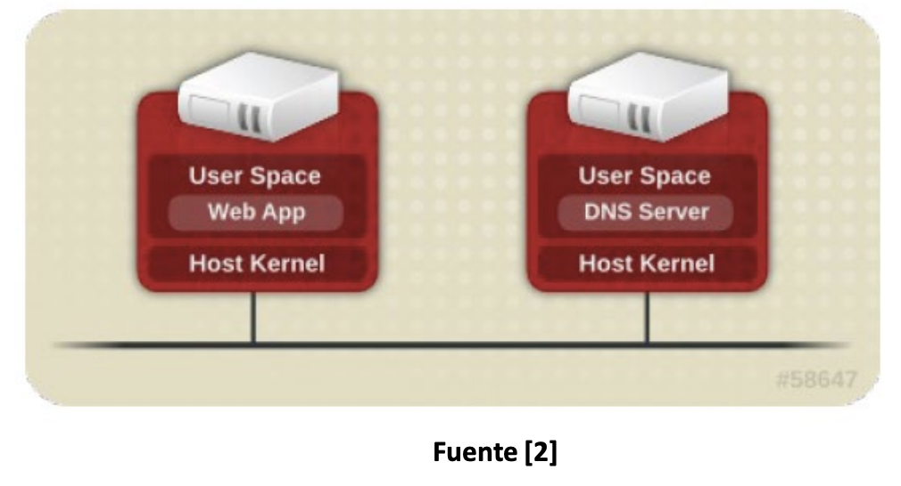
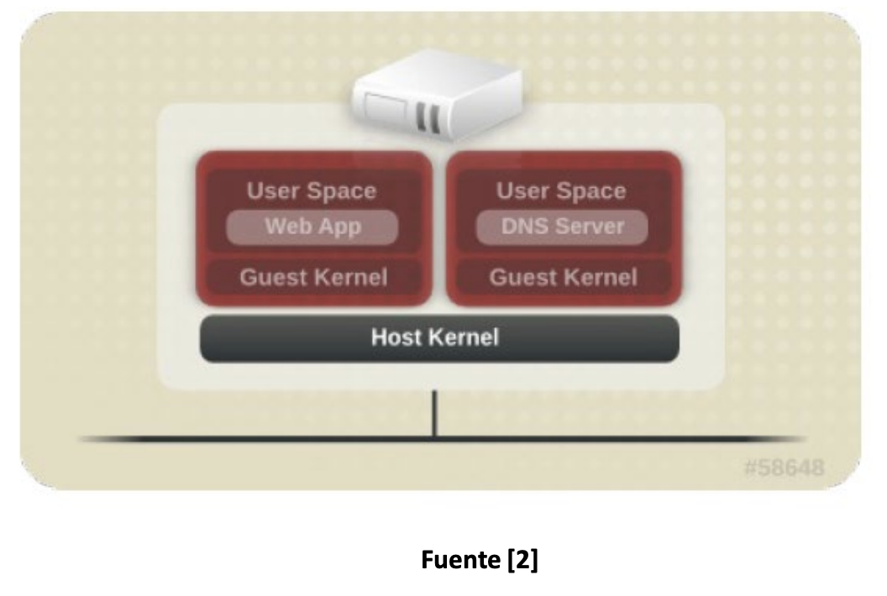
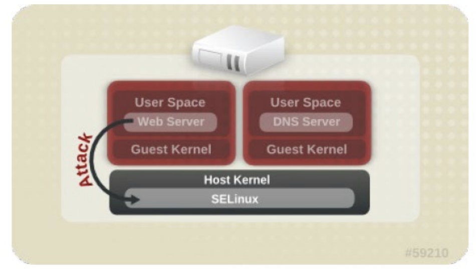
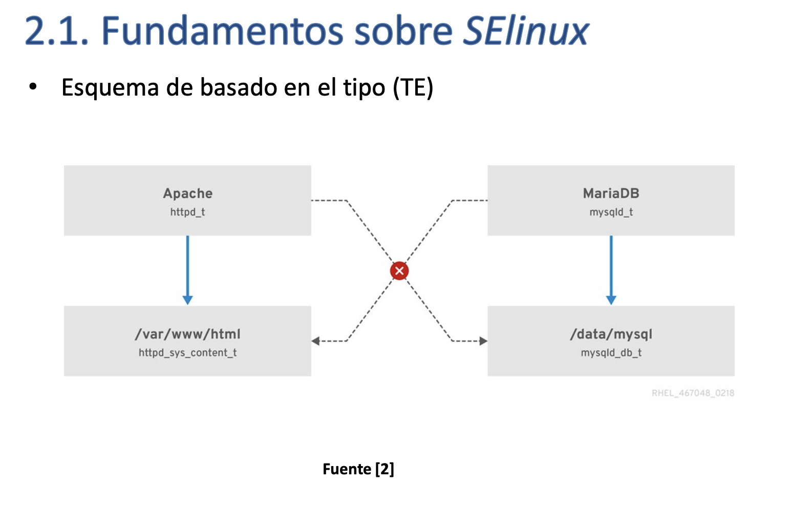
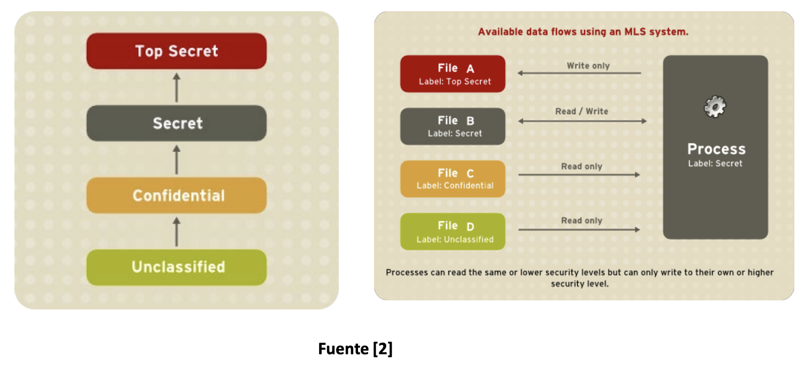
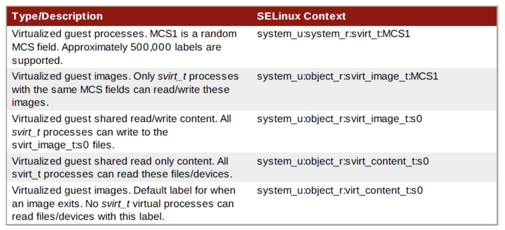

# Principios básicos de seguridad en sistemas anfitriones KVM Red Hat

## Índice

- [Principios básicos de seguridad en sistemas anfitriones KVM Red Hat](#principios-básicos-de-seguridad-en-sistemas-anfitriones-kvm-red-hat)
  - [Índice](#índice)
  - [1. Recomendaciones de seguridad en el sistema anfitrión](#1-recomendaciones-de-seguridad-en-el-sistema-anfitrión)
  - [2. Virtualización y el acceso controlado a los recursos](#2-virtualización-y-el-acceso-controlado-a-los-recursos)
    - [2.1. Fundamentos sobre _SELinux_](#21-fundamentos-sobre-selinux)
      - [2.1.1. Esquema de control de acceso basado en el tipo (_Type Enforcement (TE)_)](#211-esquema-de-control-de-acceso-basado-en-el-tipo-type-enforcement-te)
      - [2.1.2. Esquema de control de acceso basado en Seguridad Multinivel (_Multi-Level Security (MLS)_)](#212-esquema-de-control-de-acceso-basado-en-seguridad-multinivel-multi-level-security-mls)
      - [2.1.3. Configurando el modo de funcionamiento de _SELinux_](#213-configurando-el-modo-de-funcionamiento-de-selinux)
    - [2.2. Virtualización y _SELinux_](#22-virtualización-y-selinux)
      - [2.2.1. Etiquetas sVirt](#221-etiquetas-svirt)
  - [3. Virtualización y el control de tráfico de la red: cortafuegos](#3-virtualización-y-el-control-de-tráfico-de-la-red-cortafuegos)

## 1. Recomendaciones de seguridad en el sistema anfitrión

- [ ] Asegurarse de que se ejecuta el SELinux y asegurarse de que esté configurado adecuadamente. Se debe ejecutar en modo "eforcing".
- [ ] Solo se deben ejecutar los servicios y las aplicaciones que sean necesarias. Lo que no sea necesario debe ser eliminado o deshabilitado.
- [ ] Asegurarse de que se ejecuta el servicio de cortafuegos y asegurarse de que esté configurado adecuadamente. Solo deben estar habilidados aquellos puertos que sean necesarios.
- [ ] Solo deben existir aquellas cuentas de usuario que sean necesarias. Solo se debe permitir el accesso directa a aquellos usuarios que deban manejar el sistema anfitrión.
- [ ] Utilice una ubicación central para las instalaciones e imágenes de máquinas virtuales. Las imágenes de máquinas virtuales deben almacenarse en `var/lib/libvirt/images`.
- [ ] Asegurarse que el servicio de auditoría del sistema está habilitado y que el entorno de virtualización está configurado para que genere los registros de auditoría.
- [ ] La administración remota del sistema realizarla solo usando canales de red seguros.
- [ ] No permitir que las máquinas virtuales accedan directamente a dispositivos de almacenamiento de bloques completos (por ejemplo `/dev/sdb`). Como alternativa, se recomienda utilizar particiones o volúmenes lógicos para proporcionar almacenamiento a las máquinas virtuales.
- [ ] Evitar conectar dispositivos físicos de almacenamiento directamente a una máquina virtual si no está habilitado la funcionalidad SR-IOV.

## 2. Virtualización y el acceso controlado a los recursos

- **Entorno no virtualizado**: los sistemas están físicamente separados. Cada sistema posee sus servicios cuyas configuraciones están en el mismo sistema.



- **En un sistema anfitrión KVM**: Varios sistemas operativos pueden estar instalados en un único sistema anfitrión haciendo uso del núcleo del sistema operativo anfitrión.



- **Entorno virtualizado KVM**: Surgen nuevas amenazas potenciales con respectos a un sistema no virtualizado.

  - Si hay un fallo en la seguridad del sistema anfitrión, este puede afectar a los sistemas invitados.
  - Un fallo en la seguridad puede ser aprovechado para que un sistema invitado ataque a otro sistema invitado.



### 2.1. Fundamentos sobre _SELinux_

- **Discretionary Access Control List (DAC)**. Modelo básico de seguridad utilizado en sistemas Linux, basados en categorías de usuarios (`u`, `g`, `o` => `user`, `group`, `other`) y tipos de acceso (`r`, `w`, `x` => `read`, `write`, `execute`), es suficiente para proporcionar la seguridad adecuada.

- _SELinux_ es un caso de implementación del modelo \*\*_Mandatory Access Control (MAC)_. Su principio de funcionamiento:

  "Puede `<proceso>` Hacer `<acciones>` en `<objeto>`"

- En sistemas Linux primero se aplica el control de acceso básico (DAC) y si el acceso es permitido, entonces se aplica el control de acceso _SELinux_.

---

- En _SELinux_ el control de acceso se realiza en función de políticas que definen quién tiene acceso (sujetos) y a qué recursos (objetos).
- En _SELinux_:
  - Sujetos: son los procesos que intentan acceder a los recursos.
  - Objetos: son los discos, la memoria, los canales de comunicación, los archvios, etc.
  - Cada sujeto u objeto posee un conjunto de atributos de seguridad (contexto).
  - Servidor de seguridad lleva a cabo el control de seguridad mediante reglas (política de control de acceso).

---

- _SELinux_ soporta varios modelos MAC. Para sistemas de propósito general existen tres tipos:

  - _Strict_: es el modelo por defecto. Es el más restrictivo y se utiliza para sistemas de propósito general.
  - _Targeted_: es el modelo más flexible. Se utiliza para sistemas de propósito general.
  - _Custom_: es el modelo más personalizado. Se utiliza para sistemas de propósito específico.

- _SELinux_ ya forma parte de las distribuciones _Red Hat Enterprise Linux_ (RHEL) y sus derivadas (_Fedora_, _CentOS_, _Scientific Linux_, etc.)

---

- Las políticas implementadas:

  - Las escriben las distribuciones mediante un proceso de retroalimentación entre expertos en seguridad y usuarios de aplicaciones.
  - _Reference Policy_ (refpolicy): marco en el que están definidas
  - _Tresys Technology_ (Tresys): empresa que desarrolla y mantiene el _Reference Policy_ y otras políticas.ç

- _SELinux_ no es un cortafuegos. Es un sistema de control de acceso que se encarga de la seguridad de los recursos del sistema.

- _SELinux_ debe utilizarse en todo tipo de sistemas Linux. Modos de ejecución:
  - _Enforcing_: el sistema se ejecuta en modo _SELinux_.
  - _Permissive_: el sistema se ejecuta en modo _SELinux_ pero no se aplica el control de acceso.
  - _Disabled_: el sistema se ejecuta en modo _SELinux_ pero no se aplica el control de acceso.

¿Cómo saber en que modo se está ejecutando _SELinux_?

```bash
sestatus        # Ver el estado de SELinux
setenforce 0    # Deshabilitar SELinux
setenforce 1    # Habilitar SELinux
getenforce      # Ver el modo de ejecución de SELinux
```

El funcionamiento de _SELinux_ se basa en el concepto de "contexto SELinux" (o "etiqueta SELinux"). Un contexto SELinux es un conjunto de atributos que definen el contexto de un proceso o un objeto.

- Un contexto SELinux se compone de:

  - Usuarios (`_u`). Los usuarios _SELinux_ no coinciden con los del sistema anfitrión (`user_u`, `system_u`, `root_u`, etc.).
  - Roles (`_r`). El papel que juega un usuario _SELinux_ en el sistema (`sysadmin_r`, `user_r`, `root_r`, etc.).
  - Tipos (`_t`). Todas las entidades controladas por _SELinux_ se clasifican en categorías o tipos (`file_t`, `user_home_t`, `user_t`, etc.).
  - Nivel de seguridad (opcional)
    - Nivel de sensibilidad
    - Nivel de confidencialidad
  - Contextos (etiquetas) de procesos y objetos:

    ```
    Usuario : Role : Tipo : Nivel_sensibilidad : Nivel_confidencialidad
    ```

    ```
    system_u:system_r:xserver_t
    system_u:system_r:xserver_t:s0
    system_u:system_r:xserver_t:s0-s0:c0.c1023
    ```

  - Reglas:

    ```
    allow user_t user_home_t: file {create read write unlink};
    ```

---

En RHE, _SELinux_ proporciona un control de acceso:

- Basado en roles (_Role-Based Access Control (RBAC)_)
- Basado en el tipo (_Type Enforcement (TE)_)
- Seguridad multinivel (_Multi-Level Security (MLS)_)

---

- _SELinux_ proporciona un control de acceso:

  - Basado en roles (_Role-Based Access Control (RBAC)_)
  - Basado en el tipo (_Type Enforcement (TE)_)
  - Seguridad multinivel (_Multi-Level Security (MLS)_)

---

#### 2.1.1. Esquema de control de acceso basado en el tipo (_Type Enforcement (TE)_)

- _SELinux_ implementa un modelo de control de acceso llamado _Type Enforcement (TE)_, que asigna etiquetas de tipo (type labels) a procesos y archivos. Estas etiquetas definen explícitamente qué procesos pueden interactuar con qué recursos del sistema, reforzando el principio de mínimos privilegios.



```
+----------------+          X           +----------------+
|   Apache        |-------------------->|    MariaDB     |
|   (httpd_t)     |                     |   (mysqld_t)   |
+--------+--------+                     +--------+-------+
         |                                       |
         v                                       v
 /var/www/html                          /data/mysql
(httpd_sys_content_t)                  (mysqld_db_t)
```

**Accesos permitidos**:

- El proceso Apache (etiquetado como `httpd_t`) puede acceder a los archivos de contenido web en `/var/www/html` (etiquetado como `httpd_sys_content_t`).
- El proceso MariaDB (etiquetado como `mysqld_t`) puede acceder a sus archivos de base de datos en `/data/mysql` (etiquetado como `mysqld_db_t`).

**Comprobación en sistema real**:

```bash
# Ver el contexto de seguridad de un proceso (por ejemplo, Apache)
ps -eZ | grep httpd

# Ver el contexto de seguridad de un archivo o directorio
ls -Z /var/www/html
ls -Z /data/mysql
```

#### 2.1.2. Esquema de control de acceso basado en Seguridad Multinivel (_Multi-Level Security (MLS)_)

**¿Qué es el MLS?**

_SELinux_ permite aplicar un control de acceso obligatorio basado en niveles de sensibilidad de la información, siguiendo un enfoque jerárquico. Cada objeto (archivo, proceso) se etiqueta con un nivel de seguridad, como:

- Top Secret
- Secret
- Confidential
- Unclassified

Estos niveles no son arbitrarios: reflejan políticas gubernamentales/militares clásicas y se usan para evitar fugas de información entre niveles.



```
Top Secret
   ↑
Secret
   ↑
Confidential
   ↑
Unclassified
```

**Reglas de flujo de datos (derecha)**

- Un proceso con etiqueta Secret puede:

  - Leer datos etiquetados como:

    - Secret
    - Confidential
    - Unclassified

  - Escribir solo en:
    - Secret
    - Top Secret

El modelo MLS en SELinux clasifica los procesos y archivos en niveles jerárquicos de seguridad. Los procesos solo pueden leer información de su nivel o inferior, y escribir únicamente en su nivel o superior, para prevenir filtraciones de datos hacia niveles más bajos.

#### 2.1.3. Configurando el modo de funcionamiento de _SELinux_

Archivo: `/etc/selinux/config`

En vivo:

```bash
getenforce
# Permissive

setenforce 1
getenforce
# Enforcing

setenforce 0
getenforce
# Permissive
```

**Manejando contextos**:

- Visualizando:

```bash
id -Z
ls -Z /bin/bash
ps -Z
```

- Modificando:

```bash
chcon -t user_home_t /tmp/myfile    # Cambia el contexto de un archivo

semanage fcontext -a -t user_home_t /var/cache/myfile # Añade un contexto a un archivo
restorecon -v /var/cache/myfile     # Restaura el contexto de un archivo

newrole -r system_r -t unconfined_t # Cambia el rol de un proceso
runcon -u system_u /bin/bash        # Ejecuta un proceso con un contexto específico

restorecon /tmp/myfile              # Restaura el contexto de un archivo
```

**Arrancando servicios bajo el control de _SELinux_**:

- Arranque sin el control de _SELinux_:

```bash
/etc/init.d/sshd start              # Arranque del servicio SSH
# Starting OpenBSD Secure Shell server ssd [ OK ]

ps auxZ | grep sshd
# system_u:system_r:sshd_t:s0-s0:c0.c1023 1000 1000 0 00:00:00 ? 00:00:00 sshd: root@notty
```

- Arranque con el control de _SELinux_:

```bash
run_init /etc/init.d/sshd start     # Arranque del servicio SSH
# start Authenticating root
# Password:
# Starting OpenBSD Secure Shell server ssd [ OK ]

ps auxZ | grep sshd
# system_u:system_r:sshd_t:s0-s0:c0.c1023 1000 1000 0 00:00:00 ? 00:00:00 sshd: root@notty
```

**Ficheros de configuración globales **`etc/selinux`\*\*:

```
/etc/selinux/config         # Configuración global de SELinux
/etc/selinux/semanage.conf  # Configuración de SELinux
/etc/sestatus.conf          # Estado de SELinux
/etc/security/sepermit.conf # Permisos de SELinux
```

**Ficheros asociados a la política empleada**

- Ficheros de configuración de la política básicos: `/etc/selinux/<policy_name>`
- Ficheros "run-time asociados a la política empleada

### 2.2. Virtualización y _SELinux_

Entorno **sVirt**. Entorno de seguridad que permite que la seguridad del sistema anfitrión y los sistemas invitados estén bajo el control de _SELinux_.

- Definición uniforme de contextos para el sistema anfitrión y sus sistemas invitados.
- Aplicación uniforme de las reglas del sistema anfitrión y sus sistemas invitados.

Se requiere el paquete `policycoreutils-python-utils` para poder utilizar las herramientas de gestión de _SELinux_.

```bash
yum install policycoreutils-python-utils
```

#### 2.2.1. Etiquetas sVirt



| Type/Description                                                                                                                        | SELinux Context                        |
| --------------------------------------------------------------------------------------------------------------------------------------- | -------------------------------------- |
| Virtualized guest processes. MCS1 is a random MCS field. Approximately 500,000 labels are supported.                                    | `system_u:system_r:svirt_t:MCS1`       |
| Virtualized guest images. Only `svirt_t` processes with the same MCS fields can read/write these images.                                | `system_u:object_r:svirt_image_t:MCS1` |
| Virtualized guest shared read/write content. All `svirt_t` processes can write to the `svirt_image_t:s0` files.                         | `system_u:object_r:svirt_image_t:s0`   |
| Virtualized guest shared read only content. All `svirt_t` processes can read these files/devices.                                       | `system_u:object_r:svirt_content_t:s0` |
| Virtualized guest images. Default label for when an image exits. No `svirt_t` virtual processes can read files/devices with this label. | `system_u:object_r:virt_content_t:s0`  |

**Explicación**:

- `sVirt` es una extensión de _SELinux_ que aplica etiquetas de seguridad a procesos e imágenes de máquinas virtuales, con el objetivo de asegurar el aislamiento entre máquinas.
- Esto se logra utilizando **MCS (Multi-Category Security)**: un campo de categoría aleatoria que se asigna tanto a la VM como a sus imágenes. Solo los procesos etiquetados con el mismo `MCS` pueden interactuar entre sí.

Así, aunque dos VMs compartan el mismo sistema físico, _SELinux_ garantiza que una no pueda acceder a la otra, incluso si hay una brecha de seguridad.

**Ejemplo práctico**:

Supongamos que se lanza una máquina virtual con `virt-manager` o `virsh`. SELinux asigna automáticamente un contexto MCS único, por ejemplo:

```bash
ps -eZ | grep qemu  # Ver el contexto de seguridad de los procesos de las máquinas virtuales
```

Resultado:

```
system_u:system_r:svirt_t:s0:c127,c456  3512 ?  00:00:03 qemu-kvm
```

Y su disco aparece etiquetado como:

```bash
ls -lZ /var/lib/libvirt/images/*    # Ver el contexto de seguridad de los archivos de las imágenes de las máquinas virtuales
```

Resultado:

```
system_u:object_r:svirt_image_t:s0:c127,c456  vm1.qcow2
```

Esto asegura que solo el proceso `qemu` con ese `MCS` específico pueda acceder a la imagen `vm1.qcow2`.

**Variables booleanas que controlan al KVM lanzado por libvirt**:

| Entidad          | Significado                                                    |
| ---------------- | -------------------------------------------------------------- |
| virt_use_comm    | Permite a virt el uso de comunicaciones series y paralelas     |
| virt_use_fusefs  | Permite a virt leer archivos fuse                              |
| virt_use_nfs     | Permite a virt manejar sistemas de archivos NFS                |
| virt_use_samba   | Permite a virt manejar archivos CIFS                           |
| virt_use_sanlock | Permite a sanlock manejar archivos virt lib                    |
| virt_use_sysfs   | Permite a virt manejar la configuración de dispositivos PCI    |
| virt_use_xserver | Permite a las máquinas virtuales interactuar con el servidor X |
| virt_use_usb     | Permite a virt utilizar dispositivos USB                       |

**Configuración de las variables booleanas**:

```bash
semanage boolean -l     # Ver las variables booleanas
getsebool -a            # Ver las variables booleanas
getsebool virt_use_nfs  # Ver el estado de la variable booleana virt_use_nfs
setsebool virt_use_nfs on # Habilitar la variable booleana virt_use_nfs
setsebool -P virt_use_nfs on # Habilitar la variable booleana virt_use_nfs permanentemente (se guarda en el archivo de configuración)
```

## 3. Virtualización y el control de tráfico de la red: cortafuegos

- Paquetes ICMP, utilizados para la verificación de la red, deben ser aceptados. Si los paquetes ICMP no está permitidos, entonces, por ejemplo, no podrá realizar un ping a una máquina virtual.

- El puerto `22` debe estar abierto. Este puerto se utiliza para los acceso SSH y en la instalación.

- El puerto `80` o `443` (dependiendo de la configuración de seguridad en el Manager RHEV) se utiliza por el servicio `vdsm-reg` para intercambiar información sobre el sistema anfitrión.

- El rango de puertos `5634 - 6166` se utilizan para el acceso a las consolas de las máquinas virtuales, utilizando el protocolo SPICE.

- El rango de puertos `49152 – 49216` se utilizan en KVM para las operaciones de migración de máquinas virtuales. Cualquier puerto de este rango puede ser utilizado en este tipo de operaciones dependiendo del grado de concurrencia de estas.

- Se debe habilitar _IP forwarding_ (`net.ipv4.ip_forward = 1`) para el uso de bridge por defecto y para bridges compartidos. En la instalación de los paquetes de instalación esta opción de configuración se habilita.

- No se requiere la habilitación de _IP forwading_ cuando se utilizan dispositivos hardware _bridges_. Cuando una máquina virtual se conecta a través de un _bridge_ hardware, el tráfico se realiza en un nivel que no requiere configuración IP.
