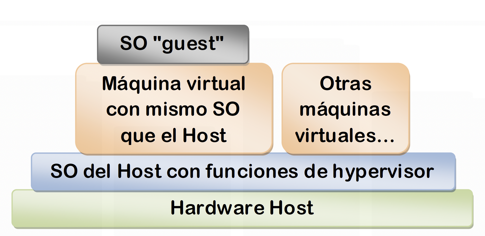

# 1. Fundamentos y tecnologías de Virtualización

## Tabla de Contenidos

- [1. Fundamentos y tecnologías de Virtualización](#1-fundamentos-y-tecnologías-de-virtualización)
  - [Tabla de Contenidos](#tabla-de-contenidos)
  - [1.1. Definición](#11-definición)
  - [1.2. Utilidad](#12-utilidad)
  - [1.3. Inconvenientes](#13-inconvenientes)
  - [1.4. Conceptos básicos](#14-conceptos-básicos)
  - [1.5. Un poco de historia](#15-un-poco-de-historia)
  - [1.6. Tipos de virtualización](#16-tipos-de-virtualización)
    - [Virtualización de recursos](#virtualización-de-recursos)
    - [Virtualización de la plataforma](#virtualización-de-la-plataforma)
      - [Virtualización Parcial](#virtualización-parcial)
      - [Virtualización Nativa](#virtualización-nativa)
      - [Emulación o simulación:](#emulación-o-simulación)
      - [Virtualización a nivel del Sistema Operativo](#virtualización-a-nivel-del-sistema-operativo)
      - [Paravirtualización:](#paravirtualización)
  - [1.7. Tipos de Hipervisores](#17-tipos-de-hipervisores)
    - [Tipo I o nativo ("Non-hosted" o "bare-metal")](#tipo-i-o-nativo-non-hosted-o-bare-metal)
    - [Tipo II o no nativo ("Hosted")](#tipo-ii-o-no-nativo-hosted)
  - [1.8. Virtualización basada en hipervisores versus virtualización a nivel de sistema operativo](#18-virtualización-basada-en-hipervisores-versus-virtualización-a-nivel-de-sistema-operativo)
    - [Diferencias:](#diferencias)
    - [Ventajas sobre la virtualización basada en hipervisores:](#ventajas-sobre-la-virtualización-basada-en-hipervisores)
  - [1.9. Cuestiones](#19-cuestiones)
  - [1.10. Glosario de términos](#110-glosario-de-términos)

## 1.1. Definición

- En general, se define como la abstracción de los recursos (normalmente la CPU, la memoria RAM y el disco duro) de un ordenador.

- En otras palabras: simular la existencia de un recurso que, a la hora de interactuar con él, no ofrezca diferencias aparentes con respecto al uso del recurso real.

- Luego, se puede entender por virtualización cosas tan simples como el particionado de un disco duro.

- Sin embargo, nos centraremos en la virtualización de máquinas al completo, pudiendo llegar a tener varias máquinas virtuales en un solo ordenador, sin tener en cuenta la configuración física del mismo.

> **Nota**: La virtualización proporciona una capa de abstracción que oculta la complejidad física subyacente, presentando interfaces lógicas simplificadas. Esto permite que múltiples entornos virtuales compartan recursos físicos mientras mantienen su independencia operativa.

> **Ejemplo práctico**: Un servidor físico con 8 núcleos y 32GB de RAM puede ejecutar simultáneamente 4 máquinas virtuales, asignando 2 núcleos y 8GB de RAM a cada una, permitiendo que cada máquina virtual funcione como si tuviera su propio hardware dedicado.

## 1.2. Utilidad

- Para un usuario de ordenador personal puede tener o no cierta utilidad.

- Es en los grandes servidores donde provoca un gran aumento de productividad.

- Ciertos análisis muestran que sólo se aprovecha entre un 20-30% de su capacidad de proceso.

- Gracias a la virtualización podríamos llegar a cargas superiores al 50%. Simulación de varios servidores que ofrezcan varios servicios en una misma máquina.

- Flexibilidad a la hora de dotar (aumentar o disminuir) recursos para los servidores virtualizados.

- Administración centralizada y mucho más simple de los servidores virtualizados.

- Mayor facilidad para la creación de entornos de test. Permite probar software en diferentes configuraciones hardware sin disponer de él físicamente.

- Proporciona aislamiento: fallos y problemas de seguridad en una máquina virtual no afecta a las otras maquinas.

- Reducción del hardware necesario.

- Reducción de los costes de software en el caso de que las licencias de software comercial limiten su uso por cada CPU o máquina física en la que se instalan. De esta forma, es posible pagar sólo una licencia e instalar múltiples copias sobre varias máquinas virtuales en la misma máquina física. Esta ventaja se produce cada vez menos.

- Migración en caliente de máquinas virtuales de un servidor físico a otro.

> **Ejemplo en entornos empresariales**: Una empresa con 10 servidores físicos (cada uno dedicado a una aplicación) operando al 25% de su capacidad podría consolidar esas cargas de trabajo en 3-4 servidores físicos mediante virtualización, reduciendo costes energéticos y de mantenimiento en más de un 60%.

> **Caso de uso**: Migración en caliente (_live migration_) - Un centro de datos puede trasladar una máquina virtual en ejecución desde un servidor que requiere mantenimiento a otro servidor activo sin interrumpir el servicio, manteniendo tiempos de actividad cercanos al 99.99%.

## 1.3. Inconvenientes

- **Rendimiento inferior**. Un sistema operativo ejecutándose en un hardware virtualizado nunca tendrá el mismo rendimiento que si estuviera directamente ejecutándose en una máquina física.

- Sólo se puede utilizar el hardware que esté gestionado o soportado por el software de virtualización utilizado.

- Rendimiento gráfico limitado.

- Una avería en el sistema de virtualización afecta a todas las entidades virtuales alojadas en él, lo cual puede ser nefasto dada la pérdida de servicio que se podría producir.

> **Análisis de degradación de rendimiento**: De media, las aplicaciones en entornos virtualizados experimentan una penalización del 5-15% en rendimiento de CPU y un 10-20% en operaciones de E/S intensivas. Sin embargo, estas cifras varían significativamente dependiendo de la tecnología de virtualización empleada y de las optimizaciones realizadas.

> **Consideración técnica**: El rendimiento gráfico limitado es especialmente notable en aplicaciones que utilizan aceleración 3D. Tecnologías como GPU passthrough y vGPU han mejorado esta situación, pero aún existen limitaciones en comparación con el acceso directo al hardware.

## 1.4. Conceptos básicos

- **Anfitrión** o **_host_**: máquina que posee el software de virtualización sobre el que se ejecutan las máquinas virtuales.

- **Huésped** o **_guest_**: la máquina virtual, la cual tiene un acceso limitado al hardware físico, debido al software de virtualización.

- **Hypervisor** o **_Virtual Machine Monitor_ (VMM)**: es la capa software que se encarga de manejar los recursos del sistema físico exportándolos a la máquina virtual. Es el núcleo de todo software de virtualización.

- **HVM (_Hardware-assitsted Virtual Machine_)**: máquinas virtuales que se benefician de las extensiones específicas de las CPU de Intel y AMD para mejorar el rendimiento de la virtualización. Dichas extensiones son **Intel-VT** y **AMD Pacífica**, respectivamente.

> **Aclaración técnica**: El hipervisor maneja diferentes tipos de recursos:
>
> - **Planificación de CPU**: Asigna tiempo de procesador a diferentes VMs
> - **Gestión de memoria**: Implementa paginación anidada para traducir direcciones
> - **Gestión de dispositivos de E/S**: Emula o pasa a través los dispositivos físicos
> - **Gestión de eventos**: Captura y maneja interrupciones para las máquinas virtuales

> **Ejemplo de extensiones de virtualización**: Las extensiones Intel VT-x y AMD-V permiten operaciones críticas como cambios en el estado de los registros CR3 (control de paginación) directamente sin intervención del hipervisor, reduciendo drásticamente la sobrecarga de virtualización.

## 1.5. Un poco de historia

**Virtualización de _mainframes_**

Fue IBM quien empezó a implementar la virtualización a mediados de los 60.

**Motivo**: particionar lógicamente los ordenadores centrales (_mainframes_) en máquinas virtuales independientes para poder ejecutar varias aplicaciones y procesos al mismo tiempo, con lo que se aprovechaba al máximo su inversión (los _mainframes_ eran recursos muy caros).

- El primer ordenador virtualizado, fue el IBM M44, que corría varias máquinas virtuales IBM 44X (aunque eran copias idénticas del M44). Objetivo: **multiprogramación**.

**Necesidad de la virtualización x86**

- La virtualización fue abandonada en las décadas de 1980 y 1990, ya que no tenía sentido un servidor con muchas máquinas virtuales. Debido a:

  - Aumento de las aplicaciones cliente-servidor.
  - Abaratamiento de los servidores y clientes (basados en la arquitectura x86).

- Con el paso del tiempo, el número de dichos servidores fue aumentando tremendamente, lo cual generó los problemas que ya sabemos de infrautilización de los recursos y aumento de costes de mantenimiento, entre otros.

**Virtualización completa del hardware x86**

- En 1999, VMware fue la primera en introducir la virtualización en los sistemas x86 para solucionar muchos de estos problemas de rendimiento.

- No resultó ser tan sencillo como en los anteriores mainframes, pues la arquitectura x86 no fue diseñada para admitir una virtualización completa.

- Como curiosidad; uno de los problemas que se encontraron es que, hay 17 instrucciones de x86 que provocan errores o funcionamientos anómalos cuando se virtualiza.

- VMware desarrolló una técnica que las "atrapa" cuando se generan y las convierte en instrucciones seguras que se pueden virtualizar.

> **Detalle técnico**: Las 17 instrucciones problemáticas pertenecen al conjunto de "instrucciones privilegiadas no atrapables" (como SGDT, SIDT, SLDT) que en x86 no generan una excepción cuando se ejecutan en modo usuario, pero tienen comportamientos diferentes en modo kernel, lo que impedía la virtualización transparente.

> **Técnica de Binary Translation**: Para solucionar este problema, VMware implementó traducción binaria al vuelo (BT), que inspecciona el código antes de ejecutarlo y reemplaza las instrucciones problemáticas con secuencias equivalentes pero virtualizables. Esta técnica introduce una sobrecarga del 15-20% pero permitió la virtualización completa antes de que existieran las extensiones VT-x/AMD-V.

## 1.6. Tipos de virtualización

### Virtualización de recursos

- **Encapsulamiento**: ocultación de la complejidad de un recurso mediante una interfaz simplificada.

- **Memoria virtual**: técnica realizada por el SO de un ordenador gracias a la cual las aplicaciones "creen" disponer de una memoria de trabajo contigua, cuando en realidad podría estar fragmentada e incluso con ciertos de esos fragmentos en el disco duro.

- **Virtualización de almacenamiento**: abstracción del almacenamiento físico (almacenamiento lógico). Ejemplo:

  - El particionado de un disco duro.
  - Un sistema de varios discos en RAID, aunque se "ven" como uno sólo.

- **Virtualización de red**: mediante el cual se crea uno o varios espacios de direccionamiento virtual en una subred.

- **Unión de canales de Ethernet**: consiste en utilizar varias interfaces de Ethernet que haya en un ordenador como si fueran una sola, con el objetivo de obtener redundancia (para reducir los errores) o aumentar la velocidad. Se suele llamar **RAIN** (_Redundant Array of Independenet Network interfaces_).

### Virtualización de la plataforma

- Es el tipo de virtualización más conocido.

- Consiste en esconder los recursos físicos del host al sistema operativo, mostrándole otra máquina (virtual) con la que trabaja realmente.

- Existen varias formas de hacer esto. Se diferencian básicamente por:

  - Cómo se implementa la máquina virtual.
  - Cuánto se implica el hardware en ella.

#### Virtualización Parcial

- Se virtualiza parte del hardware (especialmente el espacio de direccionamiento), pero no todo.
- Permite compartir recursos y, sobretodo, aislar los procesos.
- No permite varias instancias separadas de sistemas operativos invitados. No sería realmente una máquina virtual.

#### Virtualización Nativa

- Se virtualiza el hardware suficiente para permitir que un sistema operativo invitado, diseñado para la misma CPU que tiene el host (o con el mismo repertorio de instrucciones), se ejecute de forma aislada.
- El hypervisor puede usar virtualización por hardware. Si la CPU es compatible ("Hardware-assisted vitualization").
- Ejemplos: KVM, Xen,VirtualBox, VMware Workstation, VMware Server, etc

> **Mejora de rendimiento**: Con la virtualización asistida por hardware, las operaciones privilegiadas son manejadas directamente por el procesador (en lugar de por el hipervisor), reduciendo la sobrecarga de virtualización hasta en un 60% en cargas de trabajo intensivas de CPU.

> **Ejemplo técnico**: KVM (Kernel-based Virtual Machine) convierte el kernel de Linux en un hipervisor mediante un módulo cargable (`kvm.ko`), aprovechando las capacidades del planificador del kernel y la gestión de memoria para las máquinas virtuales.

#### Emulación o simulación:

- Igual a la anterior, pero el SO del sistema invitado está diseñado para una CPU con una arquitectura completamente diferente.
- Muy utilizado para permitir la creación de software para nuevos procesadores antes de que estén físicamente disponibles.
- No puede usar virtualización por hardware

> **Caso de uso**: QEMU puede emular diferentes arquitecturas como ARM, MIPS o PowerPC en un sistema x86, permitiendo el desarrollo y prueba de software para plataformas embebidas o IoT sin necesidad del hardware específico.

> **Rendimiento**: La emulación suele ser entre 10-100 veces más lenta que la ejecución nativa, ya que cada instrucción del sistema emulado debe traducirse a instrucciones del sistema anfitrión.

#### Virtualización a nivel del Sistema Operativo

- Las máquinas virtuales comparten el sistema operativo con el host.
- El kernel proporciona múltiples espacios de usuario aislados.
- Es el propio kernel del SO el que se usa para implementar el entorno de dichas máquinas virtuales.
- No obstante, las aplicaciones que corren en SO invitado lo siguen viendo como un sistema autónomo, al igual que en los anteriores tipos de virtualización.
- Ejemplos:
  - Virtuozzo (Linux)
  - Solaris Containers
  - HP-UX Containers
  - FreeBSD Jail
  - Sandboxie (Windows)
  - VMware ThinApp (Windows)

> **Tecnologías modernas**: Docker y LXC utilizan las características del kernel Linux como namespaces (para aislar recursos), cgroups (para limitar recursos) y seccomp (para filtrar llamadas al sistema), creando entornos aislados muy ligeros con una sobrecarga mínima.

> **Rendimiento**: Los contenedores tienen una penalización de rendimiento de apenas 1-5% comparado con la ejecución nativa, frente al 5-15% de las máquinas virtuales tradicionales.

#### Paravirtualización:

- El hypervisor ofrece una API especial que sólo puede usarse mediante la modificación del SO invitado (cosa que no era necesario en las técnicas anteriores).
- Las llamadas a dicha API se conocen como _hypercalls_.

- ¿Ventajas?
  - Menor complejidad del hypervisor.
  - Posibilidad de optimización desde el punto de vista del SO invitado, ya que este "es consciente" de que se está ejecutando en una máquina virtual.
  - Por ello la paravirtualización suele ser muy rápida

> **Detalles técnicos**: En la paravirtualización, el sistema operativo invitado reemplaza instrucciones privilegiadas con hypercalls explícitas. Por ejemplo, en lugar de ejecutar `cli` (clear interrupt flag) que requeriría intercepción, ejecuta una hypercall `HYPERVISOR_cli()` que puede ser manejada más eficientemente.

> **Ejemplo**: Xen implementa paravirtualización con backends y frontends para diferentes subsistemas. Para E/S de red, el controlador de red paravirtualizado (netfront) en el guest se comunica con el driver netback en el dom0 a través de anillos de memoria compartida, eliminando la necesidad de emular dispositivos de red físicos.

## 1.7. Tipos de Hipervisores

Depende de dónde se sitúe el hypervisor en la máquina host, se distinguen:

### Tipo I o nativo ("Non-hosted" o "bare-metal")

- El hypervisor interactúa directamente con el hardware del sistema anfitrión (como si él mismo fuera el SO).
- Ejemplos:
  - VMware ESX Server
  - Microsoft Hyper-V
  - Sun Logical Domains Hypervisor

> **Características de rendimiento**: Los hipervisores tipo I suelen ofrecer mejor rendimiento al eliminar la capa del sistema operativo anfitrión, con un overhead típico de sólo 5-10% en comparación con la ejecución nativa.

### Tipo II o no nativo ("Hosted")

- Se ejecutan como una aplicación en un sistema operativo existente.
- Su uso conlleva una sobrecarga de rendimiento porque deben utilizar el sistema operativo del host para acceder y coordinar los recursos del hardware del sistema anfitrión.
- Ejemplos:
  - VMware Workstation
  - Microsoft Virtual PC.

> **Caso de uso típico**: Los hipervisores tipo II son ideales para entornos de desarrollo y pruebas, donde la conveniencia de ejecutar máquinas virtuales junto con aplicaciones nativas supera las consideraciones de rendimiento.

## 1.8. Virtualización basada en hipervisores versus virtualización a nivel de sistema operativo

### Diferencias:

- En la virtualización a nivel de sistema operativo, las máquinas virtuales se gestionan de una manera muy similar a los procesos normales del sistema.
- Debido a esto es el sistema operativo el que controla los recursos asignados a la máquina virtual.
- Los sistemas basados en _hypervisor_, no dejan al sistema operativo el total control sobre el hardware, sino que es el _hypervisor_ el que se hace cargo de los drivers para discos, tarjetas de red, de video, etc.

> **Comparativa de densidad**: En el mismo hardware, la virtualización a nivel de SO puede soportar de 5 a 10 veces más instancias que la virtualización basada en hipervisores, debido a la eliminación de la sobrecarga de múltiples sistemas operativos completos.

> **Seguridad**: La virtualización basada en hipervisores ofrece mayor aislamiento, ya que cada VM tiene su propio kernel y espacio de memoria. Los contenedores comparten el kernel, por lo que un fallo de seguridad en el kernel podría comprometer todos los contenedores.

### Ventajas sobre la virtualización basada en hipervisores:

- El software de virtualización puede ser más pequeño, porque comparte más funcionalidades con el núcleo del sistema operativo.
- Se permiten usar funcionalidades del sistema operativo de muy bajo nivel, que normalmente no están soportadas en el _hypervisor_. Por ejemplo:
  - El escalado de frecuencia en la CPU
  - Suspender/recuperar en los portátiles.
- Si un dispositivo es controlado por el sistema operativo, entonces estará disponible en la máquina virtual.

> **Ejemplo comparativo de rendimiento**: Una aplicación web intensiva en E/S ejecutada en un contenedor Docker puede manejar hasta un 73% más de solicitudes por segundo que la misma aplicación en una VM tradicional, debido al acceso directo al sistema de archivos y a la red del host.

> **Eficiencia de recursos**: Los contenedores pueden iniciarse en milisegundos y ocupar apenas megabytes de memoria, mientras que las VMs tradicionales pueden tardar minutos en arrancar y ocupar gigabytes de RAM incluso con sistemas operativos mínimos.

## 1.9. Cuestiones

Sobre VirtualBox:

- ¿Qué tipo de virtualización realiza?
- ¿Su _hypervisor_ de qué tipo es?

Sobre KVM:

- ¿Qué tipo de virtualización realiza?
- ¿Su _hypervisor_ de qué tipo es?

Sobre la tecnología de contenedores:

- ¿De qué tipo de virtualización se trata?

> **Guía para resolver estas cuestiones**:
>
> - Analiza las características de cada tecnología mencionada
> - Revisa la sección 1.6 para identificar el tipo de virtualización
> - Consulta la sección 1.7 para determinar el tipo de hipervisor
> - Compara las especificaciones técnicas con las definiciones estudiadas

## 1.10. Glosario de términos

- **CPU virtual (vCPU)**: Representación lógica de un procesador físico asignado a una máquina virtual.
- **Memoria compartida transparente (TPS)**: Técnica que permite a múltiples VMs compartir páginas de memoria idénticas.
- **Over-commitment**: Práctica de asignar más recursos virtuales que los físicamente disponibles, aprovechando que no todas las VMs utilizan sus recursos al 100% simultáneamente.
- **Live migration**: Proceso de mover una VM en ejecución de un host físico a otro sin interrumpir su funcionamiento.
- **Snapshot**: Captura del estado completo de una máquina virtual en un momento específico, permitiendo revertir a ese estado posteriormente.
- **PCI Passthrough**: Técnica que asigna un dispositivo PCI físico directamente a una VM, proporcionando acceso nativo al hardware.
- **Ballooning**: Mecanismo para ajustar dinámicamente la memoria asignada a una VM según las necesidades del sistema.
