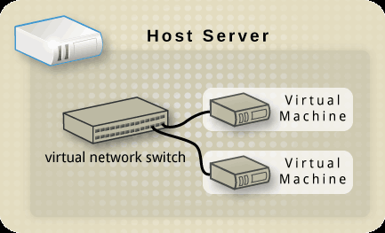
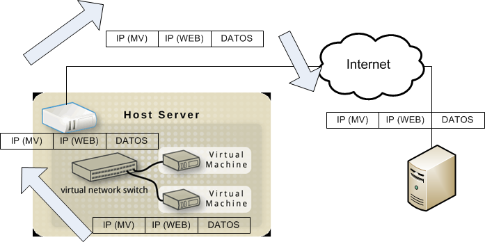
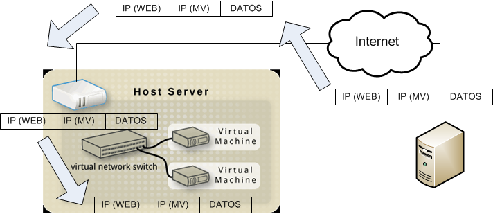
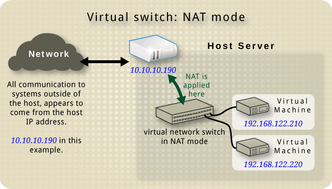
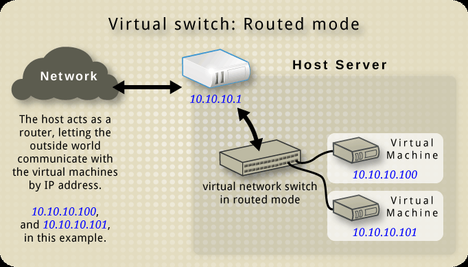
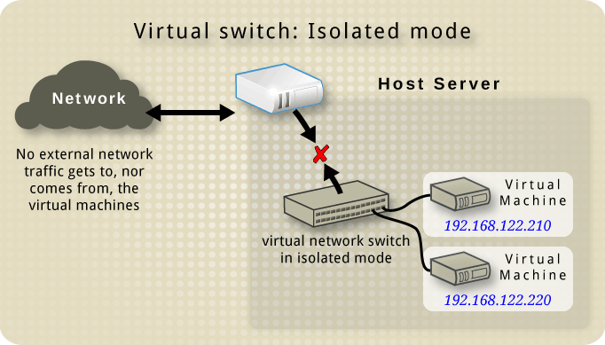
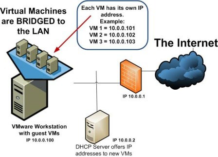

# 1. El sistema anfitrión y anatomía de la máquina virtual en KVM

## Índice

- [1. El sistema anfitrión y anatomía de la máquina virtual en KVM](#1-el-sistema-anfitrión-y-anatomía-de-la-máquina-virtual-en-kvm)
  - [Índice](#índice)
  - [Objetivos](#objetivos)
  - [1.1. Principales componentes](#11-principales-componentes)
  - [1.2. Funcionalidades principales](#12-funcionalidades-principales)
  - [1.3. Limitaciones](#13-limitaciones)
  - [1.4. La interfaz de virtualización](#14-la-interfaz-de-virtualización)
  - [1.5. Archivos de configuración XML](#15-archivos-de-configuración-xml)
  - [1.6. Recursos de la máquina virtual (MV)](#16-recursos-de-la-máquina-virtual-mv)
  - [1.7. Almacenamiento](#17-almacenamiento)
  - [1.8. Recursos virtuales de red](#18-recursos-virtuales-de-red)
    - [Switch virtual](#switch-virtual)
    - [Red NAT](#red-nat)
    - [Red enrutada](#red-enrutada)
    - [Red aislada](#red-aislada)
    - [Interfaz modo puente (_bridge_)](#interfaz-modo-puente-bridge)
  - [1.9. Bibliografía](#19-bibliografía)

## Objetivos

- Dar una visión general de KVM
  - Sus principales componentes.
  - Sus principales características y funcionalidades.

## 1.1. Principales componentes

- **_Kernel-based Virtual Machine_ (KVM)** es una tecnología de virtualización completa para sistemas anfitriones Linux.
- Su implementación tiene como principales componentes:
  - **Módulos (kVM\*)** que se integran en el núcleo. Estos módulos hacen más eficiente la virtualización. Módulos `kVM` y `kVM-Intel`.
  - **“_Quick Emulator_” (QEMU)** que emula los sistemas invitados. Cada sistema invitado en ejecución da lugar a un proceso en el sistema anfitrión. Procesos con nombre “`qemu-system-x86`”
  - Librería **libvirt** para el manejo del hypervisor:
    - API libvirt.
    - Aplicaciones. Como por ejemplo `virsh`, `virt-manager`, `virt-install`, etc.

**Arquitectura KMV**


## 1.2. Funcionalidades principales

- **_CPU and memory Overcommitting_**. Sobrecarga de CPU y memoria.
- **_Kernel Same-page Merging (KSM)_**.Las MVs pueden compartir páginas de memoria.
- En cada sistema operativo invitado se ejecuta un agente (**`qemu-guest-agent`**) que permite al sistema anfitrión controlar a los sistemas operativos invitados.
- Posibilidad de limitar las operaciones E/S de disco (_**Disk I/O throttling**_) en los sistemas huéspedes (orden blkdeviotune de virsh)
- **_Automatic NUMA balancing_**. En sistemas anfitriones con arquitectura NUMA, la asignación de CPUs a tareas se tiene en cuenta las áreas de memoria utilizadas por las tareas.
- **_Virtual CPU_ (VCPU) hot add**. Se puede aumentar el número de CPUs virtuales de una MV, estando ésta en ejecución.
- **Virtualización anidada (_Nested virtualization_)**. En una MV se puede ejecutar KMV para funcionar como un sistema anfitrión.

## 1.3. Limitaciones

- Para sistemas anfitriones: https://access.redhat.com/articles/rhel-limits
- Para MVs: https://access.redhat.com/articles/rhel-kMV-limits

## 1.4. La interfaz de virtualización

El paquete **libvirt**:

- Proporciona una **API de virtualización estable** (desarrollado en C).
- Independiente del hypervisor.
- Interactúa con el sistema operativo para sacar provecho de las capacidades de virtualización.
- Incluye:
  - Una capa de virtualización para manejar de manera segura los sistemas invitados en el sistema anfitrión.
  - Una interfaz para el manejo de sistemas anfitriones localmente o remotamente usando protocolos seguros.
  - Las utilidades `virsh` y `virt-manager` son las herramientas principales.

## 1.5. Archivos de configuración XML

- Se utilizan para especificar las configuraciones de los sistemas invitados e infraestructuras virtualizadas de almacenamiento y red definidos en el sistema anfitrión.
- Para el manejo de estos archivos de configuración XML, se debe utilizar:
  - Órdenes ejecutadas a través de `virsh`.
  - Acciones realizadas a través de `virt-manager`.
  - Orden `virt-xml`.
  - Excepcionalmente utilizando la orden `virsh edit`.
  - **No editar directamente los archivos de configuración**.

Cuestiones de interés:

- ¿Dónde están ubicados estos archivos de configuración?
- ¿Cómo se registran los cambios no permanentes en las configuraciones?

## 1.6. Recursos de la máquina virtual (MV)

- **CPU virtual (VCPU)**:
  - En Red Hat Enterprise (RHE) 7.2 y versiones superiores, los sistemas anfitriones pueden asignar a un sistema invitado hasta un máximo de 240 VCPUs, independientemente del número de CPUs lógicas que posea el sistema anfitrión.
  - CPU lógica en un sistema anfitrión: cada hilo de ejecución que se puede ejecutar en un núcleo de procesador.

- **Las MVs pueden utilizar tres tipos de dispositivos**:
  - Dispositivos emulados.
    - Dispositivos básicos (core devices).
    - Controladoras.
  - Dispositivos paravirtualizados.
  - Dispositivos físicos del anfitrión.

- **En virtualización nativa, una MV utiliza un procesador idéntico al del anfitrión**.
  - Las instrucciones no privilegiadas son ejecutadas por un procesador del anfitrión.
  - Las instrucciones privilegiadas son ejecutadas de forma segura mediante hypervisor.
  - Cada procesador de una MV posee su propio repertorio de registros, buffers y estructuras de control.
  - Si el anfitrión posee varios procesadores, entonces una MV podrá disponer de varios procesadores virtuales.

- El **acceso a memoria principal de una MV se realiza a través del hypervisor**, que:
  - Proporciona a la MVs un espacio de memoria contiguo.
  - Mapea las memorias de la MVs en los dispositivos de almacenamiento del anfitrión de virtualización. Esto se realiza de forma transparente a las MVs.
- **Memoria no paginada** es aquella que siempre reside en memoria principal. Ideal si priorizamos el <ul>rendimiento</ul>.
- **Memoria paginada** es aquella que puede ser transferida al área de intercambio. Ideal si priorizamos la <ul>escalabilidad</ul>.
- MVWare y KVM permiten utilizar ambos tipos de memoria en una MV.
- Virtual Box, Microsoft Virtual PC y Virtual Server sólo utilizan memoria no paginada.

- Dispositivos básicos emulados en KVM: proporcionan las funcionalidades básicas.
  - Intel i440FX host PCI bridge.
  - PIIX3 PCI to ISA bridge.
  - PS/2 mouse and keyboard.
  - EvTouch USB graphics Tablet.
  - PCI UHCI USB controller and a virtualized USB hub.
  - Emulated serial ports.
  - EHCI controller, virtualized USB storage and a USB mouse.
  - USB 3.0 xHCI host controller (Technology Preview in Red Hat Enterprise Linux 7.3).

- **Controladoras emuladas**: dan lugar a una capa entre el sistema invitado y el núcleo Linux del sistema anfitrión (que gestiona el dispositivo fuente).
  - La traducción entre la capa de la controladora emulada y el núcleo Linux la realiza el hypervisor.
  - Cualquier dispositivo del mismo tipo (almacenamiento, red, teclado o ratón) que sea reconocido por el núcleo de Linux puede utilizarse como dispositivo fuente de las controladoras emuladas.

- Controladoras emuladas:
  - Controladoras de almacenamiento.
  - Controladora IDE.
  - Controladora de disco flexible (floppy).
  - Controladora de sonido.
  - Controladora de gráficos.
  - Controladora de red.
  - Controladora de watchdog.

- Dispositivos paravirtualizados:
  - Aumentan el flujo de E/S.
  - Disminuyen los tiempos de latencia de E/S.
  - Aportan nuevas funcionalidades a los sistemas invitados.

- La API **`virtio`** hace de capa intermedia entre el sistema invitado y el sistema anfitrión.
- Un dispositivo paravirtualizado posee dos partes:
  - El dispositivo en el sistema anfitrión.
  - El manejador de dispositivo en el sistema invitado.
- Es recomendable, siempre que sea posible, utilizar dispositivos paravirtualizados frente a dispositivos emulados.

<!-- TODO: diferencias entre dispositivos emulados y paravirtualizados. -->

- Tipos de dispositivos paravirtualizados:
  - Dispositivo de red (virtio-net).
  - Dispositivo de almacenamiento de bloque (virtio-blk).
  - Controladora ISCSI (virtio-scsi).
  - Dispositivo de comunicación serie (virtio-serial).
  - Reloj.
  - Dispositivo de memoria balloon (virtio-ballon).
  - Generador de números aletaorios (virtio-rng).
  - Controladora gráfica (QXL).

--- 

- **Dispositivos físicos del sistema anfitrión**. Ciertas plataformas hardware de los sistemas anfitriones permiten utilizar directamente sus recursos hardware a las MVs.
  - En virtualización este proceso es conocido como “asignación de dispositivo” o también “paso a través” (_passthrough_).

  - Tipos de recursos del sistema anfitrión que se pueden asignar a un sistema invitado:
    
    - CPU.
    - Zonas de memoria principal.
    - Tarjetas controladoras.
    - Unidades de discos y particiones de disco.
    - Controladoras de red.

---

Actualmente los sistemas modernos ofrecen funcionalidades de DMA y reasignación de interrupciones para garantizar que las transferencias de E/S se realicen dentro de unos límites establecidos previamente.

  - Sistemas Intel: VT-d.
  - Sistemas AMD: AMD-Vi.

- Se trata de una funcionalidad especialmente interesante en sistemas anfitriones, ya que:
  - Facilita el aislamiento de las operaciones de E/S que realizan las MVs.
  - Mejora el rendimiento de las operaciones de E/S.
  - Reducen la carga de trabajo de las CPUs del sistema anfitrión.

- _Virtual Function I/O_ (VFIO) es un manejador de dispositivo PCI del kernel Linux que posibilita transferencias entre los dispositivos de E/S y el espacio de memoria de usuario de manera segura, utilizando la funcionalidad IOMMU del procesador.
- Utilizando VFIO, en RHE 7. se pueden conectar hasta 32 dispositivos PCI a una MV, siendo posible conectar tarjetas NVIDIA GPU.

---

**Virtualización de E/S de raíz única (_Single Root I/O Virtualization_, SR-IOV)**. Funcionalidad de la arquitectura _Peripheral Component Interconnect express_ (PCIe) que posibilita el uso compartido del bus PCIe entre las máquinas virtuales.

- La operatoria con SR-IOV se desarrolla en dos ámbitos:

  - **Funciones físicas (PF)**. Repertorio completo de funciones que poseen los dispositivos PCIe que incluyen las capacidades SR-IOV y habilidades para mover datos dentro y fuera del dispositivo.
  - **Funciones virtuales (VF)**. Funciones PCIe "ligeras" que contienen los recursos necesarios para el movimiento de datos en un dispositivo PCIe, pero con un conjunto de recursos de configuración mínimo. Cada VF está asociada a un PF de un dispositivo.

- Uso típico de SR-IOV: a una MV se le puede asignar una función virtual de SR-IOV (VF) para la conexión de red. El sistema invitado y el adaptador físico intercambian datos directamente.

- Ventajas de asignar VF a una MV:
  - Las VF tienen un rendimiento casi nativo.
  - Baja latencia: al conectar directamente una VF a una MV, se omite el proceso de software, ya que la máquina virtual está conectada directamente a un componente de hardware.
  - Se mejora la escalabilidad del anfitrión: al conectar directamente las VF, se evita el uso de la CPU, lo que significa que hay más CPU disponible para las aplicaciones de las MVs.
  - La protección de datos entre MVs está garantizada porque a cada PF y VF se le asigna un Identificador de Solicitante (RID) único que permite a una unidad de administración de memoria de E/S (IOMMU) diferenciar entre diferentes flujos de tráfico ocasionados por las Mvs.

## 1.7. Almacenamiento

Los dispositivos de almacenamiento utilizados por las MVs pueden ser:

- Unidades virtuales (archivos de imagen de disco).
  - Asociadas a controladoras paravirtualizadas.
  - Asociadas a controladoras emuladas.
- Unidades físicas (discos o particiones de disco) de almacenamiento del sistema anfitrión. 
- Volúmenes lógicos (LVM) definidos en el sistema anfitrión.
- Vólumenes de almacenamiento proporcionados por sistemas de almacenamiento en red (NFS, iSCSI, etc.).

---

**Contenedor de almacenamiento**. Es una abstracción que proporciona:

- El espacio reservado para albergar los volúmenes.
- Las funcionalidades requeridas de seguridad, rendimiento y facilidad para administrar este espacio.
- Los contenedores se pueden desplegar en:
  - Espacios de almacenamiento local: directorios, discos físicos, particiones y volúmenes lógicos.
  - Almacenamiento compartido mediante protocolos de red: NFS, iSCSI, …

---

Las **imágenes de disco** de una MV se implementan usando uno o varios archivos en el sistema anfitrión. Con ello se consigue:

- Robustez.
- Movilidad.

Propiedades de imágenes de disco:

- Expansión dinámica (_Dynamically Expanding/Dinamic Disk_).
- Se reserva su tamaño al crearlo (_Fixed/Prellocated Disk_).
- Se asocia a un disco físico o partición física (_Linked/Physical Disk_).
- Las escrituras se realizan en primera instancia en un archivo temporal y luego se realizan en el disco virtual (_Undo/Undoable Disk_). Se pregunta al finalizar la ejecución de la MV.
- Las escrituras se realizan en el momento que el sistema operativo MV las ordena (_Persistent Disk_) o se pueden descartar y se puede volver a un estado inicial cuando la MV se reinicia (_Nonpersistent Independent Disk_).
- Los accesos se guardan en un archivo de log de sesión y posteriormente de forma voluntaria se actualiza el disco (_Append Disk_)
- El contenido de un disco se representa mediante una estructura jerárquica de imágenes (_Differencing Disks_). Se parte de una imagen inicial (baseline virtual disk) y se van generando imágenes adicionales (_child disks_).
- Tamaño dinámico (_Resizing Disk_).

Las propiedades soportadas dependen del formato utilizado en la creación de la imagen de disco.

---

Formatos de imágenes de disco soportados por libvirt:

- `raw`: un archivo sin formato, suelen tener extensión **.img**.
- `dmg`: Formato de imagen de disco de Mac.
- `iso`: formato ISO para CDROM, DVD.
- **`qcow` y `qcow2`**: nativos de QEMU v1 y v2.
- `MVdk`: nativo de Mvware.
- `parallels`: nativo de Parallels.
- `vdi`: nativo de VirtualBox.
- `vpc`: nativo de VirtualPC.
- `vvfat`: sistema de archivos vfat.

## 1.8. Recursos virtuales de red

Se estructuran en base a dos conceptos.

- **Controladora de red (NIC)**
  - Controladora emulada.
  - Controladora paravirtualiazada.
  - Controladora del anfitrión conectada a la MV

- **Switch virtual**. Se implementan mediante filtros de red proporcionados por `libvirt` y reglas del cortafuegos del sistema anfitrión
  - Red virtual aislada. Se implementan mediante filtros de red manejados por libvirt.
  - Red virtual de tipo NAT. Se implementan utilizando reglas del cortafuegos del sistema anfitrión.
  - Red virtual de tipo enrutada. Se implementan utilizando reglas del cortafuegos del sistema anfitrión.

- Bridge del sistema anfitrión que se asocia a una NIC de las MVs.

---

### Switch virtual

Un **switch virtual** representa una red virtual conectada con el anfitrión.

- La comunicación entre redes virtuales y con el exterior es gestionada por el anfitrión.
- El anfitrión realiza funciones de enrutador.



- Flujo de paquetes (ida):



- Flujo de paquetes (vuelta):



En Linux el **switch virtual** se muestra como una interface de red.

- La primera vez que se inicia crea la interface **virb0**
- Las redes virtuales pueden operar en tres modos:
  - Red NAT
  - Red enrutada
  - Red aislada
- Su modo de operación lo define la configuración el cortafuego (_iptables_).
- La interface **virb0** representa a una red NAT cuyo nombre es default.

---

### Red NAT
- Se usa
  - MV con direcciones privadas
  - Conexión al exterior

➡️ Hacer NAT sobre la dirección fuente

```bash
-A POSTROUTING -s 192.168.11.0/24 ! -d 192.168.11.0/24 -o virbr0-nic -j MASQUERADE
```

- Si se desea conectarse desde el exterior
  - Desvío de puerto explícito con iptables



---

### Red enrutada

Se usa
- MV con direcciones reales (enrutables)
- Conexión al exterior

➡️ Permitir acceso hacia y desde el exterior

```bash
-A FORWARD -d 193.16.100.0/24 -o virbr1-j ACCEPT
-A FORWARD -s 193.16.100.0/24 -i virbr1-j ACCEPT
```



---

### Red aislada

Se usa
- MV sin conexión

➡️ Impedir el acceso

```bash
-A FORWARD-o virbr2-j REJECT--reject-with icmp-port-unreachable
-A FORWARD-i virbr2-j REJECT--reject-with icmp-port-unreachable
```



---

### Interfaz modo puente (_bridge_)

- Para conectar MVs a la misma LAN que el host físico
- Se define un puente (_bridge_) al que se conecta el anfitrión y a las MVs.
- Las MVs conectadas al _bridge_ poseen direcciones de la misma red que la interface física.




## 1.9. Bibliografía

- Red Hat Enterprise Linux 7. Virtualization Getting Started Guide.
- Red Hat Enterprise Linux 7. Virtualization Tuning and Optimization Guide.
