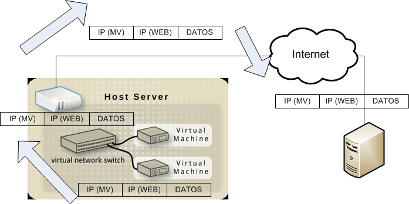
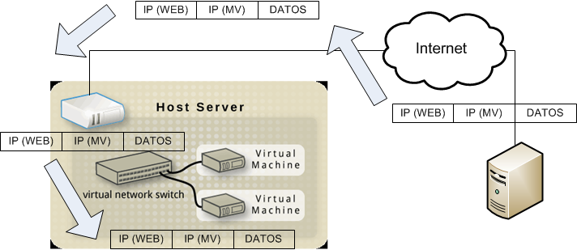
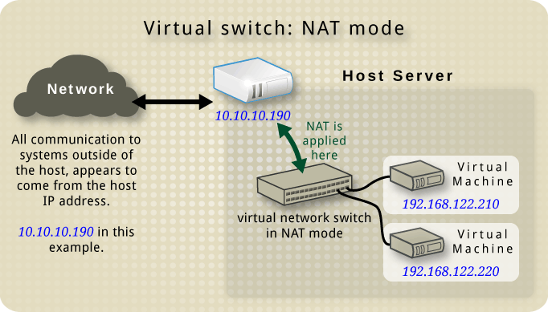
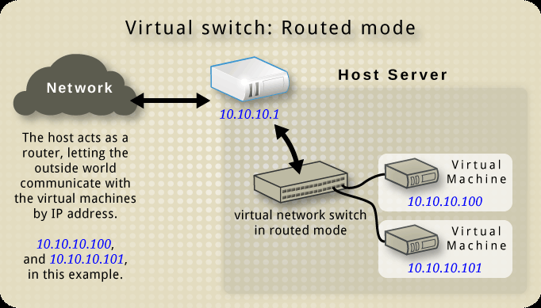
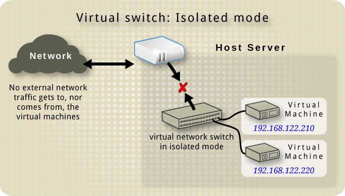
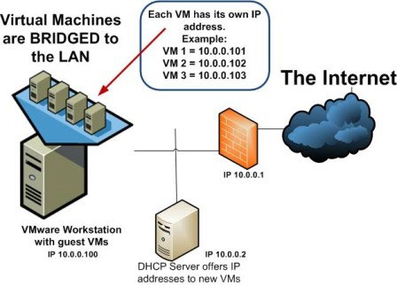

# Recurso de red en KVM

## Tabla de Contenidos

- [Recurso de red en KVM](#recurso-de-red-en-kvm)
  - [Tabla de Contenidos](#tabla-de-contenidos)
  - [Introducción](#introducción)
  - [Switch virtual](#switch-virtual)
    - [Ideas generales](#ideas-generales)
    - [Ciclo de vida](#ciclo-de-vida)
    - [Red NAT](#red-nat)
    - [Red enrutada](#red-enrutada)
    - [Red aislada](#red-aislada)
  - [Interfaz modo Bridge](#interfaz-modo-bridge)
  - [Bibliografía](#bibliografía)

## Introducción

Las distintas plataformas de virtualización proporcionan recursos para virtualizar los componentes básicos de una red:

- Controladores de red (NICs)
- Switches virtuales
  - Redes NAT
  - Redes enrutadas
  - Redes aisladas
- Bridges

Soportando protocolos y servicios, tales como:

- DHCP
- TCP/IP
- NAT

## Switch virtual

### Ideas generales

Cada **_switch_ virtual** representa una **red virtual** conectada con el anfitrión.

La comunicación entre redes virtuales y con el exterior es gestionada por el anfitrión

- El anfitrión realiza funciones de enrutador


| Flujo de paquetes (ida)                                                               | Flujo de paquetes (vuelta)                                                               |
| ------------------------------------------------------------------------------------- | ---------------------------------------------------------------------------------------- |
| MV -> Switch virtual                                                                  | Switch virtual -> MV                                                                     |
| Switch virtual -> MV                                                                  | MV -> Switch virtual                                                                     |
|  |  |

**Ideas Generales**

- En Linux, el **_switch_ virtual** se muestra como una interfaz de red.
- La primera vez que se inicia crea la interfaz **virbr0**
- Las redes virtuales pueden operar en tres modos:
  - Red NAT
  - Red enrutada
  - Red aislada
- Su modo de operación lo define la configuración del cortafuego (_iptables_)
- La interfaz **virbr0** representa a una red NAT cuyo nombre es _default_.

### Ciclo de vida

**Definición** (`virsh net-define path_fich_config`)

```bash
virsh net-define ./Mi_Red_Virtual.xml
```

**Activación** (`virsh net-start Identificador_Red`)

```bash
virsh net-start Mi_Red_Virtual
```

**Configurar para que se active con el arranque del sistema** (`virsh net-autostart Identificador_Red`)

```bash
virsh net-autostart Mi_Red_Virtual
```

**Desactiva** (`virsh net-destroy Identificador_Red`)

```bash
virsh net-destroy Mi_Red_Virtual
```

**Eliminar** (`virsh net-undefine Identificador_Red`)

```bash
virsh net-undefine Mi_Red_Virtual
```

### Red NAT

Se usa:

- MV con direcciones privadas
- Conexión al exterior

- **=>** Hacer NAT sobre la dirección fuente

`-A POSTROUTING -s 192.168.11.0/24 ! -d 192.168.11.0/24 -o virbr0-nic -j MASQUERADE`

Si se desea conectarse desde el exterior => desvío de puertos explícito con _iptables_.

`-A PREROUTING -d 192.168.11.100 -p tcp --dport 80 -j DNAT --to-destination 192.168.11.100:8080`



Ejemplo de fichero de configuración (`/etc/libvirt/qemu/networks`):

```xml
<network>
    <name>default</name>
    <uuid>313ed879-0e88-4b5d-873e-f515d26aff4c</uuid>
    <forward mode='nat'>
        <nat>
            <port start='1024' end='65535'/>
        </nat>
    </forward>
    <bridge name='virbr0' stp='on' delay='0'/>
    <mac address='52:54:00:09:7e:2b'/>
    <ipaddress='192.168.122.1' netmask='255.255.255.0'>
        <dhcp>
            <range start='192.168.122.2' end='192.168.122.254'/>
        </dhcp>
    </ip>
</network>
```

### Red enrutada

Se usa:

- MV con direcciones reales (enrutables)
- Conexión al exterior

- **=>** Permitir acceso hacia y desde el exterior

```bash
-A FORWARD -d 193.16.100.0/24 -o virbr1 -j ACCEPT
-A FORWARD -s 193.16.100.0/24 -i virbr1 -j ACCEPT
```



### Red aislada

Se usa:

- Sin conexión con el exterior de la red aislada

- **=>** Impedir el acceso

```bash
-A FORWARD -o virbr2 -j REJECT --reject-with icmp-port-unreachable
-A FORWARD -ivirbr2 -j REJECT --reject-with icmp-port-unreachable
```



Ejemplo de fichero de configuración (`/etc/libvirt/qemu/networks`):

```xml
<network>
    <name>Admin_Aislada</name>
    <uuid>ef5eb8c5-9088-4c5d-9063-540010feff25</uuid>
    <bridge name='virbr4' stp='on' delay='0'/>
    <mac address='52:54:00:ef:cf:07'/>
    <domain name='Admin_Aislada'/>
    <ipaddress='192.168.100.1' netmask='255.255.255.0'>
        <dhcp>
            <range start='192.168.100.128' end='192.168.100.254'/>
        </dhcp>
    </ip>
</network>
```

## Interfaz modo Bridge

- Para conectar máquinas virtuales a la misma LAN que el host físico. 

- Se define un **_bridge_** virtual al que se conecta el anfitrión y los huéspedes. 

  - Los huéspedes conectados al bridge poseen direcciones de la misma red que la interfaz física del anfitrión.

- La definición se realiza mediante los ficheros de configuración de las interfaces de red del sistema anfitrión (`/etc/sysconfig/network-scripts/`)

- Una vez definido correctamente, entonces aparece como una opción de configuración del hardware de red de las máquinas virtuales.



## Bibliografía

- Red Hat Enterprise Linux 7. Virtualization Deployment and Administration Guide
- https://wiki.libvirt.org/page/Networking
