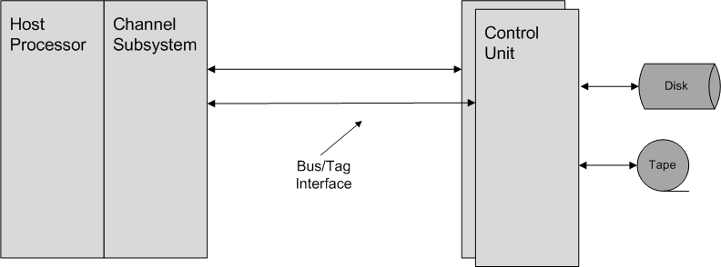
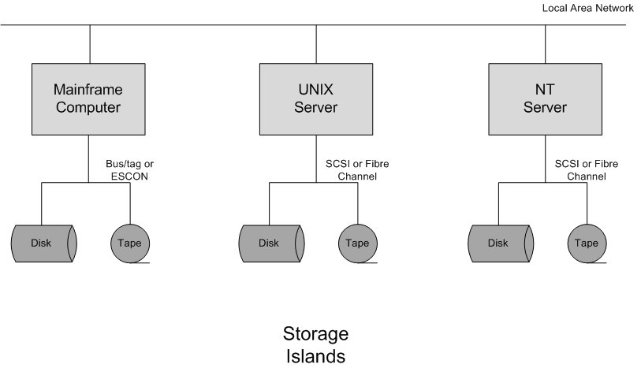
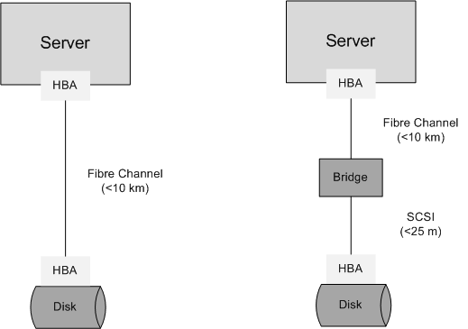
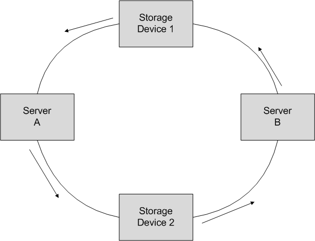
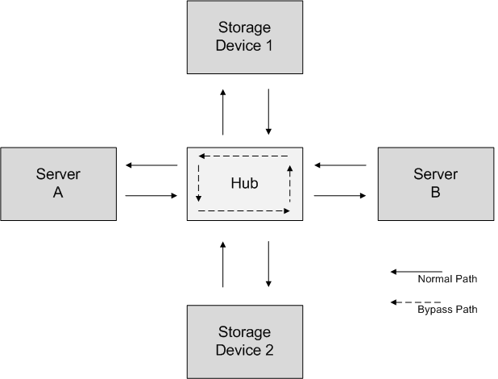
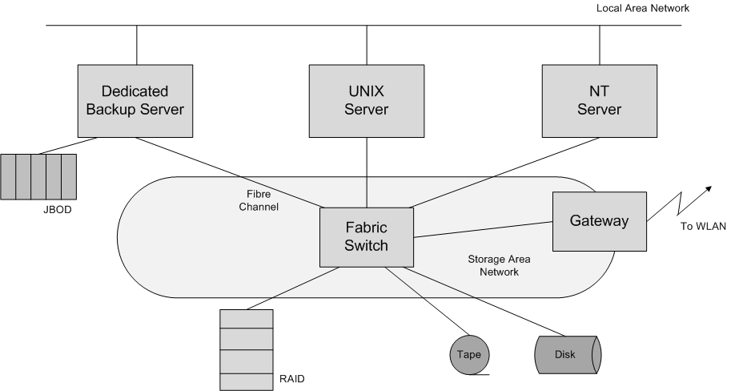
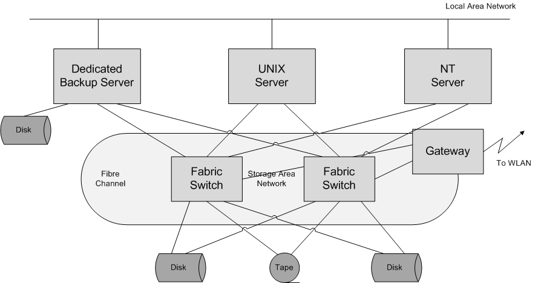
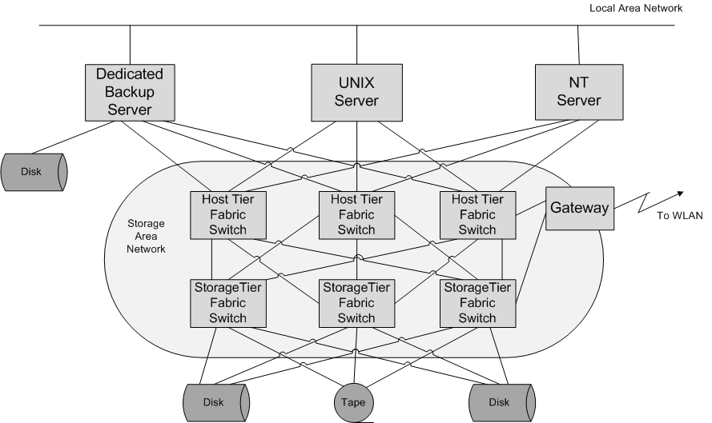
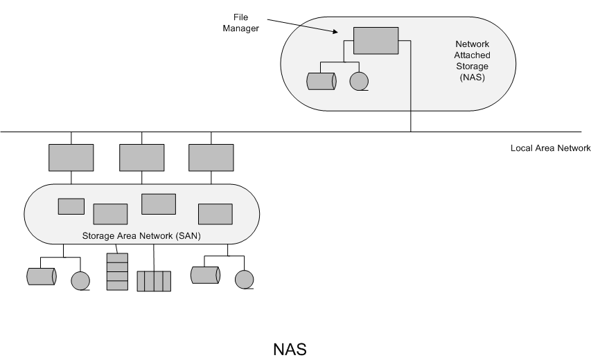

# 4. Sistemas de Almacenamiento Distribuido

## Tabla de Contenidos

- [4. Sistemas de Almacenamiento Distribuido](#4-sistemas-de-almacenamiento-distribuido)
  - [Tabla de Contenidos](#tabla-de-contenidos)
  - [4.1. Introducción a los Sistemas de Almacenamiento Distribuido](#41-introducción-a-los-sistemas-de-almacenamiento-distribuido)
    - [4.1.1. Definición](#411-definición)
    - [4.1.2. Objetivos](#412-objetivos)
    - [4.1.3. Definición de red de almacenamiento](#413-definición-de-red-de-almacenamiento)
    - [4.1.4. Evolución histórica](#414-evolución-histórica)
    - [4.1.5. Terminología relacionada](#415-terminología-relacionada)
      - [Local Area Network (LAN)](#local-area-network-lan)
      - [Wide Area Network (WAN)](#wide-area-network-wan)
      - [Storage Area Network (SAN)](#storage-area-network-san)
      - [Niveles OSI](#niveles-osi)
      - [Network attached Storage (NAS)](#network-attached-storage-nas)
      - [Almacenamiento compartido](#almacenamiento-compartido)
      - [RAID](#raid)
      - [Spanning](#spanning)
      - [Disk Mirroring](#disk-mirroring)

## 4.1. Introducción a los Sistemas de Almacenamiento Distribuido

**Objetivos**:

- Proporcionar una visión general de los sistemas de almacenamiento distribuido.
- Definir un glosario de términos relacionados con las redes de almacenamiento distribuido.

### 4.1.1. Definición

Una red de almacenamiento distribuido (_Distributed Storage Network_ - DSN) es una infraestructura que permite el acceso compartido de múltiples sistemas (ordenadores de sobremesa, servidores, dispositivos móviles de usuario, etc.) al recurso de almacenamiento de un sistema de información (SI).

### 4.1.2. Objetivos

Mejorar los siguientes aspectos del recurso de almacenamiento de un SI:

- **Disponibilidad** de los datos.
- Posibilitar el manejo **compartido** de los datos.
- **Eficiencia** en el manejo de los datos.
- **Independencia** de tecnologías y fabricantes.

### 4.1.3. Definición de red de almacenamiento

Una **red de almacenamiento** (_Storage Network_) es una red especializada en el transporte de datos entre distintos tipos de dispositivos.

- Transporte de boques de datos reconocibles por distintos sistemas operativos y dispositivos de almacenamiento.
- Utiliza protocolos especializados para el transporte de datos (SCSI, ESCON, FC, FICON, etc.).

### 4.1.4. Evolución histórica

**Redes de almacenamiento de _Mainframe_ (1960s)**

- Un procesador utiliza un subsistema específico de E/S para comunicarse con los dispositivos de almacenamiento.
- Uso de buses paralelos para la conexión entre el procesador y los dispositivos de almacenamiento.
- Limitaciones:
  - Ancho de banda
  - Distancia

**Almacenamiento para miniordenadores (1970s) y ordenadores personales (1980s)**

- Necesidad de aumentar el grado de integración de los dispositivos de almacenamiento:
  - Capacidad
  - Densidad de almacenamiento
- Tecnologías:
  - _Integrated Drive Electronics/AT Attachment_ (IDE/ATA)
  - _Small Computer System Interface_ (SCSI)
  - _Serial ATA_ (SATA)
  - _Universal Serial Bus_ (USB)
- Limitaciones:
  - Dificultad para el manejo de grandes cantidades de datos
  - Distancia

**El problema de las "islas de almacenamiento" (_storage islands_)**

- Limitaciones:
  - Accesibilidad a los datos
  - Eficiencia del almacenamiento
  - Dificulta el manejo de los datos
  - Dificulta la compartición de datos
  - Productividad

### 4.1.5. Terminología relacionada

#### Local Area Network (LAN)

**Red de área local**: Es una red para la comunicación entre computadoras.

- Orientada a soportar una gran variedad de servicios:

  - Transferencia de archivos
  - Lllamada a procedimientos remotos
  - Gestión y administración de redes
  - Etc.

#### Wide Area Network (WAN)

**Red de banda ancha (WAN)**: es una red concebida para dar cobertura de servicios a larga distancia.

Uso de protocolos específicos:

- _Asynchronous Transfer Mode_ (ATM) (1980).
- _Dense Wavelenght Division Multiplexing_ (DWDM) (1985).
- _Synchronous Optical Network_ (SONET) (1990s).

Utiliza arquitecturas como:

- **Backbone**: toplogía basada en un bus al que se conectan todos los nodos.
- **Ring**: los nodos se conectan formando un anillo.

#### Storage Area Network (SAN)

**Red de área de almacenamiento (SAN)**: es una red de almacenamiento que utiliza protocolos especializados para el transporte de datos (SCSI, ESCON, FC, FICON, etc.). Proporciona:

- Acceso compartido a los datos
- Integra múltiples tipos de dispositivos de distintos fabricantes
- Utiliza diferentes protocolos (pila de protocolos) que permiten un espacio de almacenamiento:
  - Eficiente
  - Fiable
  - Estandarización de funcionalidades (_backup_, _recovery_, _mirroring_, _migration_, etc.)

#### Niveles OSI

| Nivel | Denominación    | Descripción                                                                                                               | Dispositivo        |
| ----- | --------------- | ------------------------------------------------------------------------------------------------------------------------- | ------------------ |
| 1     | Físico          | Medio físico Cómo se transmite la información                                                                          |                    |
| 2     | Enlace de datos | Direccionamiento físico Acceso al medio Detección de errores Distribución ordenada de trama Control del flujo | Bridge Switch   |
| 3     | Red             | Enrutamiento de los paquetes                                                                                              | Router Firewall |
| 4     | Transporte      | Transporte de los paquetes de datos                                                                                       |                    |
| 5     | Sesión          | Controlar y mantener el enlace establecido entre dos computadores                                                         |                    |
| 6     | Presentación    | Representación de la información                                                                                          |                    |
| 7     | Aplicación      | Acceso de las aplicaciones a la red                                                                                       |                    |

**Tipología punto-a-punto en SAN**: Cada dispositivo de almacenamiento se conecta directamente a un host.

- Protocolos: SCSI y FC
- Limitación: distancia
  - SCSI < 10 metros
  - SCSI/FC < 10 kilómetros
- Dispositivo característico: _Bridge_

**Tipología bucle arbitrado en SAN** (_Arbitrated Loop Topology_ FC-AL): Los dispositivos formando un bucle en el que el puerto de salida de un dispositivo se conecta al del siguiente.

- Protocolos: FC
- Hasta 127 nodos pueden conectarse
- La lógica de arbitraje establece que par de puertos toman el control del bucle y evita que un par de nodos acaparen el bucle.
- Cuando se establece una conexión, todo el ancho de banda del bucle se dedica a ella.
- Variante: FC-AL con Bridge

**Tipología basada switch, _Switch Fabric Topology_**: Los dispositivos se conectan a un switch y las conexiones entre dispositivos se llevan a cabo a través de él.

- Permite múltiples conexiones concurrentemente usando todo el ancho de banda
- Tipología típica de los sistemas SAN
- Se pueden utilizar varios switchs con el objeto de:
  - Mejorar la confiabilidad de las conexiones (varias rutas de conexión entre dispositivos): conectando los dispositivos a 2 o más switchs
  - Mejorar la escalabilidad (número de nodos de SAN): utilizando conjuntos de switchs organizados en niveles

#### Network attached Storage (NAS)

**Tecnología que consiste en conectar un gestor de archivos a una LAN.**

- Está orientado a transferencia de archivos
- Utiliza protocolos LAN: Ethernet, Gigabit Ethernet

#### Almacenamiento compartido

**Espacio de almacenamiento accesible a procesadores que pueden ser de distinto tipo.**

- Tres formas de conseguirlo:
  - **Almacenamiento particionado**. Utilizando particiones separadas para cada tipo de sistemas operativo soportado.
  - **Compartición basada en copias de datos**. Los datos compartidos se copian en los distintos sistemas que acceden a ellos.
  - **Utilizando almacenamiento virtual**. Los datos compartidos se almacenan en un sistema de almacenamiento y una capa de virtualización posibilita el acceso de sistemas operativos de distinto tipo.

#### RAID

**Array redundante de discos independientes**, _Redundant Array of independent Disks_ (RAID). Tecnología que utiliza conjuntos de discos y técnicas de:

- _Striping_ para conseguir rendimiento.
- _Mirroring_ para conseguir confiabilidad.
- Técnicas de chequeo y corrección de errores (_ECC_).

| Tipo de RAID | Striping | Mirroring | ECC | Funcionalidad                                                                                                                                                                                           |
| ------------ | -------- | --------- | --- | ------------------------------------------------------------------------------------------------------------------------------------------------------------------------------------------------------- |
| RAID 0       | SI       | NO        | NO  | Aumenta el rendimiento No proporciona confiabilidad                                                                                                                                                  |
| RAID 1       | NO       | SI        | NO  | No mejora el rendimiento de un disco Mayor grado de confiabilidad                                                                                                                                    |
| RAID 2       | SI       | NO        | SI  | Mejora el rendimiento de un disco Mejora la confiabilidad de un disco. ECC utiliza varios discos.                                                                                                 |
| RAID 3       | SI       | NO        | SI  | Mejora rendimiento de un disco. Proporciona confiabilidad a menor coste que RAID 1. Se dedica un solo disco para ECC. No permite solapar operaciones de E/S.                                   |
| RAID 4       | SI       | NO        | SI  | Striping: utiliza cadenas largas de bits con paridad fija. Un registro de E/S se escribe en un disco. Se pueden solapar operaciones de lectura. No se pueden solapar operaciones de escritura. |
| RAID 5       | SI       | NO        | SI  | Striping: utiliza cadenas largas de bits con paridad flotante. Se pueden solapar operaciones de lectura. Se pueden solapar operaciones de escritura. El mejor para sistemas mutiusuarios.      |
| RAID 10      | SI       | SI        | NO  | Arrays de strips en el que cada strip es un RAID 1. Mejor rendimiento que RAID 1                                                                                                                     |

#### Spanning

**Just a Bunch of Disks (JBOD)** o también denominado spanning. Tecnología que utiliza conjuntos de discos para proporcionar un sólo volumen de datos. Su objetivo es combinar varias unidades de disco para proporcionar un mayor espacio de almacenamiento

#### Disk Mirroring

**Replicación de disco**, _disk mirroring_. Técnica que tiene por objetivo duplicar los datos en diferentes lugares de almacenamiento.

- Replicación síncrona, _Synchronous mirroring_. La replicación se realiza cuando el dato cambia
- Replicación asíncrona, _Asynchronous mirroring_, la replicación se realiza a posteriori haciendo uso de un historial de cambios en el dato.
- Replicación centrada en el procesador, _processor centric mirroring_. El computador es el responsable de realizar las escrituras en el disco primario y en el disco espejo.
- Replicación centrada en el almacenamiento, _storage centric mirroring_. El computador escribe en el disco primario y el controlador es el responsable de realizar la replicación en el disco espejo.
