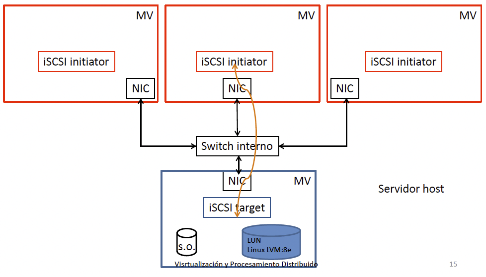

# 4. Sistemas de Almacenamiento Distribuido

## Tabla de Contenidos

- [4. Sistemas de Almacenamiento Distribuido](#4-sistemas-de-almacenamiento-distribuido)
  - [Tabla de Contenidos](#tabla-de-contenidos)
  - [4.1. Introducción a los Sistemas de Almacenamiento Distribuido](#41-introducción-a-los-sistemas-de-almacenamiento-distribuido)
    - [4.1.1. Definición](#411-definición)
    - [4.1.2. Objetivos](#412-objetivos)
    - [4.1.3. Definición de red de almacenamiento](#413-definición-de-red-de-almacenamiento)
    - [4.1.4. Evolución histórica](#414-evolución-histórica)
    - [4.1.5. Terminología relacionada](#415-terminología-relacionada)
      - [Local Area Network (LAN)](#local-area-network-lan)
      - [Wide Area Network (WAN)](#wide-area-network-wan)
      - [Storage Area Network (SAN)](#storage-area-network-san)
      - [Niveles OSI](#niveles-osi)
      - [Network attached Storage (NAS)](#network-attached-storage-nas)
      - [Almacenamiento compartido](#almacenamiento-compartido)
      - [RAID](#raid)
      - [Spanning](#spanning)
      - [Disk Mirroring](#disk-mirroring)
  - [4.2. Almacenamiento iSCSI](#42-almacenamiento-iscsi)
    - [4.2.1. Introducción](#421-introducción)
    - [4.2.2. Estándares sobre Almacenamiento IP](#422-estándares-sobre-almacenamiento-ip)
    - [4.2.3. iSCSI](#423-iscsi)
      - [Arquitectura del protocolo iSCSI](#arquitectura-del-protocolo-iscsi)
      - [Login iSCSI](#login-iscsi)
      - [Principios de las sesiones iSCSI](#principios-de-las-sesiones-iscsi)
      - [Paquete iSCSI PDU](#paquete-iscsi-pdu)
      - [Códigos de operación del nodo _initiator_ para paquetes de peticiones PDU](#códigos-de-operación-del-nodo-initiator-para-paquetes-de-peticiones-pdu)
      - [Códigos de operación del nodos _targets_ para paquetes de respuesta PDU](#códigos-de-operación-del-nodos-targets-para-paquetes-de-respuesta-pdu)
      - [Nombres iSCSI](#nombres-iscsi)
      - [Seguridad iSCSI](#seguridad-iscsi)
      - [Almacenamiento compartido iSCSI en un sistema de virtualización](#almacenamiento-compartido-iscsi-en-un-sistema-de-virtualización)

## 4.1. Introducción a los Sistemas de Almacenamiento Distribuido

**Objetivos**:

- Proporcionar una visión general de los sistemas de almacenamiento distribuido.
- Definir un glosario de términos relacionados con las redes de almacenamiento distribuido.

### 4.1.1. Definición

Una red de almacenamiento distribuido (_Distributed Storage Network_ - DSN) es una infraestructura que permite el acceso compartido de múltiples sistemas (ordenadores de sobremesa, servidores, dispositivos móviles de usuario, etc.) al recurso de almacenamiento de un sistema de información (SI).

> **Amplificación de la definición**: Un Sistema de Almacenamiento Distribuido (DSN) no solo ofrece acceso compartido a recursos de almacenamiento en red, sino que además está diseñado para escalar horizontalmente añadiendo nodos de forma dinámica. Esto garantiza tolerancia a fallos, alta disponibilidad, replicación de datos y rendimiento mediante técnicas como fragmentación (_sharding_), replicación multi-replicante y reparación automática de fallos. Ejemplos de sistemas DSN en entornos productivos incluyen:
>
> - **Google File System (GFS)** y **Hadoop Distributed File System (HDFS)** en aplicaciones de Big Data, donde grandes volúmenes de datos se distribuyen en clústeres de miles de nodos.
> - **Ceph** y **GlusterFS** en almacenamiento de objetos y archivos en nubes privadas y públicas, integrándose con OpenStack o Kubernetes.
> - **Amazon S3** en almacenamiento de objetos en la nube pública de AWS, donde se benefician de replicación geográfica y servicio altamente escalable.

### 4.1.2. Objetivos

Mejorar los siguientes aspectos del recurso de almacenamiento de un SI:

- **Disponibilidad** de los datos.
- Posibilitar el manejo **compartido** de los datos.
- **Eficiencia** en el manejo de los datos.
- **Independencia** de tecnologías y fabricantes.

- **Seguridad**: Garantizar la confidencialidad, integridad y disponibilidad de los datos mediante cifrado en reposo y en tránsito, gestión de identidades y políticas de acceso basadas en roles.
- **Escalabilidad**: Permitir el crecimiento del sistema añadiendo nodos sin interrupción del servicio, adaptándose a incrementos de carga y volumen de datos.
- **Rendimiento y Latencia**: Optimizar el acceso concurrente a datos mediante balanceo de carga, caché distribuida y topologías de red avanzadas.
- **Optimización de Costos**: Reducir el coste total de propiedad (TCO) mediante el uso de hardware genérico (COTS) y estrategias de autoescalado en la nube.

### 4.1.3. Definición de red de almacenamiento

Una **red de almacenamiento** (_Storage Network_) es una red especializada en el transporte de datos entre distintos tipos de dispositivos.

- Transporte de boques de datos reconocibles por distintos sistemas operativos y dispositivos de almacenamiento.
- Utiliza protocolos especializados para el transporte de datos (SCSI, ESCON, FC, FICON, etc.).

> **Profundización en protocolos**: Además de los protocolos mencionados, hoy en día es habitual encontrar:
>
> - **iSCSI (Internet Small Computer Systems Interface)**: Encapsula comandos SCSI sobre TCP/IP, facilitando la conexión de almacenamiento sobre redes Ethernet convencionales.
> - **NVMe over Fabrics (NVMe-oF)**: Protocolo de baja latencia que extiende el estándar NVMe a través de redes RDMA (InfiniBand, RoCE) o Fibre Channel, usado en centros de datos de alto rendimiento.
> - **Object Storage Protocols (S3 API, Swift)**: Diseñados para almacenar objetos de forma masiva, accesibles mediante API RESTful y utilizados en entornos de almacenamiento en la nube.
>
> Estas tecnologías han permitido que las redes de almacenamiento evolucionen desde infraestructuras propietarias hacia soluciones basadas en Ethernet y TCP/IP, favoreciendo la interoperabilidad y reducción de costes.

### 4.1.4. Evolución histórica

**Redes de almacenamiento de _Mainframe_ (1960s)**

- Un procesador utiliza un subsistema específico de E/S para comunicarse con los dispositivos de almacenamiento.
- Uso de buses paralelos para la conexión entre el procesador y los dispositivos de almacenamiento.
- Limitaciones:
  - Ancho de banda
  - Distancia

> **Evolución hacia la virtualización (finales de 1990s - 2000s)**  
> Con la proliferación de servidores virtualizados, apareció la necesidad de abstraer el almacenamiento físico mediante capas de virtualización. Esto permitió consolidar múltiples LUNs (Logical Unit Numbers) en volúmenes virtuales, facilitando:
>
> - **Migración en caliente** de máquinas virtuales sin interrumpir servicios.
> - **Snapshots** y **clones** de volúmenes para copias de seguridad y entornos de desarrollo.
> - **Provisionamiento dinámico**: aprovisionar y redimensionar volúmenes en tiempo real.
>
> Herramientas como **VMware vSAN** y **Microsoft Storage Spaces Direct (S2D)** ejemplifican esta tendencia en entornos empresariales.
>
> **Primera generación de soluciones en la nube (2000s - 2010s)**  
> Con el auge de proveedores de nube pública como AWS, Azure y Google Cloud, el almacenamiento pasó a un modelo de servicio (_Storage as a Service_). Esto introdujo:
>
> - **Almacenamiento de objetos** con replicación geográfica automática (por ejemplo, Amazon S3, Google Cloud Storage).
> - **Arquitecturas de microservicios** en las que múltiples componentes acceden al mismo backend de almacenamiento distribuido.
> - **Modelo de facturación por uso** (pay-as-you-go) para optimizar costes según demanda.

**Almacenamiento para miniordenadores (1970s) y ordenadores personales (1980s)**

- Necesidad de aumentar el grado de integración de los dispositivos de almacenamiento:
  - Capacidad
  - Densidad de almacenamiento
- Tecnologías:
  - _Integrated Drive Electronics/AT Attachment_ (IDE/ATA)
  - _Small Computer System Interface_ (SCSI)
  - _Serial ATA_ (SATA)
  - _Universal Serial Bus_ (USB)

> **Transición a soluciones compartidas (finales de 1980s - 1990s)**  
> A medida que crecía la cantidad de datos, surgió la necesidad de compartir almacenamiento entre múltiples servidores para reducir la complejidad operativa. Esto dio lugar a:
>
> - **NAS (Network Attached Storage)**: sistemas dedicados a archivos accesibles mediante protocolos NFS y CIFS/SMB, muy utilizados en entornos de oficina y PYMEs.
> - **Primeros SAN comerciales**: Fibre Channel (FC) se impuso como estándar para SAN de alto rendimiento. Compañías como EMC y NetApp comenzaron a ofrecer cabinas FC conectadas a switches dedicados.
>
> Estas soluciones permitieron consolidar datos y centralizar backups, mejorando la eficiencia y reduciendo los silos de información.

**El problema de las "islas de almacenamiento" (_storage islands_)**

- Limitaciones:
  - Accesibilidad a los datos
  - Eficiencia del almacenamiento
  - Dificulta el manejo de los datos
  - Dificulta la compartición de datos
  - Productividad

> **Soluciones modernas a las islas de almacenamiento**
>
> - **Virtualización de almacenamiento**: herramientas como **VMware vSphere** y **Microsoft Hyper-V** incluyen capas de abstracción que permiten consumir volúmenes virtuales por diversas máquinas virtuales sin importar la ubicación física del disco.
> - **Almacenamiento definido por software (SDS)**: plataformas como **Red Hat Ceph Storage** y **Dell EMC ScaleIO** unifican el hardware subyacente, ofreciendo administradores una única vista lógica de los recursos.
> - **Migración a la nube**: la adopción de híbridos on-premise/cloud, con proveedores como AWS Storage Gateway o Azure File Sync, mitigan la fragmentación de datos y automatizan la replicación entre centros de datos.

### 4.1.5. Terminología relacionada

#### Local Area Network (LAN)

**Red de área local**: Es una red para la comunicación entre computadoras.

- Orientada a soportar una gran variedad de servicios:

  - Transferencia de archivos
  - Lllamada a procedimientos remotos
  - Gestión y administración de redes
  - Etc.

- **Aplicaciones reales**:
  - En un entorno empresarial, una NAS basada en LAN con protocolos NFS permite a múltiples servidores de aplicaciones acceder a repositorios de archivos centralizados. Ejemplo: una compañía de ingeniería que gestiona proyectos CAD en un servidor NAS compartido.
  - Centros de datos modernos emplean VLANs y Ethernet de 10/40/100 Gbps para conectar servidores a arrays de almacenamiento distribuido.

#### Wide Area Network (WAN)

**Red de banda ancha (WAN)**: es una red concebida para dar cobertura de servicios a larga distancia.

Uso de protocolos específicos:

- _Asynchronous Transfer Mode_ (ATM) (1980).
- _Dense Wavelenght Division Multiplexing_ (DWDM) (1985).
- _Synchronous Optical Network_ (SONET) (1990s).

Utiliza arquitecturas como:

- **Backbone**: toplogía basada en un bus al que se conectan todos los nodos.
- **Ring**: los nodos se conectan formando un anillo.

- **Aplicaciones reales**:
  - Grandes corporaciones utilizan MPLS sobre WAN para interconectar sedes distribuidas geográficamente y compartir almacenamiento en la nube privada.
  - Proveedores de servicios gestionados (MSPs) usan redes WAN definidas por software (SD-WAN) para optimizar la conectividad a servicios de almacenamiento en la nube pública, mejorando latencias y reduciendo costes.

#### Storage Area Network (SAN)

**Red de área de almacenamiento (SAN)**: es una red de almacenamiento que utiliza protocolos especializados para el transporte de datos (SCSI, ESCON, FC, FICON, etc.). Proporciona:

- Acceso compartido a los datos
- Integra múltiples tipos de dispositivos de distintos fabricantes
- Utiliza diferentes protocolos (pila de protocolos) que permiten un espacio de almacenamiento:
  - Eficiente
  - Fiable
  - Estandarización de funcionalidades (_backup_, _recovery_, _mirroring_, _migration_, etc.)

> **Ejemplos de implementación**:
>
> - **Sector bancario y financiero**: Utilizan SAN de Fibre Channel con cabinas EMC o Pure Storage para garantizar transacciones de alta velocidad, replicación sincrónica entre datacenters y recuperación ante desastres.
> - **Empresas de telecomunicaciones**: Emplean SAN iSCSI de alta disponibilidad para almacenar registros de llamadas y datos de suscriptores, facilitando el escalado vertical y horizontal.

#### Niveles OSI

| Nivel | Denominación    | Descripción                                                                                                               | Dispositivo        |
| ----- | --------------- | ------------------------------------------------------------------------------------------------------------------------- | ------------------ |
| 1     | Físico          | Medio físico Cómo se transmite la información                                                                          |                    |
| 2     | Enlace de datos | Direccionamiento físico Acceso al medio Detección de errores Distribución ordenada de trama Control del flujo | Bridge Switch   |
| 3     | Red             | Enrutamiento de los paquetes                                                                                              | Router Firewall |
| 4     | Transporte      | Transporte de los paquetes de datos                                                                                       |                    |
| 5     | Sesión          | Controlar y mantener el enlace establecido entre dos computadores                                                         |                    |
| 6     | Presentación    | Representación de la información                                                                                          |                    |
| 7     | Aplicación      | Acceso de las aplicaciones a la red                                                                                       |                    |

> **Mapeo de protocolos de almacenamiento a niveles OSI**:
>
> - **Capa 1 (Físico)**: Fibra óptica, cables de cobre, conectores SFP/SFP+ para FC, cables de cobre para Ethernet.
> - **Capa 2 (Enlace de datos)**: Tramas FC en redes SAN, tramas Ethernet en iSCSI, tramas FCoE (Fibre Channel over Ethernet).
> - **Capa 3 (Red)**: IP en iSCSI, encapsulación de FCIP (Fibre Channel over IP) para túneles entre datacenters.
> - **Capa 4 (Transporte)**: TCP en iSCSI, RDMA en NVMe-oF sobre InfiniBand o RoCE.

**Tipología punto-a-punto en SAN**: Cada dispositivo de almacenamiento se conecta directamente a un host.

- Protocolos: SCSI y FC
- Limitación: distancia
  - SCSI < 10 metros
  - SCSI/FC < 10 kilómetros

> **Caso de uso**:
>
> - Laboratorios de desarrollo y entornos de prueba donde una sola máquina se conecta a un arreglo de discos para simular flujos de datos de alto rendimiento (por ejemplo, bases de datos OLTP de prueba).

- Dispositivo característico: _Bridge_

**Tipología bucle arbitrado en SAN** (_Arbitrated Loop Topology_ FC-AL): Los dispositivos formando un bucle en el que el puerto de salida de un dispositivo se conecta al del siguiente.

- Protocolos: FC
- Hasta 127 nodos pueden conectarse
- La lógica de arbitraje establece que par de puertos toman el control del bucle y evita que un par de nodos acaparen el bucle.
- Cuando se establece una conexión, todo el ancho de banda del bucle se dedica a ella.

> **Caso de uso**:
>
> - Pequeñas empresas que necesitan conectar hasta 127 dispositivos sin incurrir en el coste de un switch FC, aprovechando la topología de bucle para backups periódicos de servidores de archivo.

- Variante: FC-AL con Bridge

**Tipología basada switch, _Switch Fabric Topology_**: Los dispositivos se conectan a un switch y las conexiones entre dispositivos se llevan a cabo a través de él.

- Permite múltiples conexiones concurrentemente usando todo el ancho de banda
- Tipología típica de los sistemas SAN
- Se pueden utilizar varios switchs con el objeto de:
  - Mejorar la confiabilidad de las conexiones (varias rutas de conexión entre dispositivos): conectando los dispositivos a 2 o más switchs
  - Mejorar la escalabilidad (número de nodos de SAN): utilizando conjuntos de switchs organizados en niveles

> **Caso de uso**:
>
> - Centros de datos de proveedores de nube pública que implantan fabrics de múltiples niveles con cientos de switches FC interconectados, garantizando baja latencia y caminos redundantes para millones de operaciones IOPS.

#### Network attached Storage (NAS)

**Tecnología que consiste en conectar un gestor de archivos a una LAN.**

- Está orientado a transferencia de archivos
- Utiliza protocolos LAN: Ethernet, Gigabit Ethernet

> **Ejemplos reales**:
>
> - Una empresa de diseño gráfico que almacena proyectos en un NAS con protocolo SMB/CIFS, permitiendo que equipos Windows y macOS accedan simultáneamente a archivos compartidos.
> - Instituciones educativas que emplean NAS con NFS para repositorios de archivos de cursos y material multimedia.

#### Almacenamiento compartido

**Espacio de almacenamiento accesible a procesadores que pueden ser de distinto tipo.**

- Tres formas de conseguirlo:
  - **Almacenamiento particionado**. Utilizando particiones separadas para cada tipo de sistemas operativo soportado.
  - **Compartición basada en copias de datos**. Los datos compartidos se copian en los distintos sistemas que acceden a ellos.
  - **Utilizando almacenamiento virtual**. Los datos compartidos se almacenan en un sistema de almacenamiento y una capa de virtualización posibilita el acceso de sistemas operativos de distinto tipo.

> **Implementaciones en la práctica**:
>
> - Clústeres de bases de datos empresariales (Oracle RAC, Microsoft SQL Server Always On) donde cada nodo accede al mismo volumen compartido en SAN, garantizando coherencia y alta disponibilidad.
> - Contenedores orquestados con Kubernetes que consumen volúmenes de almacenamiento compartido a través de CSI (Container Storage Interface), permitiendo balanceo de carga y failover automático.

#### RAID

**Array redundante de discos independientes**, _Redundant Array of independent Disks_ (RAID). Tecnología que utiliza conjuntos de discos y técnicas de:

- _Striping_ para conseguir rendimiento.
- _Mirroring_ para conseguir confiabilidad.
- Técnicas de chequeo y corrección de errores (_ECC_).

| Tipo de RAID | Striping | Mirroring | ECC | Funcionalidad                                                                                                                                                                                           |
| ------------ | -------- | --------- | --- | ------------------------------------------------------------------------------------------------------------------------------------------------------------------------------------------------------- |
| RAID 0       | SI       | NO        | NO  | Aumenta el rendimiento No proporciona confiabilidad                                                                                                                                                  |
| RAID 1       | NO       | SI        | NO  | No mejora el rendimiento de un disco Mayor grado de confiabilidad                                                                                                                                    |
| RAID 2       | SI       | NO        | SI  | Mejora el rendimiento de un disco Mejora la confiabilidad de un disco. ECC utiliza varios discos.                                                                                                 |
| RAID 3       | SI       | NO        | SI  | Mejora rendimiento de un disco. Proporciona confiabilidad a menor coste que RAID 1. Se dedica un solo disco para ECC. No permite solapar operaciones de E/S.                                   |
| RAID 4       | SI       | NO        | SI  | Striping: utiliza cadenas largas de bits con paridad fija. Un registro de E/S se escribe en un disco. Se pueden solapar operaciones de lectura. No se pueden solapar operaciones de escritura. |
| RAID 5       | SI       | NO        | SI  | Striping: utiliza cadenas largas de bits con paridad flotante. Se pueden solapar operaciones de lectura. Se pueden solapar operaciones de escritura. El mejor para sistemas mutiusuarios.      |
| RAID 10      | SI       | SI        | NO  | Arrays de strips en el que cada strip es un RAID 1. Mejor rendimiento que RAID 1                                                                                                                     |

> **RAID Avanzados y Aplicaciones**:
>
> - **RAID 6**: Similar a RAID 5 pero con paridad doble, tolera la falla simultánea de hasta dos discos. Muy usado en sistemas de archivado masivo donde la confiabilidad es crítica (por ejemplo, almacenamiento de CCTV o datos de IoT).
> - **Hot Spares y Reconstrucción Automática**: La mayoría de los controladores RAID modernos permiten discos de repuesto automáticos (_hot spares_) que entran en funcionamiento al detectar fallos, minimizando el tiempo de reconstrucción.
> - **Aplicaciones Reales**:
>   - Servidores de virtualización que implementan RAID 10 para maximizar IOPS y tolerancia a fallos en entornos de escritorio virtual (VDI).
>   - Sistemas de edición de video profesional que usan RAID 5 o RAID 6 para almacenar grandes volúmenes de material crudo con redundancia.

#### Spanning

**Just a Bunch of Disks (JBOD)** o también denominado spanning. Tecnología que utiliza conjuntos de discos para proporcionar un sólo volumen de datos. Su objetivo es combinar varias unidades de disco para proporcionar un mayor espacio de almacenamiento

> **Aplicaciones y limitaciones**:
>
> - Ideal para ampliar capacidad de almacenamiento económico en sistemas de respaldo de bajo coste.
> - No ofrece redundancia ni tolerancia a fallos; en caso de falla de un disco, se pierde información almacenada en todo el volumen.

#### Disk Mirroring

**Replicación de disco**, _disk mirroring_. Técnica que tiene por objetivo duplicar los datos en diferentes lugares de almacenamiento.

- Replicación síncrona, _Synchronous mirroring_. La replicación se realiza cuando el dato cambia
- Replicación asíncrona, _Asynchronous mirroring_, la replicación se realiza a posteriori haciendo uso de un historial de cambios en el dato.
- Replicación centrada en el procesador, _processor centric mirroring_. El computador es el responsable de realizar las escrituras en el disco primario y en el disco espejo.
- Replicación centrada en el almacenamiento, _storage centric mirroring_. El computador escribe en el disco primario y el controlador es el responsable de realizar la replicación en el disco espejo.

> **Ejemplos prácticos**:
>
> - Entornos bancarios que requieren disponibilidad 24/7 implementan **replicación síncrona** entre dos centros de datos geográficamente separados para garantizar tolerancia ante desastres naturales.
> - Sistemas de alta transaccionalidad (por ejemplo, comercio electrónico) que utilizan **replicación asíncrona** para reducir impacto en latencia, replicando cambios a un sitio secundario con retardo controlado.

---

## 4.2. Almacenamiento iSCSI

### 4.2.1. Introducción

**iSCSI es una tecnología de almacenamiento IP**

- **¿En qué consiste el almacenamiento IP?** Transportar bloques de datos, provenientes o con destino a dispositivos de almacenamiento, utilizando Internet y el protocolo TCP/IP.

- **Justificación del almacenamiento sobre IP:**

  - Ubiquidad.
  - Disponibilidad.
  - Soluciones con una relación coste/rendimiento atractivas.

Tecnologías de almacenamiento sobre IP:

- Internet SCSI (iSCSI).
- Fibre Channel sobre TCP/IP (FCIP).

### 4.2.2. Estándares sobre Almacenamiento IP

**SCSI sobre Internet (iSCSI):**

- Las primeras especificaciones sobre almacenamiento IP fueron desarrolladas por _IETF IP Storage Working Group_: RFC 3347 : “Small Computer Systems Interface protocol over the Internet (iSCSI)”.
- _Standars for Internet SCSI (iSCSI) (2003)_.
- _iSCSI Naming Service (2003)_.

### 4.2.3. iSCSI

**Características generales de iSCSI:**

- Mapea el modelo de procedimiento de invocación remota de SCSI sobre el protocolo TCP.
- Las órdenes y respuestas del protocolo SCSI se transportan vía peticiones iSCSI y respuestas iSCSI.
- Para alcanzar una mayor eficiencia iSCSI no utiliza de forma estricta la secuencia orden/data/estado/mensajes empleada por el protocolo SCSI, permitiéndolas combinaciones de estas fases:
  - Una orden y sus datos asociados pueden formar parte de un único mensaje.
  - Los datos y estado de la respuesta pueden combinarse en un único mensaje.

#### Arquitectura del protocolo iSCSI

Estructurado por capas:

- Capa SCSI: Bloque Descriptor de Orden (CDB)
- Capa iSCSI: iSCSI PDU
- Capa TCP: una o más conexiones TCP (sesión)

**Protocolo SCSI**:

- Protocolo que hace uso de un bus paralelo (SCSI bus).
- Dependiendo del ancho del bus permite la conexión de 8, 16 o 32 dispositivos.
- Cada dispositivo posee un ID (asociado a la interface controladora) y sobre este se definen _Unidades Lógicas_ llamadas _LUNs_ (asociadas a las unidades de almacenamiento).
- Las _LUNs_ pueden estar en una unidad _initiator_ o _target_.
- La unidad _initiator_ es quién inicia una operación en el bus.
- La unidad _target_ es la que realiza la operación.
- En el protocolo SCSI se permite las transferencias P2P entre un _initiator_ y un _target_. Mientras se realiza la transferencia no se puede realizar otra.
- El protocolo posee un algoritmo de arbitraje que establece a quién se le cede el control del bus en cada momento.

**Fases de uso de bus SCSI**:

- Fases de arbitraje y selección.
- Fase de transferencia de información.
  - Fase de envío de mensaje.
  - Fase de orden.
  - Fase de lectura/escritura de datos.
  - Fase de recepción de mensaje.

#### Login iSCSI

**iSCSI** utiliza un proceso de login para añadir una conexión TCP a una sesión, autenticar las partes que intervienen y negociar los parámetros de la sesión.

1. El nodo initiator se conecta a un puerto TCP para iniciar el proceso de login. Los nodos targets están a la escucha, en un puerto conocido, de solicitudes de conexión.
2. Se ejecuta el proceso de autenticación.
3. Se establecen los parámetros de la conexión.
4. Se entra en la fase de funcionalidades completas iSCSI: las órdenes y datos son enviados por el nodo _initiator_ a las _LUNs_ asociados a los nodos _targets_.

#### Principios de las sesiones iSCSI

**Principio de “Lealtad de orden iSCSI”.** Cuando una sesión se ha establecido, entonces se debe respetar este principio:

> “Para cualquier solicitud iSCSI enviada en una conexión, las correspondientes secuencias de datos y/o respuestas deben ser retornadas en la misma conexión”.

- La finalización de una conexión TCP se realiza mediante un mensaje de `FIN`.
- En un contexto de operación normal, la conexión TCP no se finaliza mientras se esté en la fase de funcionalidad completa.

#### Paquete iSCSI PDU

**Se trata de la estructura de datos utilizada por iSCSI para el envío de órdenes y datos, consta:**

1. Segmento de encabezamiento básico.

   - Obligatorio.
   - Posee una longitud de 48 bytes.
   - Indica si el paquete debe ser entregado de forma inmediata (byte 0: bit 1)
   - Función del paquete PDU (byte 0: bits 2-7) (_initiator_ y _targets_ poseen conjuntos diferentes).
   - Final de secuencia (byte 1: bit 0).
   - Longitudes de las distintas partes del paquete (bytes 4-7).
   - Identificador de LUN (bytes 8-15).

2. Segmentos adicionales de encabezamiento (opcionales). Secuencia de números enteros de significado diverso.
3. Resúmenes de encabezamientos (Header Digests, opcionales). Se utilizan para controlar la integridad de los encabezamientos
4. Segmento de datos (opcional).
5. Resúmenes de datos (Data Digests, opcionales). Se utilizan para controlar la integridad de los segmentos de datos.

#### Códigos de operación del nodo _initiator_ para paquetes de peticiones PDU

| Código    | Nombre                                        | Significado                                                                            |
| --------- | --------------------------------------------- | -------------------------------------------------------------------------------------- |
| 0x00      | NOP - Out                                     | Utilizado por el nodo initiator para verificar que una conexión/sesión está aún activa |
| 0x01      | Orden SCSI                                    | El paquete PDU contiene un bloque descriptor de orden                                  |
| 0x02      | Solicitud de función de tarea de gestión SCSI | Permite al initiator especificar el control de la ejecución de una o más tareas        |
| 0x03      | Petición de login                             | Inicia el proceso de login con un nodo target                                          |
| 0x04      | Petición de intercambio de información        | Usado para intercambiar información                                                    |
| 0x05      | Salida de datos SCSI                          | Para operaciones de escritura                                                          |
| 0x06      | Petición de logout                            | Utilizado para realizar una finalización controlada de sesión                          |
| 0x10      | Petición SNACK                                | Solicitud de retrasmisión de respuestas numeradas, datos o paquetes PDUs R2T           |
| 0x1C-0x1E | Códigos específicos del fabricante            |                                                                                        |

#### Códigos de operación del nodos _targets_ para paquetes de respuesta PDU

| Código    | Nombre                                                    | Significado                                                                                                    |
| --------- | --------------------------------------------------------- | -------------------------------------------------------------------------------------------------------------- |
| 0x20      | NOP - Out                                                 | Utilizado por el nodo initiator para verificar que una conexión/sesión está aún activa                         |
| 0x21      | Respuesta a orden SCSI                                    | El paquete PDU contiene una respuesta de estado SCSI                                                           |
| 0x22      | Respuesta a solicitud de función de tarea de gestión SCSI | Respuesta enviada por el un nodo target después de realizar una o más tareas solicitadas por el nodo initiator |
| 0x23      | Respuesta a solicitud de login                            | Indica el progreso/finalización de un proceso de login                                                         |
| 0x24      | Respuesta de texto                                        | Respuesta del nodo target a una petición del nodo initiator de intercambio de información                      |
| 0x25      | Entrada de datos SCSI                                     | Para operaciones de lectura                                                                                    |
| 0x26      | Respuesta a petición de logout                            | Indica si la operación de logout se ha completado                                                              |
| 0x31      | Listo para transferir (R2T)                               | Indica que el nodo target está listo para transmitir                                                           |
| 0x32      | Mensaje asíncrono                                         | Indica un estado especial en el nodo target                                                                    |
| 0x3C-0x3E | Códigos específicos del fabricante                        |                                                                                                                |
| 0x3F      | Rechazo                                                   | Indica una condición de error iSCSI                                                                            |

#### Nombres iSCSI

Tanto los nodos _targets_ como _initiator_ utilizan nombres para identificar los nodos iSCSI. Un nombre de nodo iSCSI es el nombre del dispositivo SCSI del dispositivo iSCSI.

- Los nombres están asociados a los nodos; no a las interfaces controladoras.
- Los nombres deben identificar unívocamente a los nodos iSCSI a nivel global.
- Un nodo _initiator_ puede descubrir a nodos _targets_ mediante una función de descubrimiento.
- Los nodos iSCSI poseen sus direcciones iSCSI:
  - Nombre iSCSI.
  - (opcionalmente) Dirección de transporte TCP (puerto).
- Los nombres iSCSI puede tener alguno de los formatos:
  - Dirección IPv4.
  - Dirección IPv6.
  - Nombre del host (`mivolumen.ejemplo.org`).

#### Seguridad iSCSI

El **transporte de bloques de datos sobre una red IP** trae como consecuencia la necesidad de utilizar **mecanismos de seguridad** para:

- Asegurarse que una petición iSCSI proviene de un nodo legítimo.
- Proteger los bloques de datos frente espionajes no autorizados.

Se utilizan dos mecanismos en iSCSI para proporcionar seguridad:

- A nivel de conexión : autenticación _In-band_
  - Nodos _targets_ deben autenticar a los nodos _initiators_. Opcionalmente, los nodos _initiators_ pueden autenticar a los nodos _targets_.
  - Un proceso de autenticación se realiza por cada conexión nueva iSCSI (_login PDU_).

- IPSec (_RFC2401_). Para proteger los bloques de datos
  - Integridad criptográfica mediante el uso de códigos de autenticación de mensajes encriptados que se utilizan en cada paquete.
  - Autenticación de datos mediante el uso de códigos de autenticación de mensajes encriptados que se utilizan en cada paquete.
  - Confidencialidad mediante el envío de datos encriptados.

#### Almacenamiento compartido iSCSI en un sistema de virtualización

- **iSCSI initiator** – Establece la sesión y una vez cumplido el protocolo de comunicación, establece un identificador de comunicación envía por el canal comandos SCSI, encapsulados en paquetes IP. En la máquina virtual se debe ejecutar el software asociado a las funcionalidades de un nodo _initiator_.

- **iSCSI target** – Sirve unidades lógicas de almacenamiento LUN construidas sobre algún tipo de sistema de almacenamiento, como un disco, un array de discos, o sobre un volumen lógico LVM. Se define en el sistema servidor de disco. En la máquina virtual se debe ejecutar el software asociado a las funcionalidades de un nodo _target_.
- **Sesión de conexión de nodo initiator - nodo target** – Establece el canal por el que van a fluir los datos y los comandos entre el nodo _initiator_ y el nodo _target_.
