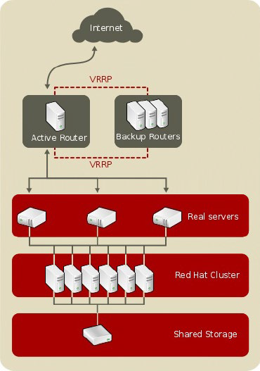

# Tema 5. Computación en Clúster

- [Tema 5. Computación en Clúster](#tema-5-computación-en-clúster)
  - [Computación en Clúster](#computación-en-clúster)
    - [1. Introducción.](#1-introducción)
    - [2. Arquitectura.](#2-arquitectura)
    - [3. Tipos de clúster.](#3-tipos-de-clúster)
    - [4. Componentes.](#4-componentes)
    - [5. Middleware.](#5-middleware)
    - [6. Manejo y planificación de recursos.](#6-manejo-y-planificación-de-recursos)
    - [7. Recursos básicos de programación.](#7-recursos-básicos-de-programación)
  - [Red Hat Enterprise High Availability Add-On](#red-hat-enterprise-high-availability-add-on)
    - [1. Visión general.](#1-visión-general)
    - [2. Infraestructura de un clúster gestionado por Pacemaker.](#2-infraestructura-de-un-clúster-gestionado-por-pacemaker)
    - [3. Componentes de Pacemaker.](#3-componentes-de-pacemaker)
    - [4. Herramientas de administración del clúster.](#4-herramientas-de-administración-del-clúster)
    - [5. Aislamiento (_Fencing_).](#5-aislamiento-fencing)
    - [6. Recursos.](#6-recursos)
  - [Algoritmos de Sincronización para el Control de Acceso a Secciones Críticas en Sistemas Distribuidos](#algoritmos-de-sincronización-para-el-control-de-acceso-a-secciones-críticas-en-sistemas-distribuidos)
    - [1. Introducción](#1-introducción-1)
    - [2. Algoritmos basados en testigo](#2-algoritmos-basados-en-testigo)
      - [2.1 Algoritmo de **Martin** (1985)](#21-algoritmo-de-martin-1985)
      - [2.2 Algoritmo de **Naimi‑Tréhel** (1996)](#22-algoritmo-de-naimitréhel-1996)
      - [2.3 Algoritmo de **Suzuki‑Kasami** (1985)](#23-algoritmo-de-suzukikasami-1985)
    - [3. Algoritmos para grandes configuraciones](#3-algoritmos-para-grandes-configuraciones)
      - [3.1 Algoritmos basados en prioridad](#31-algoritmos-basados-en-prioridad)
      - [3.2 Estrategias combinadas](#32-estrategias-combinadas)
    - [4. Rendimiento](#4-rendimiento)

## Computación en Clúster

**Objetivos**: proporcionar una visión general de la arquitectura, los elementos hardware y software de un sistema clúster.

### 1. Introducción.

> Hay tres maneras de mejorar el rendimiento:
> _Trabajar duro_ > _Trabajar más inteligentemente_, y
> _Conseguir ayuda_.
> G. Pfister, "In Search of Clusters", 1998

Un **clúster** es un tipo de arquitectura escalable para el procesamiento distribuido.

**Características**:

- **Escalabilidad**: capacidad de aumentar el rendimiento agregando más recursos.
- **Disponibilidad**: capacidad de mantener el servicio incluso si algunos de los componentes fallan.
- **Flexibilidad**: capacidad de adaptar el sistema a diferentes cargas de trabajo.

**Arquitecturas para el procesamiento paralelo**:

- Procesadores para el cómputo masivo (MPP)
- Multiprocesadores simétricos (SMP)
- Sistemas de acceso no uniforme a memoria de caché coherente (CCNUMA)
- Sistemas distribuidos: sistemas clúster

> **Definiciones rápidas**  
> • **MPP (Massively Parallel Processing)**: sistema con muchos nodos independientes y memoria distribuida; cada nodo ejecuta su propio SO y los procesos se comunican mediante paso de mensajes.  
> • **SMP (Symmetric Multiprocessing)**: varios procesadores comparten la misma memoria física bajo un único sistema operativo; la comunicación se basa en memoria compartida.  
> • **CCNUMA (Cache‑Coherent Non‑Uniform Memory Access)**: evolución de SMP donde cada CPU dispone de memoria local; la coherencia de caché se mantiene por hardware, pero la latencia varía según la cercanía de la memoria.  
> • **Clúster distribuido**: colección de nodos de propósito general conectados por red de alta velocidad, coordinados por middleware para ofrecer una Imagen Única de Sistema (SSI).

**Sinónimos del término clúster**:

- Red de estaciones de trabajo
- Clúster de estaciones de trabajo

**Principal motivación**: supercomputación de bajo coste

- Basado en tecnología de uso popular, y por tanto atractiva desde el punto de vista de su coste.
- Escalabilidad.

> **Aplicaciones típicas**: simulaciones numéricas (CFD, análisis FEM), renderizado 3D, procesamiento de Big Data, entrenamiento de modelos de IA y servicios web críticos que requieren alta disponibilidad.

### 2. Arquitectura.

Elementos de un entorno clúster:

- **Nodos** (computadores): máquinas físicas o virtuales que forman parte del clúster.
- **Sistemas Operativos**
- **Infraestructura de red**: permite la comunicación entre los nodos.
- **Protocolos de comunicación y Servicios**
- **Middlewares**
- **Entorno de desarrollo de aplicaciones**
- **Aplicaciones**

La imagen muestra la arquitectura lógica de un clúster de computación. Es un sistema distribuido compuesto por:

Estos elementos están organizados de manera que permitan la ejecución transparente de aplicaciones, gracias a la capa de middleware que coordina la comunicación, sincronización y asignación de recursos.

**Detalles adicionales:**

- _Comm. S/W (Communication Software)_: Puede incluir bibliotecas como MPI (Message Passing Interface) o sockets TCP/IP personalizados que permiten a los procesos intercambiar datos entre nodos.
- _Net Interface HW_: Tarjetas de red de alta velocidad, como Ethernet Gigabit o Infiniband, fundamentales para minimizar la latencia y maximizar el ancho de banda.
- _Cluster Middleware_: Suele estar compuesto por herramientas de gestión de recursos (como Slurm o Torque), servicios de alta disponibilidad (como Pacemaker o Corosync), y sistemas de archivos distribuidos (como GlusterFS o Lustre).

Esta arquitectura permite que un clúster funcione como una única máquina lógica, donde los recursos se aprovechan de forma conjunta para resolver problemas que requieren alto poder computacional.

- Nodos (PC/Workstation): Equipos conectados por una red de alta velocidad. Cada uno tiene:
- Net Interface HW: hardware de red.
- Comm. S/W: software de comunicación.
- Cluster Middleware: capa que abstrae los nodos como si fueran un único sistema (Single System Image). Gestiona disponibilidad y coordinación.
- Aplicaciones:
- Secuenciales: funcionan sin cambios sobre el clúster.
- Paralelas: diseñadas para aprovechar múltiples nodos.
- Entornos de programación paralela: ayudan a desarrollar estas aplicaciones.

Resumiendo: es un sistema cooperativo de PCs que actúan como un superordenador, coordinados por middleware y conectados en red.

### 3. Tipos de clúster.

En función del **objetivo perseguido**:

- Alto rendimiento
- Alta disponibilidad
- Almacenamiento distribuido
- De balanceo de carga

  > _Ejemplo práctico_: un clúster de alto rendimiento (HPC) para investigación climática agrupa cientos de nodos y maximiza FLOPS, mientras que un clúster de alta disponibilidad para bases de datos prioriza la redundancia para minimizar el tiempo de inactividad.

En función de la **configuración del nodo**:

- Homogéneo: todos los nodos son iguales.
- Heterogéneo: los nodos son diferentes.

En función del **número de nodos**:

- Grupo: 2-29.
- Departamentales: 10-100.
- Corporativos: más de 100.
- Nacionales: (agrupaciones de clúster de alguno de los tipos anteriores vía WAN/Internet).
- Internacionales: (agrupaciones de clúster de alguno de los tipos anteriores, vía WAN/Internet, de más de 1000 nodos).

### 4. Componentes.

**Nodos**:

- CPU.
- Memoria.
- Bus del sistema.
- Subsistema de E/S.

**Interconexión**:

- Ethernet, Fast Ethernet y Gigabit Ethernet.
- Asynchronous Transfer Mode (ATM).
- Scalable Coherent Interface (SCI).
- Myrinet

  > **Notas de rendimiento de redes**
  >
  > - _Gigabit Ethernet_ es económico pero su latencia (~30 µs) puede ser un cuello de botella en HPC.
  > - _Infiniband_ ofrece latencias menores a 2 µs y más de 100 Gbps de ancho de banda, ideal para cargas MPI intensivas.
  > - _Myrinet_ fue popular en la década de 2000; su bajo retardo la hizo atractiva, aunque hoy ha sido sustituida por tecnologías como Infiniband y Omni‑Path.

**Sistema operativo**:

- Linux.
- Microsoft Windows.

### 5. Middleware.

**Objetivo**: Cumplir con el requerimiento de Imagen Única del sistema: "_a partir de un conjunto de nodos interconectados, proporcionar una imagen unificada de los recursos del sistema (SSI)_".

- Transparencia: el usuario no necesita conocer la existencia de los nodos.
- Mejora de la disponibilidad: el sistema sigue funcionando aunque fallen algunos nodos.
- Rendimiento escalable: el sistema puede aumentar su rendimiento agregando más nodos.

Middleware es un módulo software estructurado en dos capas:

- **Infraestructura SSI**:

  - Un único punto de entrada.
  - Jerarquía única de archivos.
  - Un único punto de control y gestión del clúster.
  - Una única red virtual.
  - Un único espacio de memoria.
  - Un único sistema de gestión de tareas.
  - Una única interfaz de usuario.

- **Infraestructura de disponibilidad del sistema**:
  - Espacio de E/S único.
  - Un único espacio de procesos.
  - Mecanismo de salvaguardado de contexto.
  - Mecanismo de migración de procesos.
    > **Herramientas concretas**
    >
    > - _Imagen única del sistema_: gestores de recursos como **Slurm**, sistemas de archivos distribuidos como **GFS2** o **CephFS**, y redes virtuales mediante **Open vSwitch**.
    > - _Alta disponibilidad_: la pila **Corosync + Pacemaker** controla miembros y recursos, mientras que **DRBD** proporciona réplicas de bloques en tiempo real.

### 6. Manejo y planificación de recursos.

En un entorno clúster el **manejo y la planificación de recursos (RMS)** tiene por objeto hacer un uso eficiente de los recursos disponibles con el fin de cumplir los objetivos del clúster (alto rendimiento, alta disponibilidad, balanceo de carga, almacenamiento distribuido)

**¿Cómo?** Gestionando los procesos entre los nodos del clúster, con un mínimo impacto de cara a los usuarios. Dependiendo del objetivo perseguido, se requerirán alguna(s) de las siguientes funcionalidades:

- Migración de procesos.
- Monitorización de contextos.
- Aprovechamiento de los ciclos ociosos.
- Tolerancia a fallos.
- Balanceado de carga.
- Planificación mediante múltiples colas de proceso
  > **Planificadores habituales**: **Slurm**, **PBS Pro**, **HTCondor** y, para cargas contenedorizadas, **Kubernetes**. Implementan políticas como _FCFS_, _backfilling_ y _fair‑share_ para optimizar CPU y memoria.

### 7. Recursos básicos de programación.

**Entornos de programación estándares para entornos distribuidos**:

- **Uso de hilos**.

  - _IEEE POSIX threads interface (pthreads)_.

- **Sistemas de mensajes**.

  - _Parallel Virtual Machine (PVM)_.
  - _Message Passing Interface (MPI)_.

- **Sistemas de memoria compartida y distribuida**.
  - Sistemas software de memoria compartida.
    - TreadMarks.
    - Linda.
  - Sistemas hardware de memoria compartida.
    - DASH.
    - Merlin.
- **Depuradores**:
  - _High Performance Debugging Forum (HPDF)_.
  - _TotalView_
    - C, C++,F77,F99,HPF.
    - MPI, PVM.
    - IBM AIX, SGI IRIX, SunOS, etc.
- **Herramientas de análisis de rendimiento**:

  - Funciones para monitorizar el rendimiento.
  - Librería “run-time” .
  - Herramientas para procesar y visualizar los datos de rendimiento.

- **Administración**:
  - NOW.
  - _SMILE ( K-CAP )_.
  - _PARMON_ (Grandes configuraciones).
  - **_Orden pcs_ (Red Hat Enterprise High Availability Add-On)**.
  - _Servicio pcsd Web UI_ (Red Hat Enterprise High Availability Add-On).

> **Comparativa rápida**
>
> - **MPI** (p.ej., OpenMPI, MPICH): comunicación explícita por mensajes, escalabilidad a miles de nodos.
> - **OpenMP**: paralelismo mediante directivas en memoria compartida; se habilita con `-fopenmp`.
> - **Modelo híbrido MPI+OpenMP**: usa memoria compartida dentro de cada nodo y paso de mensajes entre nodos para escalar eficientemente.
> - Depuración: **TotalView** y **GDB** con soporte para multiproceso paralelo permiten inspeccionar ejecuciones distribuidas.
> - Perfilado: **gprof**, **perf**, **Intel VTune** y **HPCToolkit** ayudan a identificar cuellos de botella de CPU, memoria y red.

## Red Hat Enterprise High Availability Add-On

**Objetivo**: Proporcionar una visión general de la plataforma Red Hat para proporcionar **alta disponibilidad** (_Red Hat Enterprise High Availability Add-On_).

### 1. Visión general.

Tipos de clúster soportados en Red Hat:

- **Alta disponibilidad**: soportado por _Red Hat Enterprise High Availability Add-On_. **_Pacemaker_** es el software responsable del manejo del clúster.
- **Almacenamiento**: soportado por _Red Hat Enterprise High Availability Add-On_ y _Global FileSystem_ (componente de _Red Hat Enterprise Resilient Storage Add-On_).
- **Balanceo de carga**: soportado por _Red Hat Enterpriese Load Balancer Add-On_.

**Componentes de _Red Hat Enterprise High Availability Add-On_**:

- Infraestructura (_Cluster infrastructure_).
- Manejo de servicios de alta disponibilidad (_High-availability Service Management_).
- Herramientas de administración del clúster (_Cluster administration tools_).

**Componentes suplementarios (no forman parte de _Red Hat Enterprise High Availability Add-On_):**

- _Red Hat Global File System_ (GFS).
- _Cluster Logical Volume Manager_ (CLVM).
- _Load Balancer Add-On_ (LVS).

### 2. Infraestructura de un clúster gestionado por Pacemaker.

Proporciona las funcionalidades básicas para que los nodos puedan trabajar de manera conjunta:

- **Cluster management**: Gestiona el clúster y sus recursos.
- **Lock management**: Gestiona los recursos compartidos.
- **Aislamiento (_Fencing_)**: Evita que los nodos se ejecuten simultáneamente.
- **Cluster configuration management**: Gestiona la configuración del clúster.

Un ejemplo:

### 3. Componentes de Pacemaker.

**Cluster Information Base (CIB)**: Manejo de la configuración y estado del clúster.

- Nodo coordinador (DC).
- Archivos XML.
- Demonio Pacemaker.

**Manejo de los recursos del clúster**:

- Demonio Cluster Resource Management (CRMd).
- Demonio Local Resource Manager (LRMd).

**Shoot the Other Node in the Head (STONITH)**:

- Manejo del aislamiento (_fencing_) de un nodo.

  > Evita la temida condición _split‑brain_, donde dos nodos crean ser maestros simultáneamente. STONITH aísla por completo al nodo problemático antes de reasignar los recursos.

**Demonio corosync**:

- Comunicaciones requeridas entre los miembros del cluster para proporcionar alta disponibilidad.
- Manejo de quorum

### 4. Herramientas de administración del clúster.

Configuración y manejo de todos los aspectos relacionados con los demonios Pacemaker y Corosync.

- Crear y configurar un clúster.
- Modificar la configuración del clúster, estando en funcionamiento.
- Arrancar, detener y obtener información del clúster.

**Herramientas**:

- Línea de órdenes: herramienta **pcs**.
- Intefaz gráfica web: **pcsd Web UI**.

### 5. Aislamiento (_Fencing_).

El **aislamiento de un nodo (fencing)** es la acción de desconectar un nodo del clúster, para evitar que corrompa los datos compartidos.

- Este aislamiento se debe realizar cuando se detecta que el nodo tiene un comportamiento errático.
- Se realiza mediante el componente **STONITH**.
- El aislamiento se puede realizar de distintas maneras (fencing devices):
  - Uninterruptible Power Supply (UPS).
  - Power Distribution Unit (PDU).
  - Blade power control devices.
  - Lights-out devices.
  - Sistema anfitrión de máquinas virtuales (**_fence_virt_**).
  - Otros.

> **Buenas prácticas**: configure siempre mecanismos de quorum junto con dispositivos de fencing redundantes. Realice pruebas periódicas para verificar que STONITH funciona y protege los datos ante fallos de red o hardware.

### 6. Recursos.

Un recurso es una instancia de programa, dato o aplicación que es manejado por un servicio del clúster.

Los recursos son manejados por agentes que proporcionan una interfaz común.

**Tipos de recursos**:

- Linux Standards Base (LSB).
- Open Cluster Framework (OCF).
- Systemd.
- Nagios.
- STONITH

Para garantizar que todos los recursos funcionan correctamente, todos estos son monitorizados periódicamente (por defecto 60 segundos).

- Se puede establecer en el momento de la creación del recurso en el clúster.
- Si no, entonces se establece por defecto cuando se crea el recurso mediante la utilidad pcs.

**Restricciones de recursos**:

- **Restricción de localización**: establece en qué nodos se puede ejecutar el recurso.
- **Restricción de orden**: establece en qué orden se debe ejecutar el recurso.
- **Restricción de colocación**: establece dónde se deben ubicar los recursos en relación con otros recursos.

## Algoritmos de Sincronización para el Control de Acceso a Secciones Críticas en Sistemas Distribuidos

**Objetivos**

- Describir las técnicas de sincronización para resolver el problema de la sección crítica en entornos distribuidos dispersos (clústeres).
- Nos interesa:
  - Como operan
  - Sus ventajas e inconvenientes

### 1. Introducción

El _problema de la sección crítica (SC)_ en sistemas distribuidos consiste en garantizar que, en todo instante, **como máximo un proceso** esté ejecutando la SC, incluso cuando los nodos sólo se comunican por mensajes de red. Las prestaciones de cualquier protocolo de sincronización dependen, principalmente, del **tráfico de mensajes** que genera y de la **latencia** de cada envío.

Existen dos grandes familias de algoritmos:

| Familia                        | Idea clave                                                                           | Mensajes típicos     |
| ------------------------------ | ------------------------------------------------------------------------------------ | -------------------- |
| **Basados en permisos**        | Cada nodo solicita permiso a (todos)/(mayoría) de los demás antes de entrar en la SC | `O(N)` por entrada   |
| **Basados en testigo (token)** | Un _token_ exclusivo circula entre nodos; sólo el poseedor puede ejecutar la SC      | ≤ `O(1)` por entrada |

Los algoritmos basados en **testigo** suelen ser preferibles en clústeres porque reducen el tráfico de red, aunque requieren mecanismos de _recuperación del token_ si éste se pierde.

---

### 2. Algoritmos basados en testigo

#### 2.1 Algoritmo de **Martin** (1985)

- **Estructura**: los nodos forman un **anillo lógico**.
- **Mensajes**:
  - _Petición de testigo_ ⟶ sentido antihorario.
  - _Testigo_ ⟶ sentido horario.
- **Funcionamiento**:
  1. Un nodo que desea la SC y no tiene el token envía la petición a su sucesor.
  2. La petición avanza hasta llegar al nodo poseedor del token.
  3. Cuando el poseedor termina (o no está en SC) reenvía el token siguiendo el anillo.
  4. Si el token pasa por otro nodo que también había solicitado, éste lo captura.
- **Coste**: hasta `N‑1` saltos de token en el peor caso y ≤ `N‑1` peticiones.
- **Ventajas**: sencillo y determinista.
- **Inconvenientes**: latencia proporcional al tamaño del anillo; sensible a fallos de enlace.

#### 2.2 Algoritmo de **Naimi‑Tréhel** (1996)

- **Estructuras de control por nodo**:
  - `LAST`: construye un **árbol dinámico** cuyo _raíz_ será el siguiente receptor del token.
  - `NEXT`: cola distribuida de solicitudes pendientes.
- **Petición**: viaja siguiendo los punteros `LAST` hasta la raíz; cada salto actualiza `LAST` al solicitante.
- **Cesión del token**: cuando un nodo libera la SC, envía el token al nodo apuntado por su `NEXT`.
- **Coste promedio**: `O(log N)` saltos; en ausencia de contención puede ser `O(1)`.
- **Fortalezas**: se adapta dinámicamente y minimiza mensajes en caso de baja contención.
- **Debilidades**: requiere mantener dos punteros por nodo y actualizar coherentemente la cola.

#### 2.3 Algoritmo de **Suzuki‑Kasami** (1985)

- **Estructuras globales**:
  - Array `LN[N]`: última petición atendida de cada nodo (viaja con el token).
  - Cola `Q`: nodos esperando token (viaja con el token).
- **Estructuras locales**:
  - Array `RN_i[N]`: nº de peticiones conocidas por nodo _i_.
- **Petición**: el nodo emite _broadcast_ con `(id, seq)`; cada receptor actualiza su `RN`.
- **Cesión del token**: al salir de la SC, el poseedor actualiza `LN` y, si la cola `Q` no está vacía, envía el token al primero.
- **Coste**: `N‑1` mensajes de petición (broadcast) + ≤ 1 para el token.
- **Observaciones**: eficiente en redes con _broadcast_ barato; puede saturar la red en entornos con miles de nodos.

---

### 3. Algoritmos para grandes configuraciones

En infraestructuras con **centenares o miles de nodos** (o varios clústeres geográficamente dispersos) la latencia inter‑clúster domina. Los diseños modernos combinan **prioridades** y **jerarquías** para reducir tráfico.

#### 3.1 Algoritmos basados en prioridad

| Algoritmo   | Año  | Idea principal                                                                                         | Mejora                                                        |
| ----------- | ---- | ------------------------------------------------------------------------------------------------------ | ------------------------------------------------------------- |
| **Bertier** | 2004 | Modifica Naimi‑Tréhel priorizando peticiones _intra‑clúster_ hasta un umbral `U`                       | Menor tráfico inter‑clúster antes de saturar                  |
| **Muller**  | 1998 | Cada petición lleva una prioridad; las colas locales se fusionan en una _cola virtual global_ ordenada | Evita inanición y permite políticas de servicio diferenciadas |

#### 3.2 Estrategias combinadas

- **Dos niveles de arbitraje**
  1. **_Intra‑clúster_**: se usa un algoritmo rápido (p.ej., Naimi‑Tréhel).
  2. **_Inter‑clúster_**: se usa otro algoritmo (p.ej., Suzuki‑Kasami) sólo entre _coordinadores_ de clúster.
- **Prioridad** habitual: se atienden primero las peticiones locales; las remotas se difieren salvo que se alcance un límite de inanición.

---

### 4. Rendimiento

Variables que condicionan las pruebas:

| Símbolo   | Significado                              |
| --------- | ---------------------------------------- |
| `A`       | Tiempo dentro de la SC                   |
| `B`       | Intervalo entre dos peticiones sucesivas |
| `P = B/A` | Frecuencia relativa de acceso            |
| `N`       | Nº de procesos                           |

**Grados de paralelismo**

- _Bajo_: `P ≤ N` (mucha contención).
- _Medio_: `N < P ≤ 3N`.
- _Alto_: `P > 3N` (poca contención).

**Métricas clave**

| Métrica                       | Fórmula / Comentario                   |
| ----------------------------- | -------------------------------------- |
| Tiempo de espera `TpendCS`    | `Treq + Tproc + Ttoken`                |
| Varianza del tiempo de espera | Evalúa impredecibilidad                |
| Mensajes totales              | Depende de algoritmo (`O(1)` a `O(N)`) |

**Ejemplo empírico – Grid’5000 (Francia)**: 17 clústeres conectados a 10 Gb/s.  

Comparando combinaciones _Naimi/Suzuki_, _Naimi/Martin_ y _Naimi/Naimi_, se observa que la elección óptima varía con la contención y el tamaño (`K`, nº de coordinadores) — véanse las tablas de la página 18‑19 del pdf
