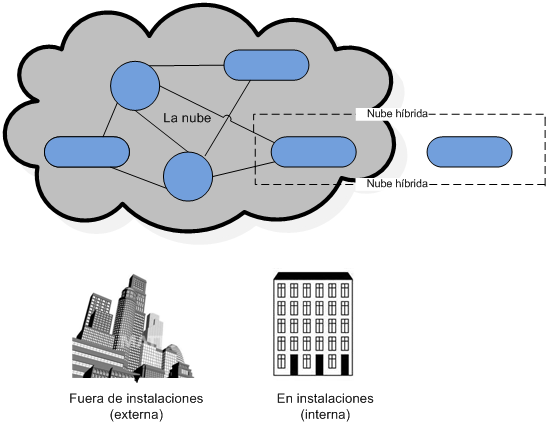
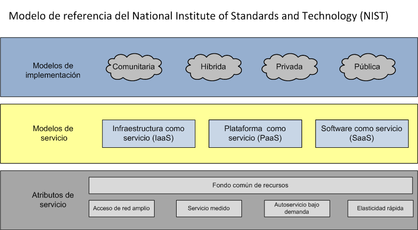
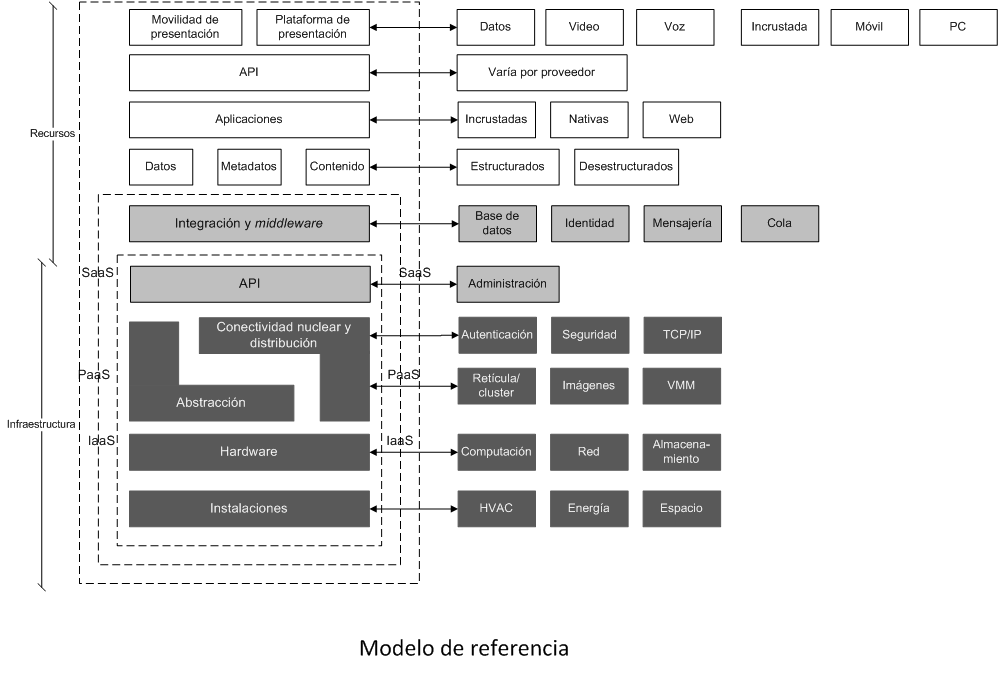
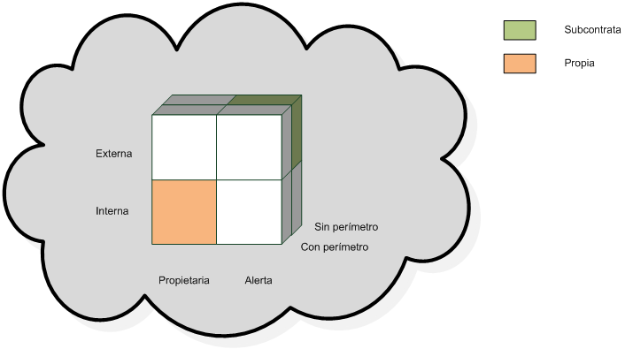

# Tema 6. Introducción a la computación en la nube

- [Tema 6. Introducción a la computación en la nube](#tema-6-introducción-a-la-computación-en-la-nube)
  - [1. Definición.](#1-definición)
  - [2. Objetivos.](#2-objetivos)
  - [3. Conceptos básicos.](#3-conceptos-básicos)
    - [Desde el punto de vista de la implementación. Modelo NIST](#desde-el-punto-de-vista-de-la-implementación-modelo-nist)
    - [Desde el punto de vista del tipo de servicio proporcionado. Modelo SPI](#desde-el-punto-de-vista-del-tipo-de-servicio-proporcionado-modelo-spi)
    - [Modelo de nube cúbica (_Open Group, Jericho Forum_)](#modelo-de-nube-cúbica-open-group-jericho-forum)
  - [4. Casos de uso.](#4-casos-de-uso)
  - [Bibliografía:](#bibliografía)

## 1. Definición.

La **Computación en la nube** es un modelo de computación distribuida basada en:

- Abstracción
- Virtualización
- Internet

## 2. Objetivos.

Proporcionar recursos:

- Bajo demanda
- Gestión flexible
- Gestión Ágil
- De usos medibles
- Gestión contable de los recursos

Con el fin de proporcionar entornos de computación:

- Con costes de implantación, mantenimiento y explotación atractivos.
  - Barreras de entrada bajas
  - Fáciles de administrar
- Fáciles de usar
- Fiables
- Con calidad de servicio

## 3. Conceptos básicos.

Tipos de sistemas de computación en la nube:

### Desde el punto de vista de la implementación. Modelo NIST

- **Nube pública**: La organización obtiene los recursos de un proveedor externo, vía Internet, quién además debe garantizar la seguridad.
- **Nuble pública in situ**: Nuble pública con la infraestructura TI subyacente en la propia organización.
- **Nube privada**: La propia organización es el proveedor de los recursos, haciendo uso de su infraestructura TI subyacente. La seguridad es responsabilidad de la propia organización. La infraestructura TI subyacente puede ser proporcionada por un proveedor externo.
- **Nube privada gestionada**: Nube privada que es gestionada por un proveedor externo.
- **Nube múltiple (Multicloud)**: Varias nubes del mismo tipo (pública o privada).
- **Nube híbrida**: Nube pública + Nube privada.
- **Nube comunitaria**: Nube de varias organizaciones.

### Desde el punto de vista del tipo de servicio proporcionado. Modelo SPI

- **Software, Software as a Service (SaaS)**:

  - Role del usuario típico: **usuario final**.
  - Responsabilidad del usuario del servicio en la nube: manejo los datos e interacción con sus clientes.
  - Responsabilidad del suministrador del servicio en la nube: desde las aplicaciones hasta la infraestructura requerida para su uso.

- **Plataforma, Platform as a Service (PaaS)**:

  - Role del usuario típico: **desarrollador**.
  - Responsabilidad del usuario del servicio: desplegar las aplicaciones o desarrollar nuevas aplicaciones usando herramientas compatibles con el servicio proporcionado.
  - Responsabilidad del suministrador del servicio en la nube: administración de la infraestructura, sistemas operativos y software de habilitación (acceso al servicio, ejecución de las aplicaciones que utilice el usuario)

- **Infraestructura, Infrastructure as a Service (IaaS)**:

  - Role del usuario típico: **administrador del sistema**.
  - Responsabilidad del usuario del servicio en la nube: todo del software que se ejecuta utilizando el servicio proporcionado (recursos virtuales como máquinas virtuales, almacenamiento virtual, redes virtuales y activos hardware de aprovisionamiento).
  - Responsabilidad del suministrador del servicio en la nube: administrar la infraestructura subyacente.

| Capa                          | Qué muestra                                                                                                      | Por qué importa                                                                                                   |
| ----------------------------- | ---------------------------------------------------------------------------------------------------------------- | ----------------------------------------------------------------------------------------------------------------- |
| **Modelos de implementación** | Nube Pública, Privada, Híbrida y Comunitaria                                                                     | Describe dónde residen los recursos y quién es su propietario / operador.                                         |
| **Modelos de servicio**       | IaaS, PaaS, SaaS                                                                                                 | Define qué porción del stack delegas al proveedor: infraestructura, plataforma o aplicación.                      |
| **Atributos de servicio**     | Acceso amplio a la red, autoservicio bajo demanda, elasticidad rápida, servicio medido y fondo común de recursos | Son los "cinco mandamientos" que diferencian la nube de un simple hosting: elasticidad automática y pago por uso. |

Idea clave: el **modelo NIST** combina dónde se ejecuta (deployment) con qué consumes (service) y cómo se entrega (atributos). Eso permite clasificar cualquier oferta cloud sin ambigüedades.

Esta imagen profundiza en la pila tecnológica:

1. Infraestructura (IaaS)

- Instalaciones → CPDs, energía, HVAC.
- Hardware → compute, red, almacenamiento.
- Abstracción → hipervisores, redes virtuales, volúmenes.
- Conectividad núcleo → backbone y distribución.

2. Plataforma (PaaS)

- API de gestión sobre la abstracción.
- Middleware de integración (mensajería, BBDD, identidad).
- Servicios base (autenticación, seguridad, imágenes, orquestación).

3. Recursos / SaaS

- Datos, metadatos y contenido.
- Aplicaciones expuestas vía API.
- Canales de presentación (móvil, web, voz, vídeo).

Lectura rápida: de abajo arriba se pasa de “tornillos y aire acondicionado” a “micro-servicios listos para consumo”. Las flechas laterales recuerdan que cada capa exporta APIs y puede consumirse de forma independiente.

### Modelo de nube cúbica (_Open Group, Jericho Forum_)

- El cubo evalúa tres ejes de riesgo:

  1. Interna ↔ Externa (dónde se aloja).
  2. Propietaria ↔ Subcontrata (quién la gestiona).
  3. Con perímetro ↔ Sin perímetro (control de fronteras de seguridad).

- Cada celda resulta de la intersección de esos ejes.
- Ej.: Interna-Propietaria-Con perímetro ≈ datacenter clásico.
- Externa-Subcontrata-Sin perímetro ≈ SaaS multi-tenant público.

Utilidad práctica: ayuda a hacer risk-mapping rápido — ver en qué cuadrantes cae tu carga y qué controles compensatorios necesitas.

## 4. Casos de uso.

- **Nube pública**:

  - Amazon Web Services.
  - Microsoft Azure.
  - Google Cloud Platform.
  - Alibaba Cloud.
  - IBM Cloud.

- **Nube privada**:

  - OpenStack.
  - OpenNebula.
  - CloudStack.

- **Servicio de infraestructura (IaaS)**:

  - Amazon Web Services
  - Microsoft Azure
  - Google Cloud Platform
  - OpenStack
  - OpenNebula

- **Servicio de plataformas (PaaS)**:

  - AWS Elastic Beanstalk
  - Azure App Service
  - Google App Engine
  - Red Hat OpenShift

- **Servicio de software (SaaS)**:
  - GoogleApps
  - Microsoft Office 365
  - Oracle CRM On Demand

## Bibliografía:

- Barrie Sosinsky “¿Qué es la nube? El futuro de los sistemas de información”, cap.1, pp.27-49 Edit. Anaya Press, 2011.
- “Tipos de cloud computing”. RedHat.
  [https://www.redhat.com/es/topics/cloud-computing/public-cloud-vs-private-cloud-and-hybrid-cloud](https://www.redhat.com/es/topics/cloud-computing/public-cloud-vs-private-cloud-and-hybrid-cloud)
