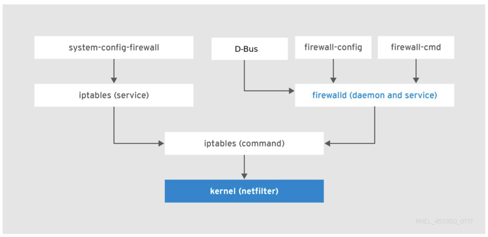

# Firewalld

## Índice

- [Firewalld](#firewalld)
  - [Índice](#índice)
  - [1. Introducción](#1-introducción)
  - [2. Zonas](#2-zonas)
    - [Zonas por defecto](#zonas-por-defecto)
    - [Zonas definidas](#zonas-definidas)
    - [Trabajando con zonas](#trabajando-con-zonas)
    - [Trabajando con servicios](#trabajando-con-servicios)
  - [3. Abriendo y redirigiendo puertos](#3-abriendo-y-redirigiendo-puertos)
  - [4. Otras órdenes](#4-otras-órdenes)
  - [Bibliografía](#bibliografía)

## 1. Introducción

- Cortafuegos por defecto en CentOS7 y Fedora 20+

Para instalarlo en aquellos casos en los que no esté instalado:

```bash
# dnf install firewalld
# systemctl unmask firewalld
# systemctl enable firewalld
# systemctl start firewalld
```

Comprobación del estado del servicio:

```bash
# systemctl status firewalld
```

**Firewalld** es una interfaz (frontend) para el cortafuegos de Linux, **iptables**, que permite gestionar las reglas de filtrado de paquetes de una forma más sencilla. **Firewalld** es un demonio que se ejecuta en segundo plano y que se encarga de gestionar las reglas de filtrado de paquetes. **Firewalld** se basa en conceptos de zonas y servicios.



**Firewalld** emplea el concepto de **zona** para agrupar un conjunto de reglas predeterminadas que determinan el tráfico permitido en función del nivel de confianza que se tenga en base a las características de la red o redes a las que esté conectado el equipo. 

- **Zona**: Un conjunto de reglas de filtrado de paquetes que se aplican a un interfaz de red o a un conjunto de interfaces de red. Cada interfaz de red se asigna a una zona. Las zonas predefinidas son: `drop`, `block`, `public`, `external`, `internal`, `dmz`, `work`, `home` y `trusted`.

- A las interfaces de red se les asigna una zona que determina el conjunto de reglas aplicables a dicha interfaz. 

- **Firewalld** también emplea el concepto de **servicio** en una zona concreta, mediante el cual se aplican unas reglas predeterminadas que definen el comportamiento del cortafuegos para permitir el tráfico entrante necesario para el funcionamiento adecuado del servicio. 

  - Los servicios predefinidos se encuentran en el directorio `/usr/lib/firewalld/services/`.

**Firewalld** emplea dos conjuntosa de configuración: configuración en ejecución y la configuración permanente. 

- La _configuración en ejecución_ establece las reglas que se aplican en ese momento en el equipo mientras que la _configuración permanente_ es la que queda establecida cuando se arranca el cortafuegos.
- Cuando aplicamos cambios en un conjunto, estos cambios no afectan al otro conjunto. 
- Por defecto, los cambios afectan a la configuración en ejecución. Para que los cambios afecten a la configuración permanente, es necesario aplicarlos explícitamente.
- El comando de recarga de la configuración es `firewall-cmd --reload`. Este comando elimina la configuración en ejecución y la reemplaza por la configuración permanente almacenada en el disco.

```bash
# firewall-cmd --reload
```

**Firewalld** administra las reglas de forma dinámica, es decir, es posible crear, cambiar y eliminar reglas de forma dinámica sin necesidad de parar y arrancar nuevamente el servicio firewalld. Por tanto, no se interrumpen las conexiones y sesiones existentes.

---

**Firewalld** se configura a través de archivos XML:

- `/usr/lib/firewalld`: Configuraciones predeterminadas.
- `/etc/firewalld`: Configuraciones personalizadas que sobreescriben las predeterminadas.

```bash
# ls /usr/lib/firewalld 
```

- Pero la forma más habitual de gestionar y configurar el cortafuegos **Firewalld** es a través de la orden **firewall-cmd**, por ejemplo:

```bash
# firewall-cmd --state (comprobar el estado del cortafuegos)
# firewall-cmd --get-zones (listar las zonas disponibles)
# firewall-cmd --help (ayuda)
```

## 2. Zonas

### Zonas por defecto

- Las zonas por defecto están almacenadas en el directorio `/usr/lib/firewalld/zones/`.

- Los ficheros asociados son copiados en el directorio `/etc/firewalld/zones/` solo cuando estos son modificados.

### Zonas definidas

- **Zona drop**:
  - Para redes públicas.
  - Los paquetes entrantes no solicitados se descartan sin respuesta.
  - Los paquetes entrantes que están relacionados con las conexiones de red salientes se aceptan.
  - Se permite el tráfico de salida.
  - Servicios habilitados: ninguno.
  - Política predeterminada: DROP

- **Zona block**:
  - Para redes públicas.
  - Los paquetes entrantes no solicitados se descartan sin respuesta.
  - Los paquetes entrantes que están relacionados con las conexiones de red salientes se aceptan.
  - Se permite el tráfico de salida.
  - Servicios habilitados: ninguno.
  - Política predeterminada: REJECT

- **Zona public**:
  - Para redes públicas.
  - Suele ser la zona predeterminada.
  - Sólo se aceptan algunas conexiones entrantes seleccionadas.
  - Servicios habilitados: `ssh` y `dhcpv6-client`.
  - Política predeterminada: REJECT

- **Zona external**:
  - Empleada para la parte externa de una puerta de enlace (redes externas).
  - Configuración para el enmascaramiento de NAT para que la interna permanezca privada pero accesible.
  - Sólo se permiten conexiones entrantes seleccionadas.
  - Servicios habilitados: ssh.
  - Política predeterminada: REJECT

- **Zona internal**:
  - Empleada para la parte interna de una puerta de enlace (redes externas).
  - Se confía en los sistemas que coexisten en la misma red, pero solo se permiten conexiones entrantes seleccionadas.
  - Servicios habilitados: `ssh`, `ipp-client`, `mdns`, `samba-client` y `dhcpv6-client`.
  - Política predeterminada: REJECT.

- **Zona work**:
  - Para oficinas o trabajo.
  - Se confía en los sistemas que coexisten en la misma red, pero solo se permiten conexiones entrantes seleccionadas.
  - Servicios habilitados: `ssh`, `ipp-client` y `dhcpv6-client`.
  - Política predeterminada: REJECT.

- **Zona home**:
  - Para el hogar.
  - Básicamente igual que la zona work.
  - Servicios habilitados: `ssh`, `ipp-client`, `mdns`, `samba-client` y `dhcpv6-client`.
  - Política predeterminada: REJECT.

- **Zona dmz**:
  - Para redes DMZ (red desmilitarizada).
  - Una red DMZ es una red aislada perteneciente a la red interna de la organización en la que se ubican los servicios accesibles desde el exterior. Por lo general, una DMZ permite las conexiones procedentes tanto de Internet, como de la red local de la empresa donde están los equipos de los trabajadores, pero las conexiones que van desde la DMZ a la red local no están permitidas.
  - Sólo se aceptan algunas conexiones entrantes seleccionadas y el resto son rechazadas.
  - Servicios habilitados: `ssh`.
  - Política predeterminada: REJECT.

- **Zona trusted**:
  - Todas las conexiones son aceptadas.
  - Servicios habilitados: todos.
  - Política predeterminada: ACCEPT.

### Trabajando con zonas

```bash
// Ver las zonas disponibles
# firewall-cmd --get-zones

// Ver la zona por defecto
# firewall-cmd --get-default-zone

// Establecer la zona por defecto
# firewall-cmd --set-default-zone=internal

// Ver las zonas activas para cada interfaz
# firewall-cmd --get-active-zones

// Mostrar las reglas de una zona
# firewall-cmd --zone=public --list-all

// Mostrar las reglas de todas las zonas
# firewall-cmd --list-all-zones
```

### Trabajando con servicios

```bash
// Mostrar los servicios operativos
# firewall-cmd --list-services

// Mostrar los servicios predefinidos
# firewall-cmd --get-services

// Añadir un servicio a una zona de manera permanente
# firewall-cmd --zone=public --add-service=http [--permanent]
# firewall-cmd --zone=public --remove-service=http [--permanent]
```

```bash
// Si empleamos la opción --permanent y queremos que
// se aplique al conjunto en ejecución
# firewall-cmd --zone=public --add-service=http --permanent
# firewall-cmd reload

//o bien después de modificar el conjunto en ejecución
# firewall-cmd --zone=public --add-service=http
# firewall-cmd --runtime-to-permanent

// Si queremos evitar errores involuntarios que nos puedan dejar
// sin acceso a la máquina
# firewall-cmd --add-service=ssh --timeout 15m
```

## 3. Abriendo y redirigiendo puertos

```bash
// Listar puertos permitos en la zona pública
# firewall-cmd –-list-ports –-zone=public

// Abriendo el puerto 12345/tcp en la zona pública
# firewall-cmd --zone=public --add-port=12345/tcp
# firewall-cmd --zone=public --remove-port=12345/tcp

// Abriendo un rango de puertos en la zona pública
#firewall-cmd --zone=public --add-port=12345-12350/tcp

// Redirección de puertos en el mismo host
# firewall-cmd --zone=public --add-forward-port=80:proto=tcp:toport=12345

// Redirección de puertos a otro host
# firewall-cmd --zone=public --add-masquerade
# firewall-cmd --zone=public --add-forward-port=80:proto=tcp:toport=12345toaddr=10.22.147.11
```

## 4. Otras órdenes

```bash
// Cerrar todo el tráfico
# firewall-cmd --panic-on

// Volver a la configuración permanente
# firewall-cmd --panic-off

// Consultar si el modo “pánico” está on u off
# firewall-cmd --query-panic
```

## Bibliografía

- M. Jahoda, J. Fiala, S. Wadeley, R. Krátky, M. Prpic, I. Gkiova, T. Capek, Y. Ruseva, and M. Svoboda, "Red Hat Enterprise Linux 7 Security Guide: Concepts and techniques to secure RHEL servers and workstations," Red Hat, 2020. [Online]. Available: https://access.redhat.com/documentation/en-us/red_hat_enterprise_linux/7/html/security_guide/index
